**背景：**

> Kimi 的月额度大于 4 份 Coding 周额度，只写代码的话每月都会有额度遗留。剩下的额度正好用来试用 Kimi 网页端的功能，顺便整理一份各个功能的额度消耗清单，供想要付费 Kimi 的读者参考。

# 档位介绍

Kimi 会员分四档，都用音乐速度记号命名：

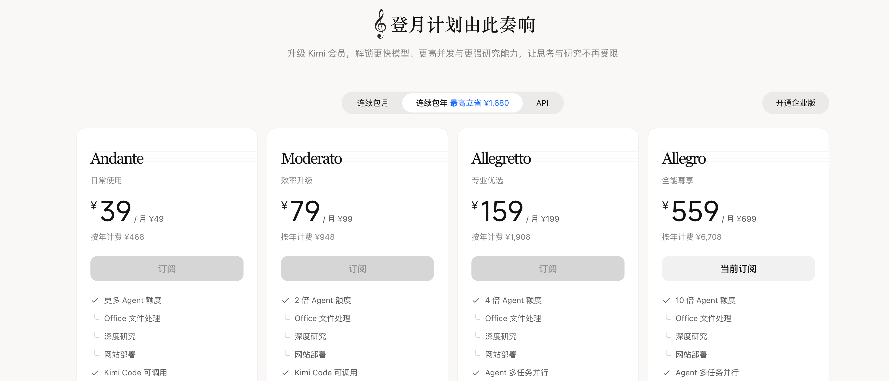

额度页里是三条互不相干的进度条：

- **总使用额度**：按月刷新，网页端和 Code 共用
- **5 小时用量**：Code 专属
- **7 天用量**：Code 专属

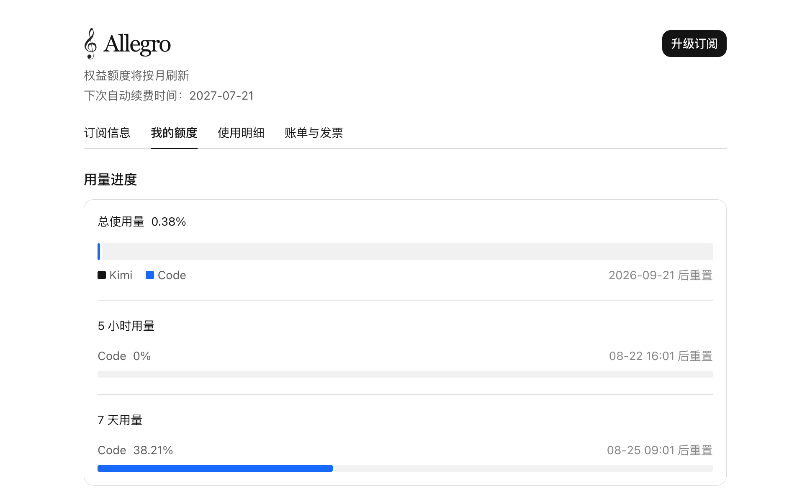

# 功能介绍

侧边栏的功能入口分三部分：

- 主入口：**PPT、集群、深度研究**
- 「收起」里的 **文档、网站、表格、设计**：集成好的办公套件
- 应用下载相关：**Kimi Work（Beta）、Kimi Code、Kimi Claw**

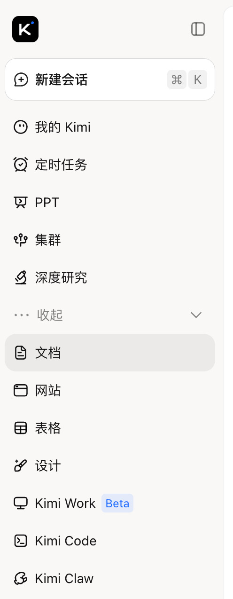

对话框「+」号可传文件和图片，还带 10 个插件（图像/音频生成、法律、SEC、学术、金融、世界银行、IMF、iFinD、天眼查）和 40+ 个技能（模拟出题器、小红书笔记生成、股票投研报告……）。

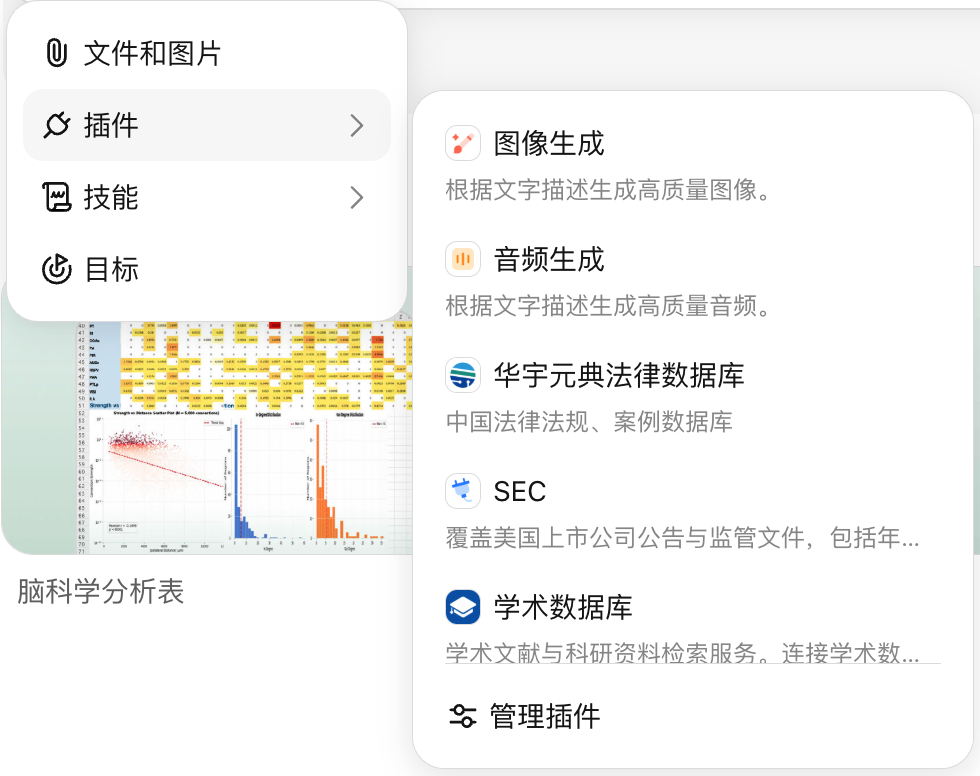

# 功能粗测

第一轮把主要功能各点一次（消耗 = 占月度总额度百分比；折合费用按 Allegro 包年 ¥559/月 折算）：

| # | 功能 | 提示词 | 消耗 | 折合费用 |
| --- | --- | --- | --- | --- |
| 1 | PPT | 请生成一份8页的《AI辅助教学实践》PPT大纲，风格选"简约商务" | 0.51% | ¥2.85 |
| 2 | 集群 | 请分步完成"策划一场50人线下读书会"：先输出议程，再输出物料清单，最后输出预算表 | 0.07% | ¥0.39 |
| 3 | 深度研究 | 请用300字摘要回答：2026年国产大模型在金融领域的落地案例有哪些？ | 0.04% | ¥0.22 |
| 4 | 文档 | 请生成一份"产品需求评审会议纪要"文档模板，包含结论、待办、责任人 | 0.26% | ¥1.45 |
| 5 | 网站 | 请生成一个"独立设计师作品集"网站首页结构，每个板块一句话文案 | 0.90% | ¥5.03 |
| 6 | 表格 | 请生成"校园读书节活动任务表"，5行，包含任务、时间、负责人、进度 | 0.12% | ¥0.67 |
| 7 | 设计 | 请设计一张"夏日音乐节"宣传海报，给出画面描述和标题文案 | 0.37% | ¥2.07 |
| 8 | 插件·图像生成 | 请生成一张"未来城市空中花园"概念图 | 0.15% | ¥0.84 |
| 9 | 技能·模拟出题器 | 请生成5道"Python基础"单选题，附答案 | 0.03% | ¥0.17 |
| 10 | 技能·小红书笔记 | 请生成一篇"通勤降噪耳机"小红书种草笔记，100字以内 | 0.06% | ¥0.34 |

挑 4 个有代表性的展开：

**PPT：一次成型，还能局部改写（0.51% ≈ ¥2.85）**

8 页《AI辅助教学实践》一次成型，右侧在线编辑器里点选任意文字即可让 Kimi 局部改写，可导出 PPTX：

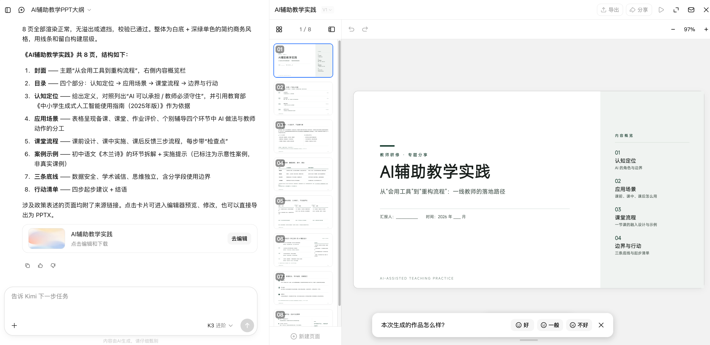

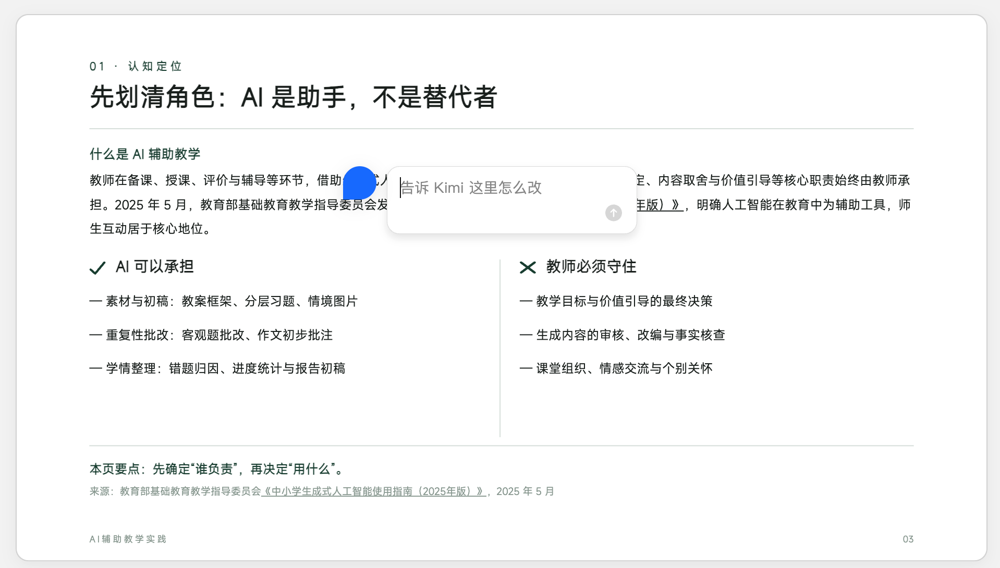

**网站：本轮最贵，但直接部署上线（0.90% ≈ ¥5.03）**

产出 38KB 单文件设计师作品集站，衬线字体混排、自定义光标、杂志式审美，完整地址：https://26mqqvwt4qsgq.ok.kimi.link

**设计·海报：生成即可编辑（0.37% ≈ ¥2.07）**

夏日音乐节海报一次成型，日期、地点、演出阵容、早鸟票信息齐全，生成后直接进编辑器改字体和图层：

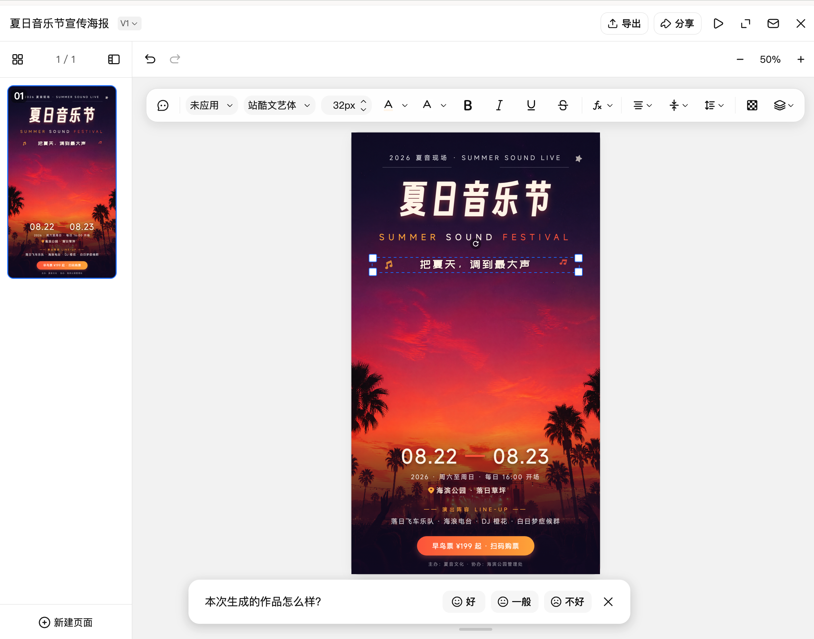

**技能·小红书笔记：文案和卡片一次给齐（0.06% ≈ ¥0.34）**

一次产出笔记文案 + 1 张封面 + 4 张正文卡片，配置 Cookie 后还能一键发布：

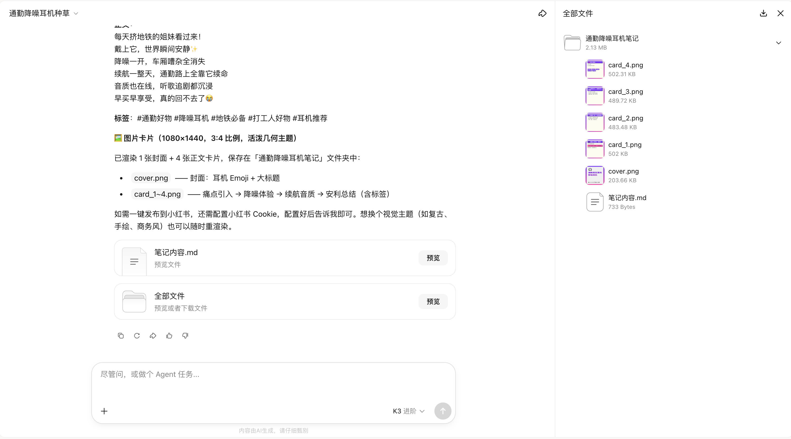

# PPT 专项

粗测里 PPT 表现不错，加测 10 个主题，覆盖 6 种预设风格和自定义风格描述（「+0.13%」= 生成后再微调一次的花费）：

| # | 提示词 | 消耗 | 折合费用 |
| --- | --- | --- | --- |
| 1 | 请生成一份5页《新员工入职培训》PPT大纲，风格选"简约商务" | 0.26% | ¥1.45 |
| 2 | 请生成一份6页《AI智能眼镜新品发布》PPT大纲，风格自定义为"未来科技、深色背景、发光线条" | 0.39% + 0.13%×2 | ¥3.63 |
| 3 | 请生成一份8页《基于深度学习的城市交通流预测》论文答辩PPT大纲，风格选"学术风" | 0.44% | ¥2.46 |
| 4 | 请生成一份4页《Q3运营数据复盘》PPT大纲，风格选"数据可视化" | 0.29% | ¥1.62 |
| 5 | 请生成一份7页《校园音乐节》活动策划PPT大纲，风格自定义为"潮流涂鸦、高饱和撞色" | 0.79% + 0.13% | ¥5.14 |
| 6 | 请生成一份10页《宠物智能硬件项目》融资路演PPT大纲，风格选"极简黑白" | 0.67% | ¥3.75 |
| 7 | 请生成一份5页《海洋塑料污染》公益宣讲PPT大纲，风格选"扁平插画" | 0.51% + 0.13%×4 | ¥5.76 |
| 8 | 请生成一份6页《产品经理作品集》个人介绍PPT大纲，风格自定义为"杂志风、左右分栏、衬线字体" | 0.51% + 0.13%×4 | ¥5.76 |
| 9 | 请生成一份6页《初中物理：电路基础》课件PPT大纲，风格选"手绘风" | 0.76% | ¥4.25 |
| 10 | 请生成一份5页《人类简史》读书分享PPT大纲，风格自定义为"暖色调、纸张纹理、手写批注" | 0.51% + 0.13% | ¥3.58 |

Kimi 网页端做 PPT 时会自主生成插图。抽三张封面看效果：

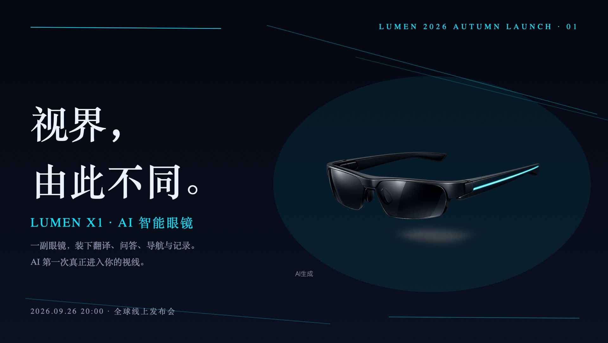

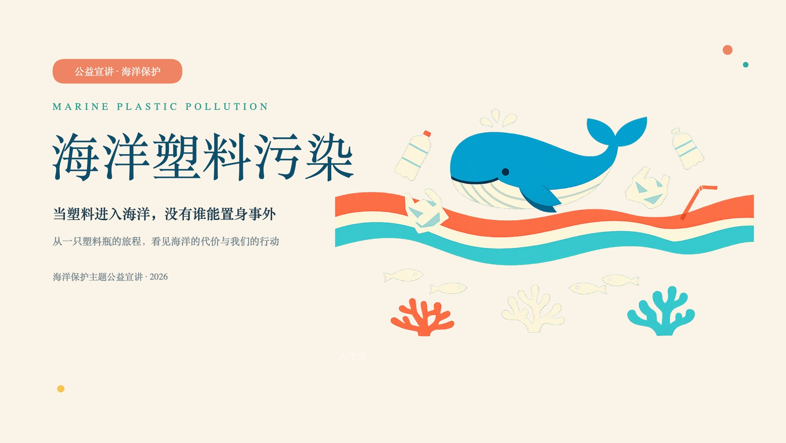

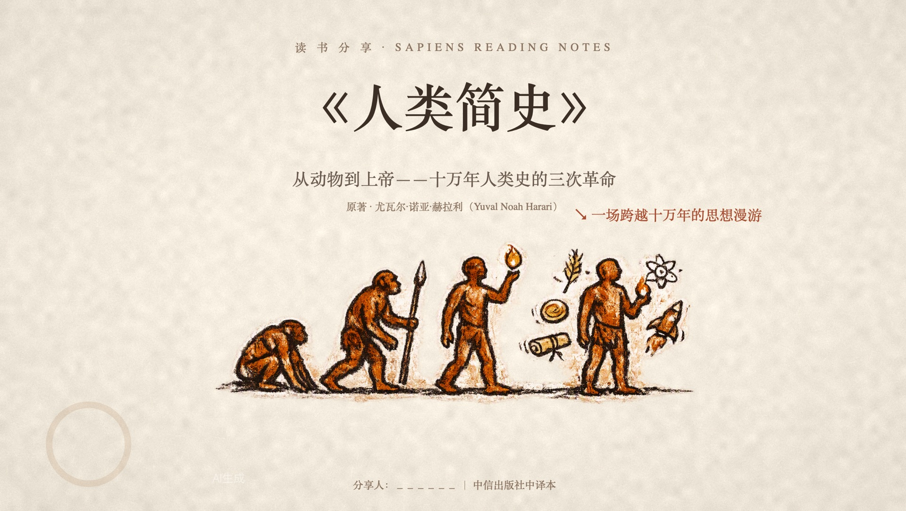

规律：页数越多越贵（4 页 0.26% → 10 页 0.67%）；微调一次固定 0.13%。

# 设计专项

设计是子类最多的功能，8 个子类各测至少一题：

| # | 子类 | 提示词 | 消耗 | 折合费用 |
| --- | --- | --- | --- | --- |
| 1 | 社媒图文 | 请设计一张"通勤穿搭"小红书封面图，竖版3:4，标题"5件单品搞定一周通勤"，风格简约韩系 | 0.27% | ¥1.51 |
| 2 | 海报 | 请设计一张"独立书店深夜读书会"活动海报，画面要有月亮、台灯、书堆，文案"夜读计划" | 0.38% | ¥2.12 |
| 3 | 商品图 | 请设计一张"无线降噪耳机"电商主图，突出"-45dB深度降噪"，背景为深空蓝，产品居中 | 0.27% + 0.13% | ¥2.24 |
| 4 | 信息图 | 请设计一张"2026年远程办公趋势"信息图，包含62%企业允许混合办公、平均通勤节省58分钟、视频会议时长下降30%、员工满意度提升22% 共4个数据点，风格商务扁平 | 0.21% | ¥1.17 |
| 5 | 教学图 | 请设计一张"光合作用过程"教学示意图，包含光反应和暗反应两个阶段，适合高中生物课件，风格清晰明快 | 0.42% | ¥2.35 |
| 6 | 学术插图 | 请设计一张"纳米药物递送系统"学术插图，展示脂质体包裹药物进入肿瘤细胞的过程，适合论文配图，风格为3D渲染 | 0.43% + 0.13% | ¥3.13 |
| 7 | 视觉创作 | 请设计一张"记忆中的夏日午后"视觉艺术作品，画面包含老式风扇、西瓜、竹席、窗外的蝉鸣，风格为复古胶片感 | 0.24% + 0.13% | ¥2.07 |
| 8 | 其他 | 请设计一张"周末露营派对"电子邀请函，横版，包含时间、地点、报名二维码占位，风格手绘水彩 | 0.35% + 0.13% | ¥2.68 |
| 9 | 海报 | 请设计一张"科幻电影节"主视觉海报，画面为巨大的月球背后出现空间站剪影，标题"星际放映"，风格赛博朋克 | 0.51% | ¥2.85 |
| 10 | 信息图 | 请设计一张"咖啡因在体内的代谢时间线"信息图，展示0-12小时咖啡因浓度变化，用渐变色曲线，适合健康科普 | 0.82% | ¥4.58 |

成品全部放上：

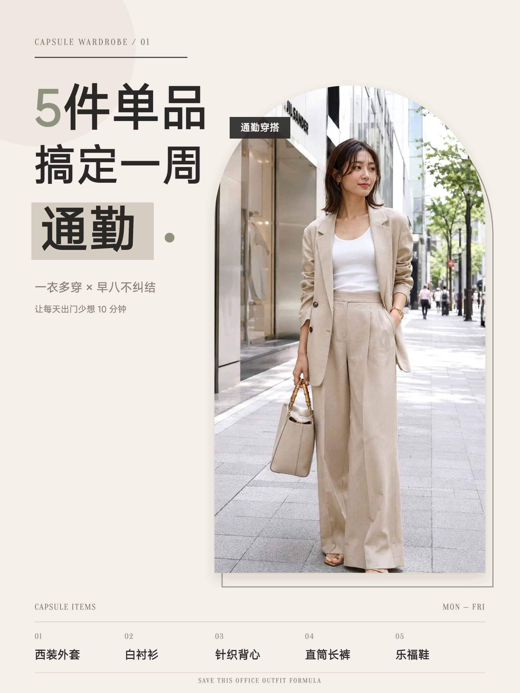

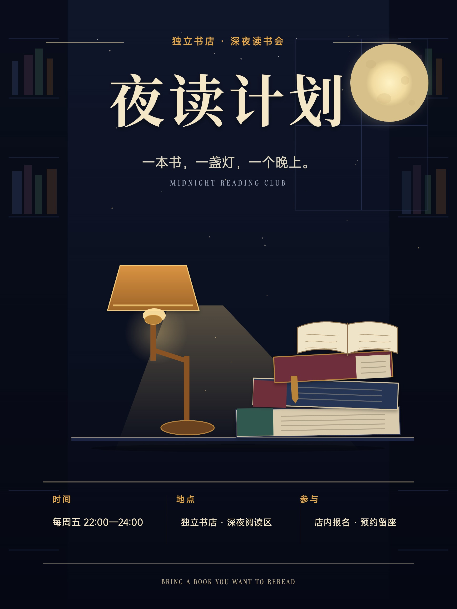

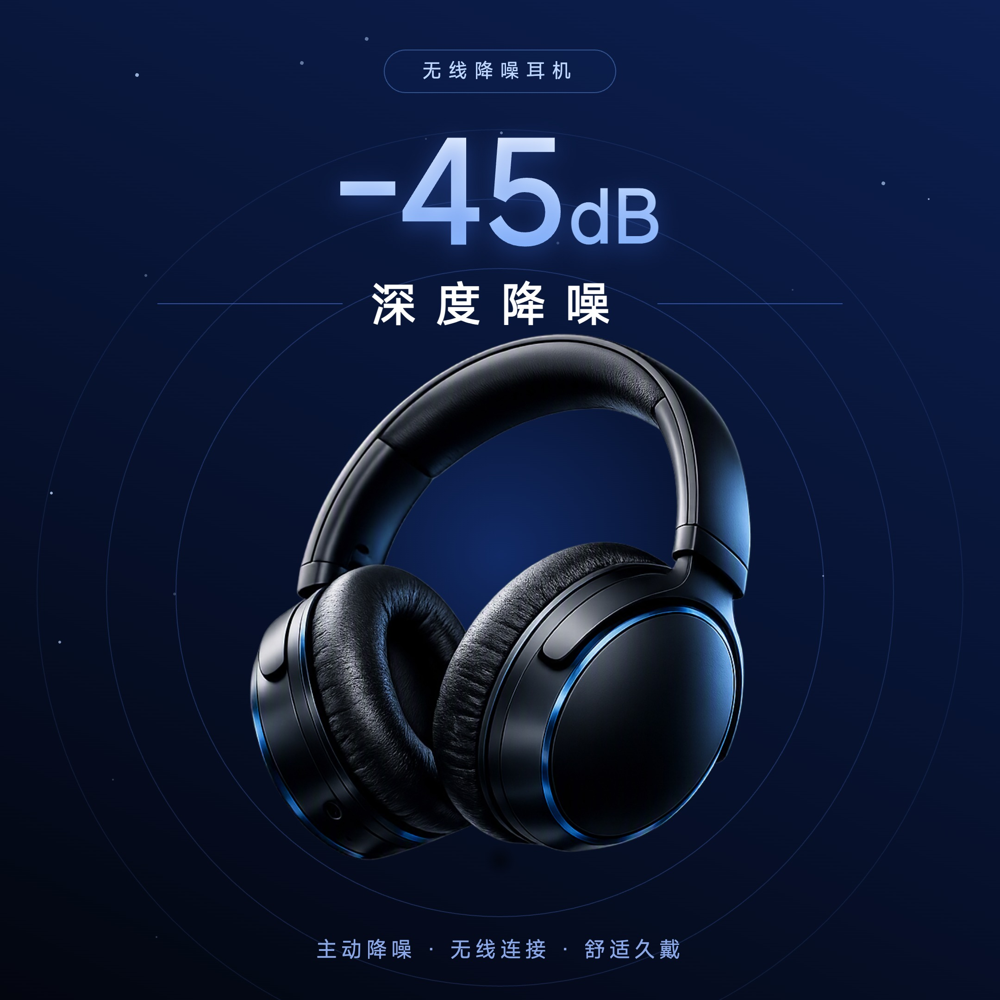

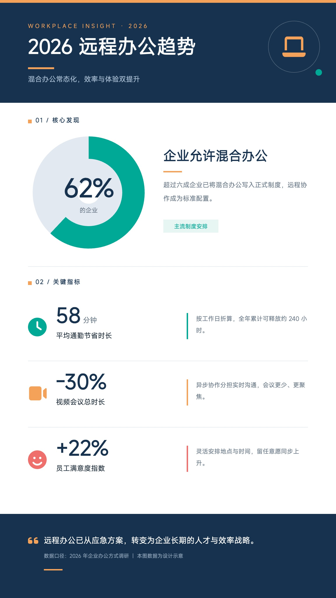

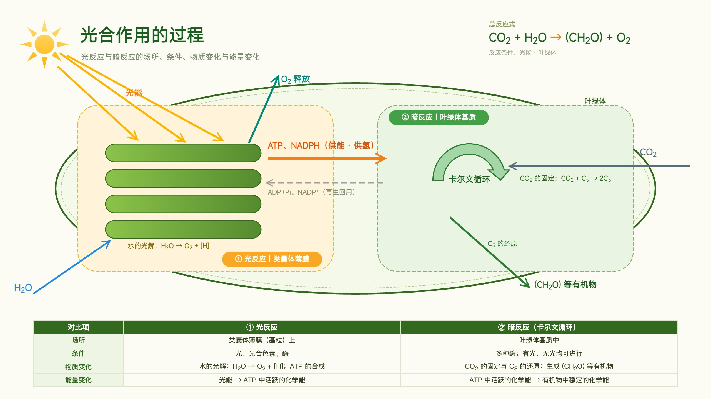

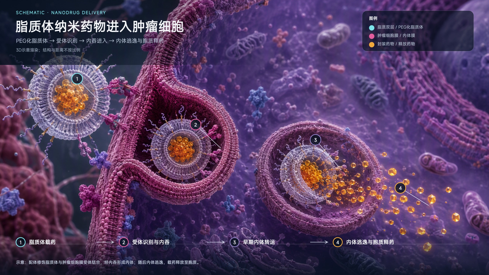

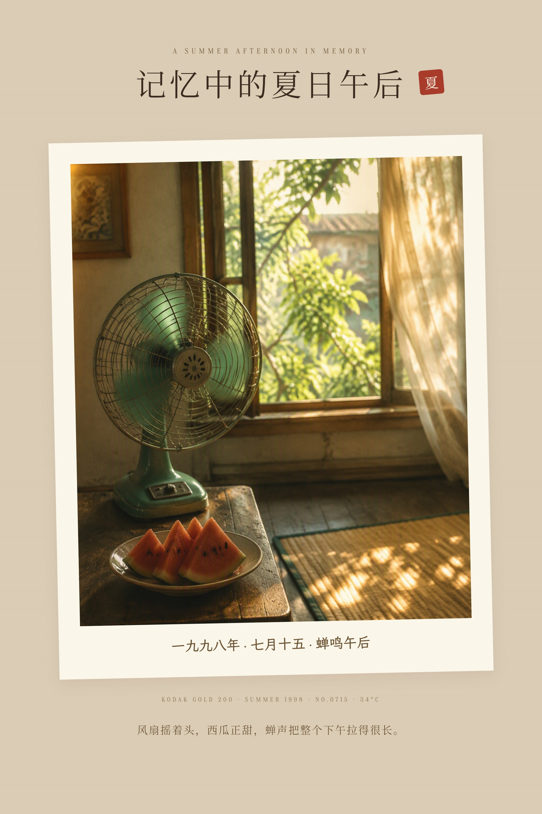

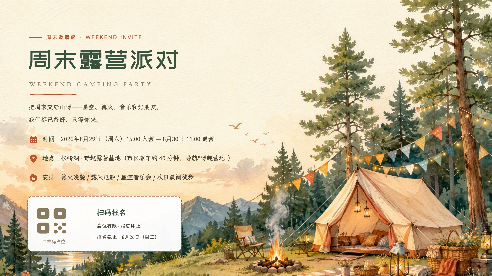

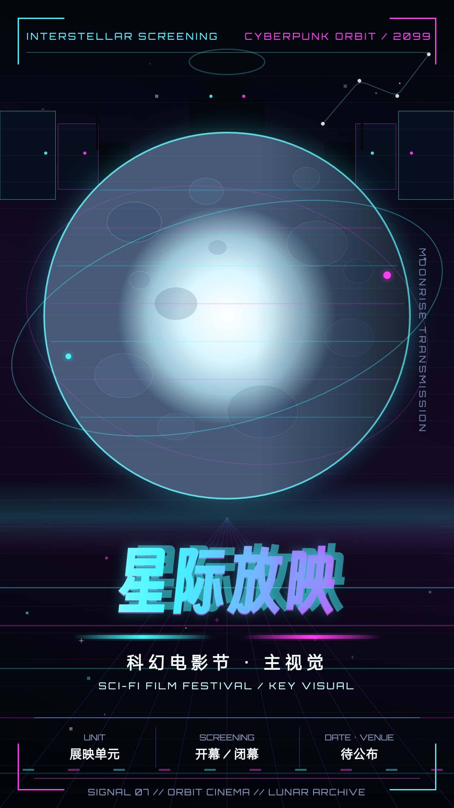

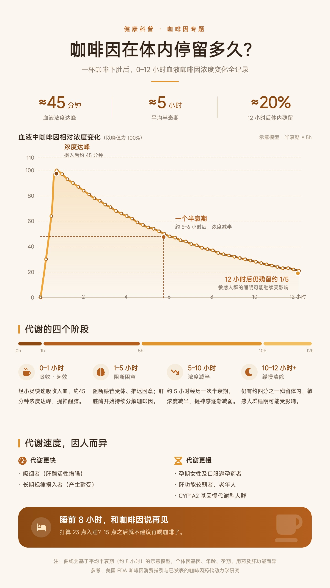

# 定制化设计

最后用「芯片设计全流程 10 步信息图」一道题，测自定义风格描述的控制力。扁平化商务风（0.29%）版式最规整，但 08、09 两张卡片的序号渲染丢失——全批唯一的文字事故：

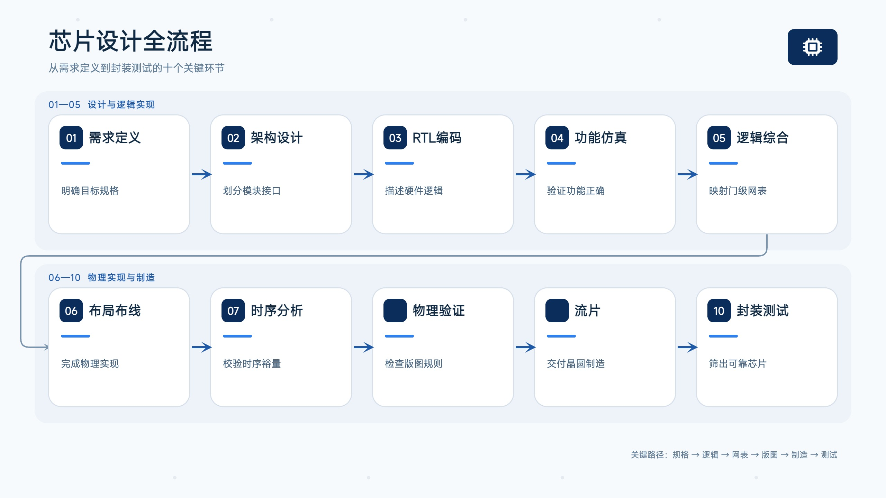

深色科技感（0.50%）是全批唯一 4K，术语最严谨（门级网表、时序裕量）：

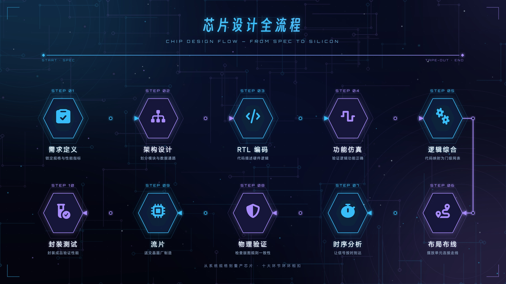

手绘插画风效果最好，但前后迭代 11 次，0.30% + 0.13%×11 = **1.73%（≈¥9.67）**，是全场最贵的一张图——好效果是用微调堆出来的。完整提示词：

```text
请生成一张"芯片设计全流程"介绍图，风格为手绘插画风。
背景为米白色纸张纹理，使用暖色调（橙、棕、米色）和手绘线条。
流程步骤：需求定义、架构设计、RTL编码、功能仿真、逻辑综合、布局布线、时序分析、物理验证、流片、封装测试。
每个步骤用手绘小图标表示（如笔记本、芯片、铅笔、放大镜、电路板、晶圆、包装盒等），并配一句由你撰写的简短说明（不超过10字）。
步骤名称使用轻松的手写字体，说明文字简短。
步骤之间用弯曲的箭头或虚线连接，整体布局可以稍微自由、不呆板。
图片风格温暖、亲切，适合科普展示。横版。
```

生成的内容：米白纸张底上 10 个圆形节点 S 形排布，每步配手绘小图标和一句口语化说明（"给元件安个家""穿衣体检再出厂"），中央还有拟人芯片吉祥物：

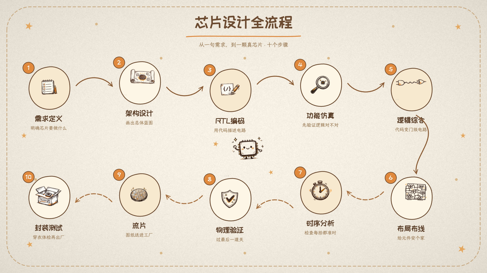

# 测试总结

33 次生成 + 27 次微调的额度总账（折合费用按 ¥559/月 折算）：

| 测试轮次 | 消耗 | 折合费用 |
| --- | --- | --- |
| 功能粗测（10 项） | 2.51% | ¥14.03 |
| PPT 专项（10 个主题） | 6.69% | ¥37.40 |
| 设计专项（10 张图） | 4.42% | ¥24.71 |
| 定制化设计（3 种风格） | 2.52% | ¥14.09 |
| **合计** | **16.14%** | **≈¥90.22** |

测试前当月总额度已用 82.85%，测试结束停在 **99.12%**。

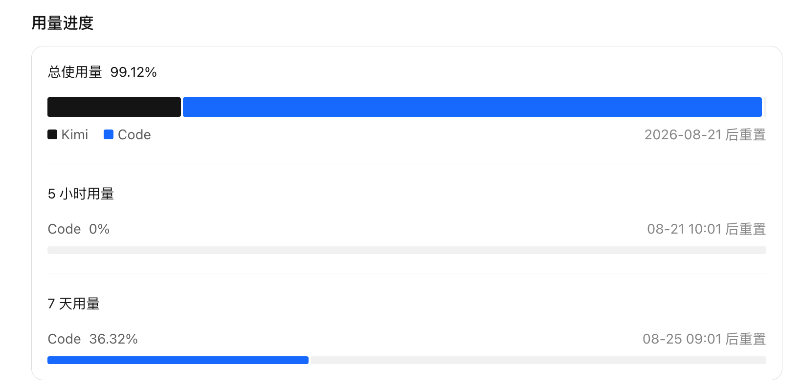

几点结论：

1. **纯文字任务相对便宜**（深度研究 ¥0.22、集群策划 ¥0.39、出题器 ¥0.17），不过这类需求用 DeepSeek 等网页端应该也能胜任，单靠它们不足以成为付费 Kimi 的理由
2. **Kimi 网页端真正有价值的是 PPT 和设计**：都支持在线编辑、局部改写，PPT 单份约 ¥1.45~¥5.76、设计单张约 ¥1.17~¥4.58（按 Allegro ¥559/月折算）
3. **本文仅用了最简单的提示词**：实际使用时把提示词写得更细（参考「定制化设计」一节的手绘版提示词），效果还有提升空间
