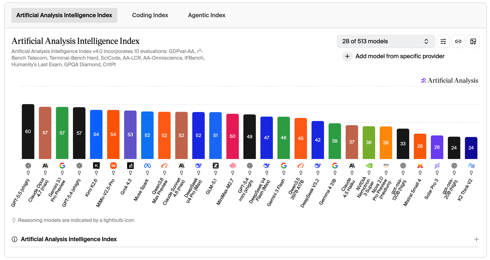
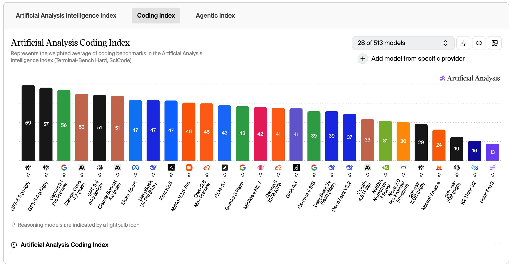
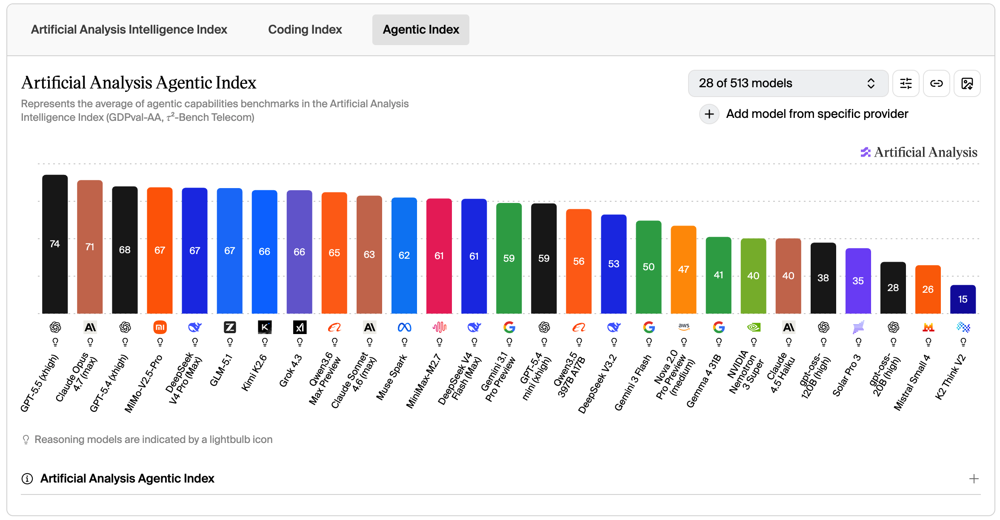
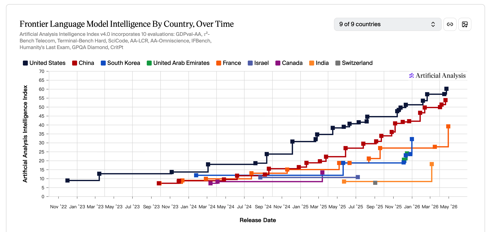
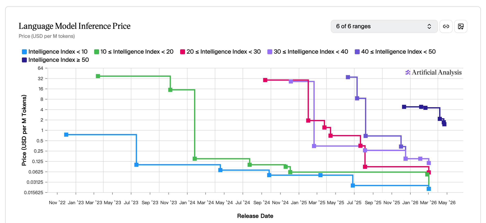

> 学而不思则罔，思而不学则殆。

**背景导读**

> 这个月尝试了更多的 AI 使用，一边实践一边思考，才能不被信息的海洋淹没。
>
> 国外，GPT-5.5 与 Claude Opus 4.7 接连发布，图像生成进入推理式时代，桌面操作则让 AI 从"问答工具"走向"操作代理"。国内，DeepSeek V4、Kimi K2.6、GLM-5.1 相继更新，国产模型已跟上生产级水平。

---

## 资讯盘点 - 本月发生了什么

- **2026.04.07** | Anthropic发布十万亿参数模型Claude Mythos 5，榜单分数遥遥领先，因安全风险考量仅向审查合作方开放，不提供公开API
- **2026.04.08** | 智谱发布开源模型GLM-5.1，在SWE-bench Pro上首次超越Claude Opus 4.6
- **2026.04.10** | OpenAI CEO Sam Altman住宅遭燃烧瓶袭击，FBI定性为针对AI从业者的暴力升级
- **2026.04.16** | Anthropic发布Claude Opus 4.7，距Opus 4.6仅70天，编码与智能体任务提升显著
- **2026.04.20** | 月之暗面发布并开源Kimi K2.6，万亿参数MoE架构，支持300子智能体协同
- **2026.04.21** | SpaceX与AI编程工具Cursor达成协议，拥有年底前以600亿美元收购的选择权
- **2026.04.22** | OpenAI发布GPT-Image-2，具备推理能力，登顶Image Arena全部榜单
- **2026.04.22** | Google Cloud Next大会确认苹果新一代Siri将基于Gemini定制
- **2026.04.23** | 小米发布MiMo-V2.5全模态模型，主打Agent能力与百万Token上下文
- **2026.04.24** | OpenAI发布GPT-5.5，智能体原生，综合性能登顶基准测试
- **2026.04.24** | DeepSeek发布V4并开源，首次将国产AI芯片与英伟达GPU并列写入硬件验证清单，国产芯片实现Day 0适配，支持百万级Token上下文
- **2026.04.27** | SpaceX加速太空AI生态布局，xAI合并后估值1.25万亿美元
- **2026.04.30** | Anthropic寻求以9000亿美元估值融资，年化营收300亿美元

---

## 信息解读

**国外：OpenAI与Anthropic在高性能模型上持续竞争**

4月，OpenAI发布GPT-5.5，Anthropic发布Claude Opus 4.7，两者均在智能体任务和编码能力上有明显提升。双方同时在推进商业化——OpenAI以Pro版API的高定价策略探索天花板，Anthropic估值在两个月内从3800亿美元升至9000亿美元。两家公司正在各行业加速渗透，而非单纯的整合并购。

**国内：模型厂商持续迭代，国产算力取得关键进展**

智谱GLM-5.1在开源领域挑战了Opus 4.6的基准成绩。月之暗面Kimi K2.6展示了300子智能体协同运行的能力。小米MiMo加入战局。DeepSeek V4的发布有两个亮点值得关注：一是支持百万级Token上下文，二是首次将国产AI芯片与英伟达GPU并列写入硬件验证清单，华为昇腾、寒武纪、摩尔线程等实现Day 0适配。国产芯片在推理环节的可用性得到了实际验证。

**开源不等于免费，商业模式正在分化**

4月多家模型选择开源（GLM-5.1、Kimi K2.6、DeepSeek V4），但各自的路径不同。DeepSeek和Kimi通过开源吸引开发者生态，智谱则在开源的同时将API提价至接近海外水平。MiniMax M2.7采用商用受限协议，说明厂商在探索"模型免费、服务收费"的模式。垂类领域可能成为中小厂商的切入方向。

**社会对AI的不安情绪有所显现**

Sam Altman住宅遇袭是一个值得注意的信号。当AI开始进入生产环境并影响就业结构时，社会层面的反弹可能增多。这一趋势需要持续观察。

**图像生成能力显著提升，信息验证面临挑战**

[GPT-Image-2](https://blog.underlaminar.com/posts/surfing01gptimage2/)的推理式图像生成意味着低成本的逼真图像制作成为可能。这对信息真实性验证提出了新的要求。

---

## AI榜单

本月发布的重点模型在 Artificial Analysis 的多项指数上接受了评测。以下基于其 Intelligence Index、Coding Index 和 Agentic Index 三项指标，对本月的模型格局做一个梳理。

**三个指标分别衡量什么**：

- **Intelligence Index（智能指数）**：综合10项评估（GDPval-AA、SciCode、GPQA Diamond、IFBench等），衡量模型的综合能力
- **Coding Index（编码指数）**：基于Terminal-Bench Hard和SciCode的加权平均，衡量编程任务表现
- **Agentic Index（智能体指数）**：基于GDPval-AA和τ²-Bench Telecom，衡量自主完成复杂任务的能力

**Intelligence Index**：GPT-5.5 以60分领先，其后是 Claude Opus 4.7、Gemini 3.1 Pro Preview 和 GPT-5.4（均为57分）。国外三大家构成了第一集团。国内模型目前集中在40-50分区间，属于第二梯队。详见下图。

**Coding Index**：GPT-5.5（59分）、Gemini 3.1 Pro Preview（56分）、Claude Opus 4.7（53分）位居前三，三家包揽了编码能力的第一集团。国内模型在这一项上差距较大，尚未进入前列。详见下图。

**Agentic Index**：GPT-5.5 以74分大幅领先，Claude Opus 4.7 获得71分。值得关注的是，国内模型在这一项上表现出色——MiMo-V2.5-Pro、DeepSeek V4 Pro、GLM-5.1 均在67分梯队，与第一集团的差距明显小于其他两项指标。详见下图。

**中美差距**：从趋势图来看，美国自2022年底起步，中国从2023年底开始发力。截至2026年4月，中国模型在智能指数上大约落后美国3-4个月。差距在缩小，但短期内仍会存在。其他国家（韩国、法国等）与中美两国存在明显断层。详见下图。

**价格趋势**：高智能模型的推理价格已降至1.x美元/百万Token，且降价趋势持续。稍低智能的价位降低速度变快。AI使用成本正在下降，更多应用场景将被解锁。

---

## 实战心得 - 现在AI能做什么

这个月尝试了更多的 AI 使用，一边实践一边思考。以下是几个验证或观察到的方向。

**Claude Code + 国内模型是不错的方案**

Claude Code 与国内模型的组合已经可以应对大多数实际工作场景。这种混搭策略兼顾了成本与效果。

**阿里云交互支持原生Agent**

阿里云的终端已经支持原生Agent，终端可以自动识别文字或命令。AI交互正在从"对话"向"任务执行"演进。

**Kimi.com的Agent集群**

Kimi.com 的 Agent 集群可以端到端完成报告、文档等任务，效果接近在线版Agent。留坑后续深入研究。

**GPT-5.5 和 Claude Opus 4.7 的工作流变化**

两个模型都已支持接入桌面操作，实现更深层的系统控制。AI正从"问答工具"变为"操作代理"。留坑继续研究。

---

## 个人洞察 - AI会走向何方

**裁员潮会开始吗？=> 效率提升的瓶颈在哪里？**

上月：一旦有头部公司跑通AI降本增效的案例，裁员就会大面积铺开。

本月：问题演化为「效率提升的瓶颈在哪里？」——组织结构、为人构建的基建、人机交互界面的落后将成为效率瓶颈。技术不再是问题，人和流程才是。

**Agent将如何演进？【完】**

上月：OpenClaw让用户顺滑地接受了Agent交互模式，“开口对话就能解决问题”将成为新习惯。

本月：逐步进入工作和生活，不再讨论。

**科研的边界在哪里？**

上月：自动化科研完成全链路，“定义问题”的能力比“解答问题”更重要。

本月：引领新思路、定义新问题的能力重要。同时需要尝试自己构建AI科研系统。

**软件开发会被颠覆吗？【完】**

上月：AI辅助开发让代码生成极快且可控，未来程序员需将精力从编码转移到规划产品演进。

本月：必然颠覆，不再讨论。

**大模型开源生态会走向何方？**

上月：对开源生态持悲观态度，阿里Qwen可能闭源，MiniMax M2.7已转为闭源。

本月：惊喜发现国内模型除了Qwen都在走开源。开源会利好更多服务商提供服务，打造品牌效应，同时可以布局垂类领域的模型市场。

**算力与模型如何共生？【完】**

上月：模型架构与芯片的“系统级融合”是压低Token成本的终极路径。

本月：问题超前，短期不再讨论。

**教育的本质将发生什么改变？**

上月：死记硬背的教育模式将被颠覆，学习重心转向“核心概念与底层理论”。

本月：重心不变。各专业会结合AI设计教学模式。计算机将成为通识课程，AI使用能力成为必备技能。计算机专业未来会存在但会更关注例如量子计算、计算机理论、AI算法研究等深度分化方向。

**国内算力芯片是否会走向自给【新】**

如果按照模型和芯片两块的话，会。芯片分为芯片设计、设计工具、芯片制造三块的话，走向自给还有距离。

**AI的应用边界在哪里【新】**

边界不在于AI能做什么，而在于人能控制什么。应用边界取决于群体中个体能力的分布，不同地方都会因人的能力而有不同的边界。

**AI是否会带来危险【新】**

会。危险来自人为滥用、系统失控、权限放大三个维度。战争AI决策、黑客借AI提升破坏力、权限自底向上被开放、机器人落地——便捷性和风险性同步提升。

---

## 总结

首先，关注你的身心健康。AI发展再快，身体依然是本钱。

这个月最大的感受是：国内AI已经到了生产级，可以更快地构建你想完成的事。不要被信息覆盖，多去尝试。

Kimi Agent集群、GPT-5.5的桌面操作能力、AI科研系统……都值得后续深入研究。信息在爆炸，时间有限，挑最感兴趣的下手。只有真正用过，才能知道它能帮到你什么。