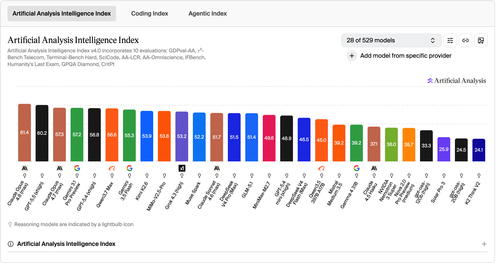
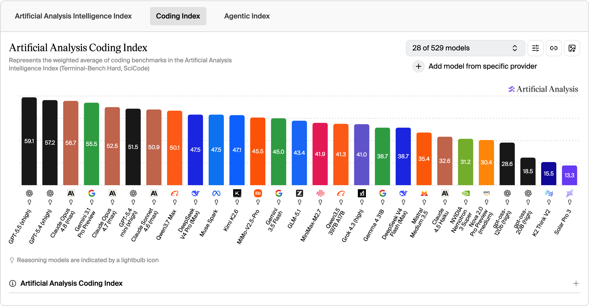
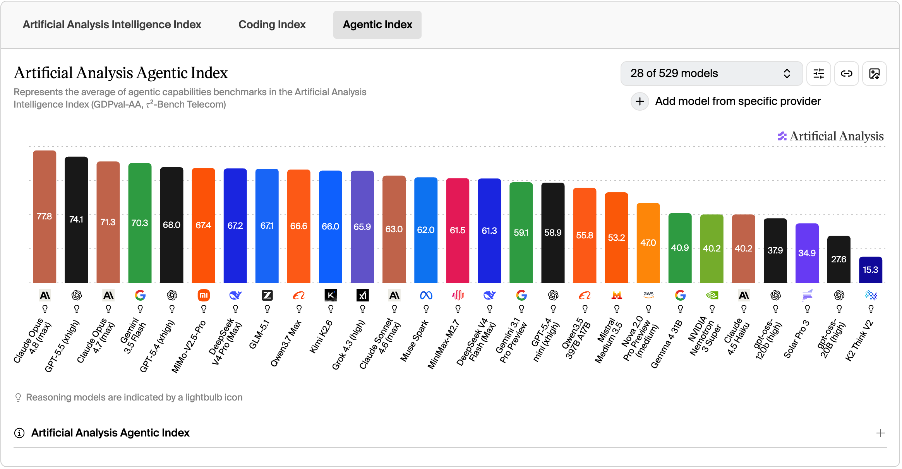
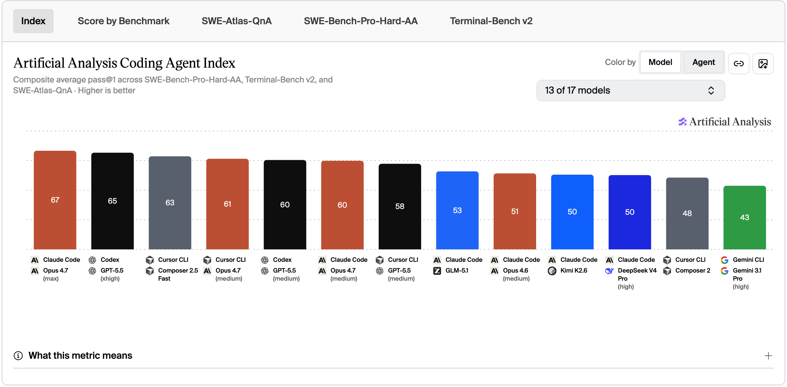
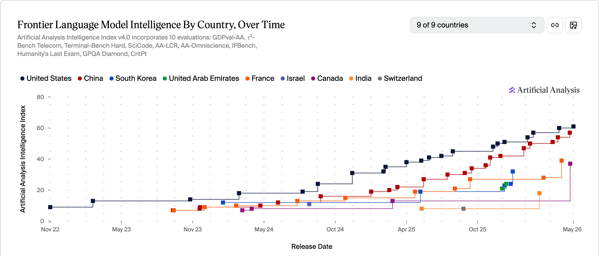

> 学非探其花，要自拔其根。

**背景导读**

> 这个月 AI 的关键词是「落地」——Anthropic 联手金融巨头、OpenAI 成立 Deployment Company、华为"韬"定律出炉、通用推理模型证伪近 80 年数学猜想。模型与商业、工程、科学的连接越来越紧，单纯卷参数的时代正在过去。

---

## 资讯盘点 - 本月发生了什么

- **2026.05.04** | Anthropic 与黑石、高盛等金融巨头成立 AI 服务合资公司，总承诺投资额约 15 亿美元，采用 FDE（Forward Deployed Engineer）模式将工程师派驻客户现场协助深度集成 Claude
- **2026.05.06** | Anthropic 与 SpaceX 签订算力合作框架协议，同步上调 Claude 各档位使用上限，以应对订阅用户与 API 客户持续增长的需求
- **2026.05.07** | Elon Musk 宣布 xAI 作为独立公司解散，整体并入 SpaceX 成为 SpaceXAI，AI 业务作为 SpaceX 旗下产品线继续运营
- **2026.05.11** | OpenAI 推出 OpenAI Deployment Company 并收购 AI 咨询/工程公司 Tomoro，获得超 40 亿美元初始投资，全面进军企业级 AI 落地服务
- **2026.05.16** | 国内三大运营商（电信、联通、移动）先后推出 Token 算力套餐，实现"像买流量一样买算力"的标准化定价
- **2026.05.16** | 谷歌前 CEO 埃里克·施密特在亚利桑那大学毕业典礼演讲中遭毕业生集体嘘声，他回应称理解年轻人的"AI 恐惧"
- **2026.05.19** | 谷歌 I/O 大会发布 Gemini 3.5 Flash 及首款个人智能体 Gemini Spark，正式将 Agent 能力下放至消费级产品
- **2026.05.20** | OpenAI 内部通用推理模型证伪困扰数学界近 80 年的埃尔德什单位距离猜想，获菲尔兹奖得主公开盛赞
- **2026.05.25** | 华为半导体业务部总裁何庭波在 IEEE ISCAS 2026 上正式发表"韬（τ）定律"，宣布在 3D 堆叠技术上实现重大突破
- **2026.05.28** | Anthropic 发布 Claude Opus 4.8（max），在 Artificial Analysis 的 Intelligence Index（61.4）与 Agentic Index（77.8）上同时登顶
- **2026.05.28** | Anthropic 完成 H 轮融资，募资 650 亿美元，投后估值达 9650 亿美元，距上一轮 9000 亿估值仅一个月

---

## 信息解读

**国外：模型 × 行业的复合能力开始决定下一阶段的格局**

Claude Opus 4.8 在 Intelligence Index（61.4）与 Agentic Index（77.8）双榜登顶，Anthropic 同步完成 H 轮 650 亿美元融资（估值 9650 亿），并与黑石、高盛成立 15 亿美元合资公司，采用 FDE 模式切入金融行业落地。OpenAI 则成立 Deployment Company 并收购 Tomoro（初始投资超 40 亿美元），将企业交付能力内化为核心产品。两家路径各异：Anthropic 走行业纵深，OpenAI 走交付能力——单纯卷模型参数的阶段正在过去，模型 × 行业的复合能力决定下一阶段格局。

**国内：韬（τ）定律与算力自循环**

华为何庭波在 IEEE ISCAS 2026 发表"韬（τ）定律"，宣布 3D 堆叠技术突破。三大运营商同步推出 Token 算力套餐——"像买流量一样买算力"——国产算力首次同时打通芯片设计与算力定价两个关键节点。意义在于"算力自循环"：模型、芯片、算力供给在国产体系内闭环，应用层不再为外部供应链不确定性买单。国产算力从"可用"走向"结构性优势"。

**通用推理模型证伪近 80 年数学猜想**

OpenAI 通用推理模型证伪埃尔德什单位距离猜想，获菲尔兹奖得主认可。两层含义：AI 已介入数学核心命题而非边缘任务；突破来自通用模型而非专用系统，能力泛化在数学领域站稳。数学研究将进入"人机协作"模式，算力集权直接影响前沿数学话语权。

---

## AI 榜单

本月 Artificial Analysis 新增了 **Coding Agent Index（编码智能体指数）**，与 Intelligence Index、Coding Index、Agentic Index 一起构成本期榜单的四个维度。

**Intelligence Index**：Claude Opus 4.8（max）以 61.4 分登顶，GPT-5.5（xhigh）60.2 分紧随其后。Qwen3.7 Max 以 56.6 分进入全球前六，是国产模型首次跻身第一梯队前列。

**Coding Index**：GPT-5.5（xhigh）以 59.1 分稳居榜首，Opus 4.8（max）56.7 分位列第三，OpenAI 与 Anthropic 仍是编码能力的第一集团。

**Agentic Index**：Claude Opus 4.8（max）以 77.8 分大幅领先，GPT-5.5（xhigh）74.1 分紧随其后。Opus 4.8 的 Agentic 领先优势（3.7 分）远大于 Intelligence（1.2 分），提升重点在智能体能力。国产 MiMo-V2.5-Pro、DeepSeek V4 Pro Max 继续稳居 67 分梯队。

**Coding Agent Index**：评估"Agent + 模型"组合的实际工程能力。Claude Code + Opus 4.7（max）以 67 分位居第一，Codex + GPT-5.5（xhigh）65 分位列第二。工具链成熟度成为新的竞争维度。国内模型处于第二梯队，但实际工程表现已达可投产状态，结合国产算力补强，实用化进程正在加速。

**中美差距**：本月两国最优模型分别为 Claude Opus 4.8（美国，61.4 分）与 Qwen3.7 Max（中国，56.6 分）。中国模型在智能指数上约落后美国 3-4 个月，但 Qwen3.7 Max 显著缩小了差距。

---

## 个人洞察 - AI会走向何方

**效率提升的瓶颈在哪里？【完】**

上月：瓶颈在组织结构、为人构建的基建、人机交互界面——技术不再是问题，人和流程才是。

本月：结论不变，不再讨论。

**科研的边界在哪里？**

上月：引领新思路、定义新问题的能力重要，需要尝试自己构建 AI 科研系统。

本月：OpenAI 通用模型证伪埃尔德什猜想，算力集权在前沿数学中的影响将非常大。莱顿大学发布《人工智能与数学宣言》，探讨 AI 在数学中的边界——哪些由 AI 完成、哪些保留人类判断、成果如何归属。科研边界正从"AI 能不能做"转向"允不允许 AI 做、如何做"。

**大模型开源生态会走向何方？【完】**

上月：国内模型除 Qwen 外都在走开源，利好服务商打造品牌、布局垂类市场。

本月：趋势不变，不再讨论。

**教育的本质将发生什么改变？**

上月：各专业结合 AI 设计教学模式，计算机成为通识课程，AI 使用能力成为必备技能。

本月：人力断层。AI 承担初、中级知识工作后，初级从业者失去传统"学徒期"，不再通过基础任务积累经验。这将催生"过渡型人才"：既能与 AI 协作完成中高级任务，又能将行业经验转化为 AI 可理解的流程——为人力与 AI 搭建桥梁的新产业方向。

**国内算力芯片是否会走向自给**

上月：芯片分为设计、工具、制造三块，走向自给还有距离。

本月：DeepSeek V4 将国产芯片与英伟达 GPU 并列写入验证清单，华为"韬"定律在 3D 堆叠上给出明确路线图。设计侧已有可用产品，制造侧"韬"定律提供了绕过制程限制的方向。但整个链路（工具、工艺、封装、生态）仍需时间——方向对了，剩下的交给工程。

**AI 的应用边界在哪里**

上月：边界不在于 AI 能做什么，而在于人能控制什么，取决于群体中个体能力的分布。

本月：AI 从有人力缺口的方向开始应用。当前替代的是脑力劳动中"可标准化"部分（编码、写作、数据分析）——恰好是人才供给长期不足的领域。对尖端行业（药物研发、材料科学），AI 不是替代而是压缩——团队数月的工作，一个人几周完成。应用边界的本质不是"AI 会不会做"，而是"行业缺不缺人"。

**AI 是否会带来危险【完】**

上月：危险来自人为滥用、系统失控、权限放大。

本月：结论不变。值得记录——多起 Linux 上由 AI 发现/利用的提权漏洞出现，AI 在安全攻防两端的能力同步增长，危险形态正从"会不会发生"变成"以什么方式发生"。

---

## 总结

这个月最大的感受：AI 正在从"产品"变成"基础设施"。Anthropic 联手金融巨头、OpenAI 成立 Deployment Company、运营商推出 Token 套餐、华为"韬"定律——头部公司不再只比模型分数，而是构建"模型 × 行业 × 算力"的整体能力。

研究侧同样重要：通用推理模型证伪埃尔德什猜想获菲尔兹奖得主认可，莱顿大学发布《人工智能与数学宣言》为 AI 在数学研究中的角色划定边界——科研工具升级的同时，科研伦理的讨论也在跟上。
