> 青山依旧在，几度夕阳红。

**背景导读**

> 这个月 AI 的关键词是「受限」——Fable 5 上线仅 4 天即被美国出口管制强制下架；OpenAI 联手博通发布 LLM 推理芯片 Jalapeño；Artificial Analysis 新增 Agent 容量与 Harness Comparison 维度，Agent 评估从"模型即能力"进入"工具即能力"阶段。

---

## 资讯盘点 - 本月发生了什么

- **2026.06.01** | MiniMax M3 发布，MSA 稀疏注意力支持 1M 上下文，原生多模态，SWE-Bench Pro 超过 GPT-5.5
- **2026.06.02** | 《人工智能与数学莱顿宣言》发布，呼吁在数学研究中谨慎使用 AI
- **2026.06.03** | Anthropic 发表《When AI builds itself》，80%+ 代码由 Claude 编写，提出"递归自我改进"
- **2026.06.09** | Anthropic 发布 Claude Fable 5 与 Mythos 5，多项基准登顶，定价为 Opus 4.8 的 2 倍
- **2026.06.12** | 月之暗面开源 Kimi K2.7 Code，Kimi Code Bench v2 提升 21.8%，Token 消耗降低 30%
- **2026.06.12** | 美国商务部以"国家安全"为由强制暂停 Fable 5 与 Mythos 5 的外国主体访问
- **2026.06.17** | 智谱开源 GLM-5.2，1M 上下文，Code Arena（前端开发可用模型盲测）全球第一，Day 0 跑通国产算力
- **2026.06.23** | 字节发布豆包 Seed 2.1 系列与 Seedance 2.5（单条视频 30 秒），日均 Token 突破 180 万亿
- **2026.06.24** | OpenAI 与博通联合发布 LLM 推理芯片 Jalapeño
- **2026.06.26** | Anthropic 发布《Economic Index: Cadences》，分析 40 万次 Claude Code 交互
- **2026.06.26** | OpenAI 发布 GPT-5.6 Preview（Sol/Terra/Luna），将网络安全与生化风险标为 High

---

## 信息解读

**Fable 5 上线仅 4 天**

Anthropic 发布 Fable 5 与 Mythos 5（双轨同底模型）后，美国商务部以"国家安全"为由强制下架，连外籍员工都不许接触。OpenAI GPT-5.6 System Card 同步将网络安全与生化风险标为 High，限定最敏感能力仅向受信任防御方开放。**强模型的开放性走到能力管控点，开放对象由用途决定，不再由国界或开闭源决定**。

**OpenAI 造芯片**

OpenAI 联手博通发布 LLM 推理芯片 Jalapeño，是双方多代计算平台的首款 AI 加速器。同期 Agent Capacity per MW 榜单显示 GB300-NVL72 与 H200 能效代差达 23 倍——**模型公司 + 芯片公司的绑定关系从"采购"升级为"共研"，硬件自研从可选项变成头部公司标配动作**。

**国产 GLM-5.2**

智谱开源 GLM-5.2，专为长程任务设计，1M 上下文稳定可用，曾完成 88 万 tokens 的完整工程交付。Code Arena（前端开发盲测，全球百万用户参与）取得全球可用模型第一。**亮点是极致 Infra 优化 + Day 0 跑通国产算力平台 + MIT 开源协议——证明前沿模型能在国产基础设施上高效部署，且无地域限制**。

---

## AI 榜单

本月 Artificial Analysis 在原有 4 个模型维度之外，新增 Harness Comparison、Agent 效率（Token Usage / Turns / Execution Time）、硬件能效（Agent Capacity per Accelerator / per MW）三大方向。

### 一、模型智能

Claude Fable 5（with fallback）以约 60+ 分位居 Intelligence Index 榜首，**GLM-5.2（max）以 51 分排名全球第四，是国产模型首次进入全球前五**。Qwen3.7 Max 46、MiniMax-M3 44、DeepSeek V4 Pro 44、Kimi K2.6 43——国产在 Intelligence 前十占四席。Agentic Index 上 GLM-5.2 43.1 排全球第四，国产占五席。**中国模型在智能指数上约落后美国 2-3 个月，但 GLM-5.2 显著缩小了与头部的差距**。

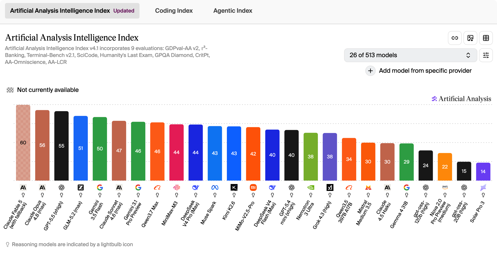

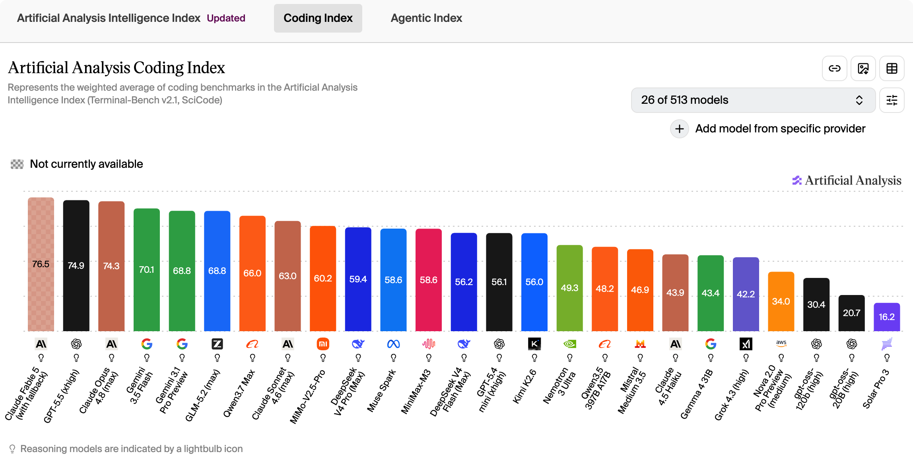

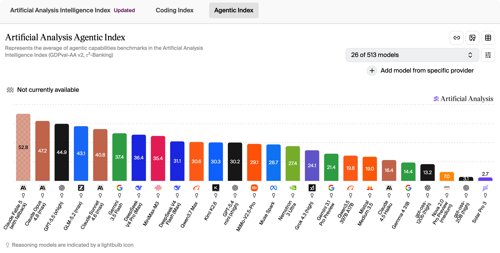

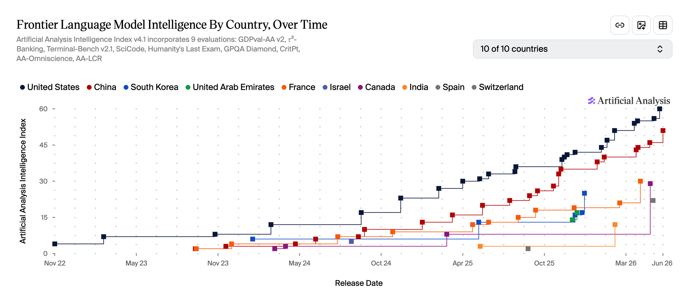

### 二、Agent 框架

Claude Code + Fable 5 以 77 分领跑 Coding Agent Index，Codex + GPT-5.5（xhigh）76 分位列第二。

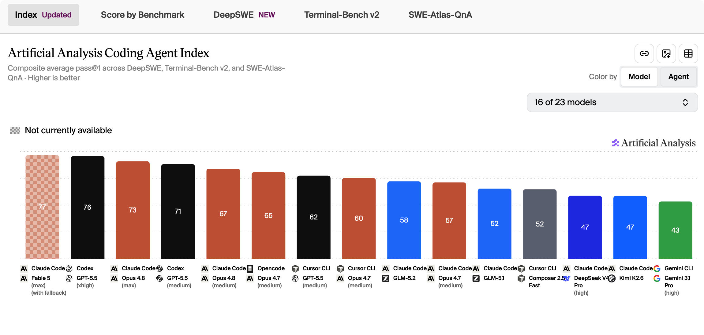

**Harness Comparison 维度下，相同 Opus 4.7（medium）模型在 Opencode、Cursor CLI、Claude Code 三个框架下得分分别为 65、60、57**——底层模型相同，工具链不同导致 8 分差距，"工具即能力"首次以量化方式被验证。**不过 65 > 60 > 57 的排序反直觉：Anthropic 官方 Claude Code 反而低于开源 OpenCode，提示评估体系可能存在偏向性，结果普适性还需更多场景验证**。

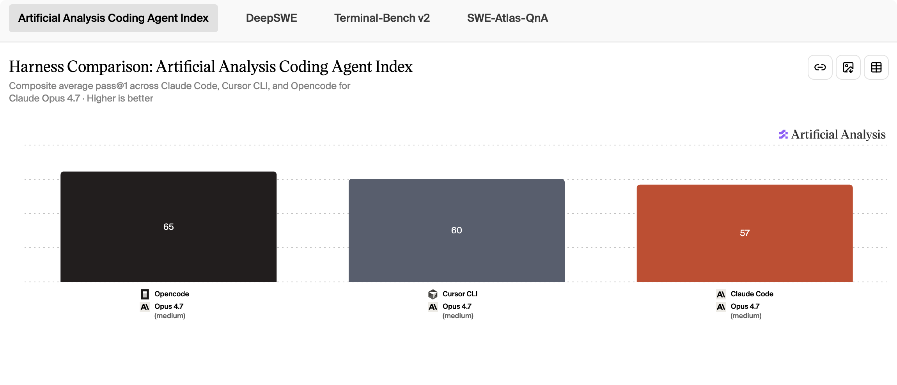

**效率维度，Time per Task 上 Codex + GPT-5.5（medium）6.4 分钟最快，Claude Code + Kimi K2.6 41.2 分钟最慢；Turns per Task 上 Gemini CLI + Gemini 3.1 Pro（high）30.7 回合最少，Claude Code + GLM-5.1 174.3 回合最多**。两个维度都显示国际模型普遍效率优于国产模型，但国产模型在 Coding Agent Index 上绝对分已达 47-58 分区间。

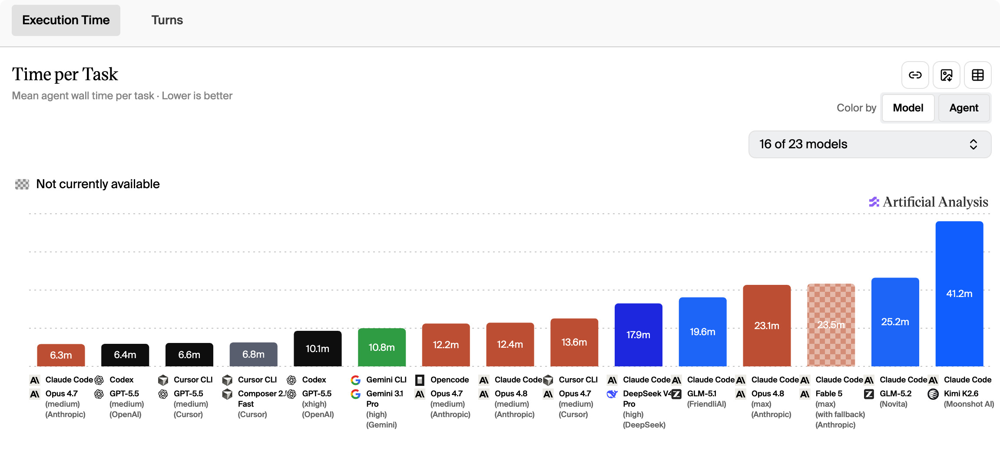

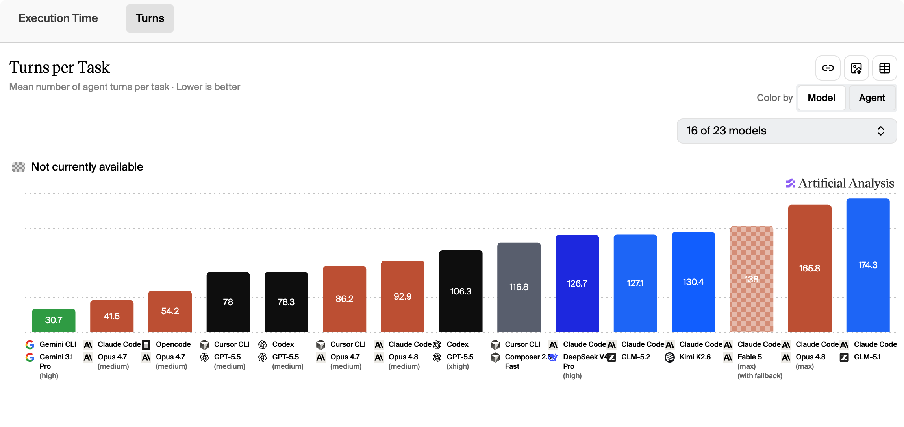

Token Usage 维度，**缓存输入占绝对主导——Claude Code + GLM-5.1 单任务 13.3M tokens 最高**，约为最低消耗模型（2.1M）的 6 倍。GLM-5.2 相对 5.1 已有较大提升，但**输入命中率（缓存读取占比）依然偏低**，是国产模型在 Agent 时代的成本短板。

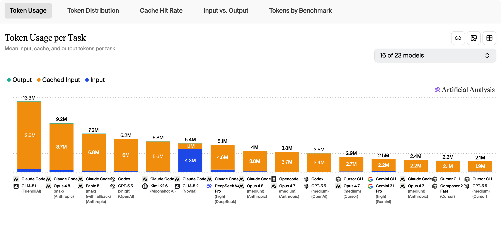

**Coding Agent Index vs. Execution Time 散点图显示：Anthropic 与 OpenAI 占据"高分+短时"的最优象限；Kimi K2.6 执行时间最长（约 42 分钟）但指数分仅约 47，性价比劣势明显**。

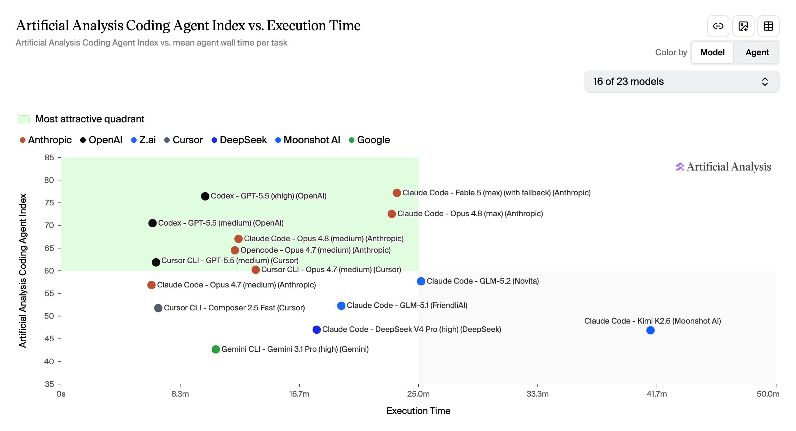

### 三、硬件能效

**GB300-NVL72 在 20 tokens/s SLO 下每瓦并发智能体数 61,354，是 H200 的 23 倍**——硬件代差直接转化为 Agent 部署成本差。

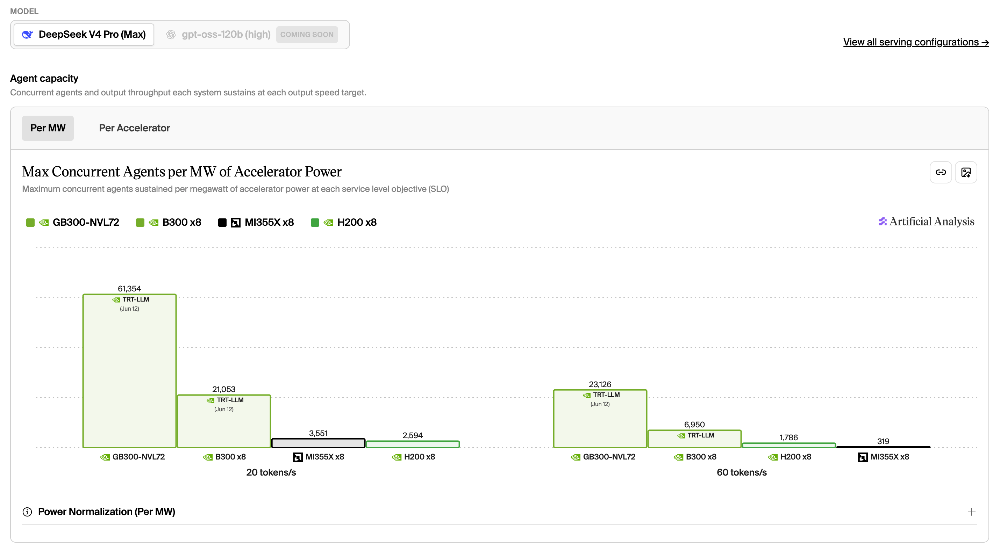

**单卡并发，GB300 单卡 57.5 并发领先，是 B300 的 3 倍以上**。MI355X 与 H200 在 60 tokens/s 的更高速度要求下，每卡仅能维持 0.1-0.9 个并发智能体。

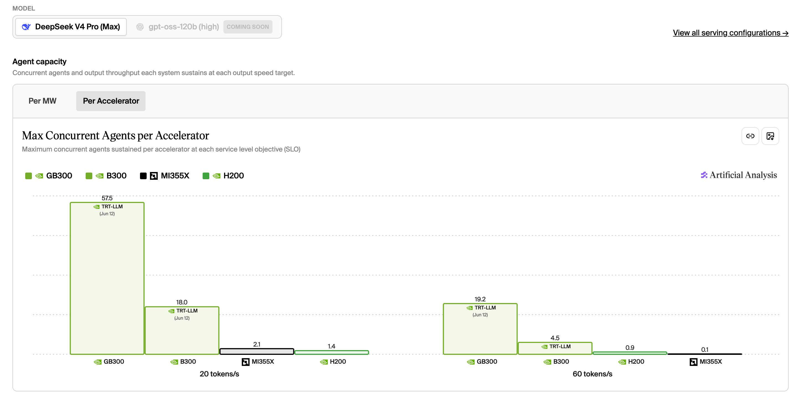

---

## 个人洞察 - AI会走向何方

**科研的边界在哪里？【完】**

上月：OpenAI 通用模型证伪埃尔德什猜想，算力集权在前沿数学中的影响将非常大。莱顿宣言划定 AI 在数学中的边界。

本月：科研属于尖端行业，极可能深度应用AI。

**教育的本质将发生什么改变？**

上月：人力断层。AI 承担初、中级知识工作后，初级从业者失去传统"学徒期"，催生"过渡型人才"。

本月：恰逢高考填志愿，兴趣会变得更加重要。专业+AI是必然趋势。

**国内算力芯片是否会走向自给**

上月：DeepSeek V4 将国产芯片与英伟达 GPU 并列写入验证清单，华为"韬"定律在 3D 堆叠上给出明确路线图。

本月：时间尺度上应该没问题。持续观察。

**AI 的应用边界在哪里 【完】**

本月：高净值和尖端行业深度应用，其他行业应用程度不会非常高。

**强模型会开放吗？【新】**

本月：基于Fable 5和GPT 5.6的限制，个人认为到达这个级别的智能就会受限。不关乎国界和开闭源，均会受到管控。toB（监管下）和toG才能使用该类智能。toC场景当前的模型能力以及基本够用，待市场进一步打磨。

**AI时代什么公司会获利？【新】**

本月：三波浪潮。第一波是开创者，卖铲子（GPU、模型），受益方是NVIDIA和A国模型公司；第二波是卖更便宜的铲子，收益方是卷GPU和模型，以及降低整个成本相关的公司；第三波是卖应用，除了第一波以及第二波的收益方外，还会有垂类智能化转型成功的原有头部公司以及新型Ai-Native公司。

---

## 总结

模型能力已经走到管控点——Fable 5 公开即被下架，OpenAI 同步收紧最强能力的访问范围。**下一个阶段的竞争从"谁的模型更强"转向"谁能稳定、低成本、合规地提供前沿能力"**——比拼的是算力、工具链、部署成本与合规能力的总和。
