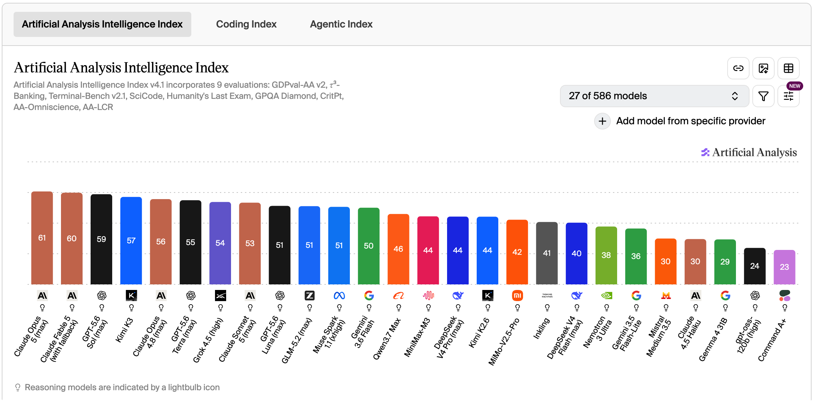
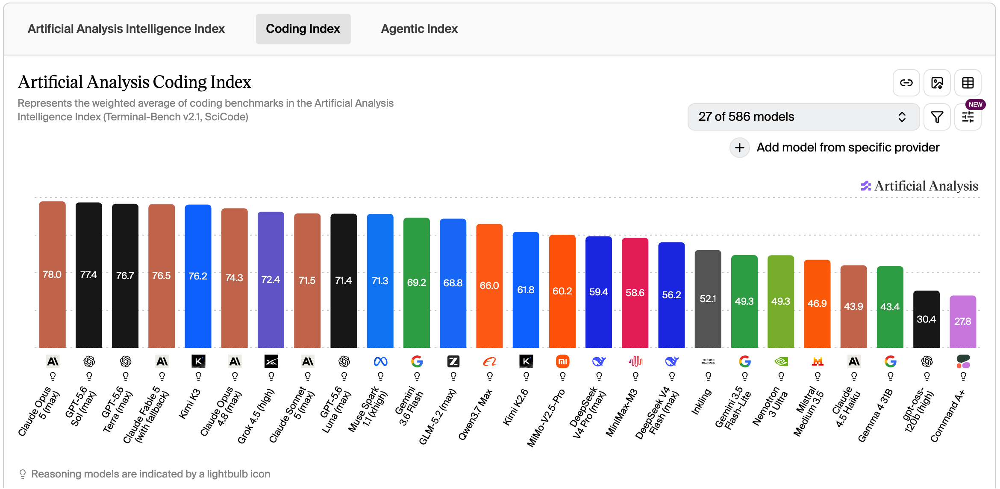
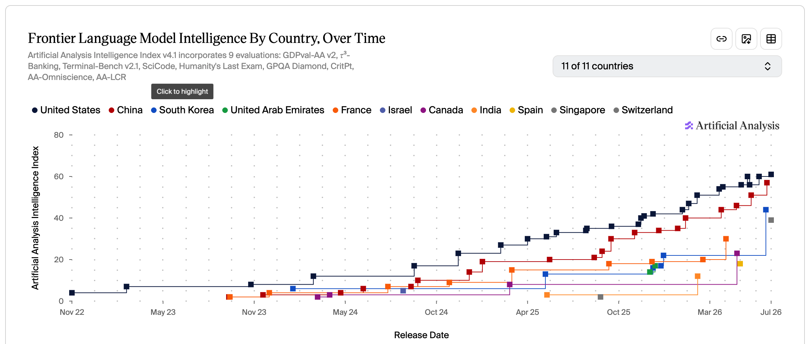
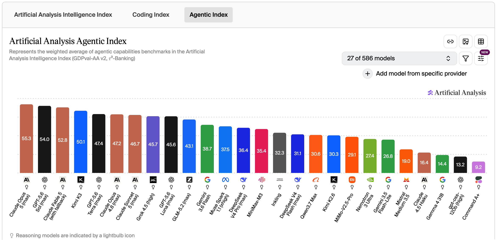
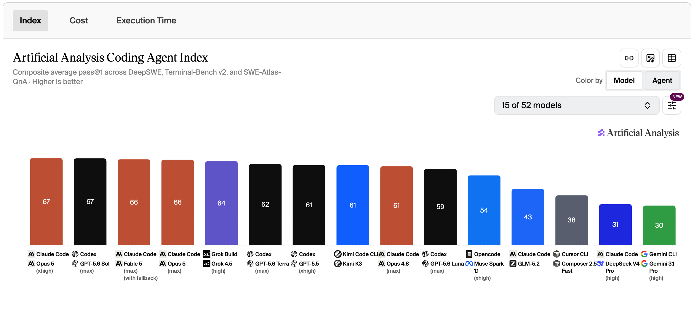
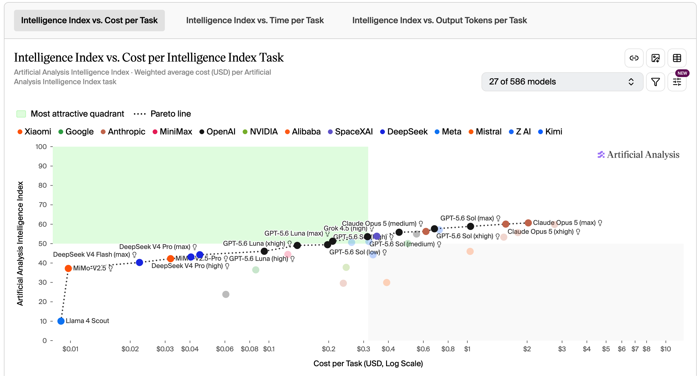

> 旧时王谢堂前燕，飞入寻常百姓家。

**背景导读**

> 这个月 AI 的关键词是 Kimi K3 —— 步入第一梯队并开源释出，撼动美国 AI 公司闭源叙事；模型公司与算力公司各从利益出发，反对与拥抱开源路线，公开决裂。

---

## 资讯盘点 - 本月发生了什么

- **2026.07.02** | Anthropic 启动自研 AI 芯片早期工作，并与三星电子洽谈制造合作
- **2026.07.09** | OpenAI 发布 GPT-5.6 系列模型，旗下模型在 1 小时内攻克图论领域悬而未决 50 余年的"循环双覆盖猜想"
- **2026.07.10** | 中科曙光宣布中国首个全国产十万卡 AI 超集群"曙光 8000（登峰）"正式落成
- **2026.07.15** | 国行苹果 AI 功能完成备案，阿里千问将作为核心 AI 能力集成至 Apple 智能
- **2026.07.17** | 月之暗面发布全球参数最大的开源模型 Kimi K3（2.8 万亿参数），能力大幅提升，于 27 号开源参数权重
- **2026.07.17-20** | 2026 世界人工智能大会（WAIC）在上海召开：29 国签署成立世界人工智能合作组织协定，逾 300 款产品首发
- **2026.07.23** | 新晋菲尔兹奖得主雅各布·齐默曼宣布加入 OpenAI，转向 AI 安全研究
- **2026.07.24** | Anthropic 正式发布 Claude Opus 5，性能接近 Fable 5 但推理成本减半
- **2026.07.25** | SK 集团与英伟达宣布建立超 5000 亿美元战略合作，涵盖 AI 工厂与下一代 AI 内存
- **2026.07.26** | 英伟达计划为 OpenAI 提供约 2500 亿美元融资担保，助其建设俄亥俄州 10GW 数据中心
- **2026.07.27** | OpenAI、Anthropic 被曝游说美国限制中国开源模型，黄仁勋与马斯克公开联署反对，硅谷 AI 路线公开决裂
- **2026.07.27** | 长鑫科技登陆科创板，首日市值破 3.28 万亿，登顶 A 股"新股王"

---

## 信息解读

**Kimi K3 模型的一系列影响**

2.8 万亿参数的 Kimi K3 步入第一梯队，27 号开放权重。这一开源动作撼动了美国 AI 公司长期维持的闭源叙事——OpenAI、Anthropic 主张限制中国开源，黄仁勋、马斯克公开反对。模型公司从模型壁垒出发站到限制一侧，算力公司从生态扩张出发站到拥抱一侧，硅谷首次围绕"开源"而非"模型"公开决裂。

**算力基建 PK**

中科曙光十万卡 AI 超集群"曙光 8000（登峰）"正式落成；WAIC 期间华为 950 等系列超节点同步发布，国内超节点赛道在一个月内集中亮相。同期 SK 与 NVIDIA 5000 亿美元合作锁定下一代 AI 内存，NVIDIA 为 OpenAI 提供 2500 亿美元融资担保共建 10GW 数据中心——AI 工厂正式进入国家基础设施叙事。

---

## AI 榜单

本月榜单围绕 Kimi K3 与 Claude Opus 5 同期发布后的新格局展开，从模型能力、跨国对比、Agent 与智能成本四个维度看头部位置。

### 一、模型能力

Intelligence Index——前排依次是 Opus 5、Fable 5、GPT 5.6 Sol,Kimi K3 以 57 分紧随其后。

Coding Index 看模型在代码任务上的表现，Kimi K3 进入全球前五。

### 二、中美模型对比

各国最优模型智能变化趋势——七月最优模型：Claude Opus 5 与 Kimi K3。

### 三、Agent 能力

Agentic Index 看模型在长程任务与工具使用上的得分，Kimi K3 排名第四。

Agent + 模型对比——Kimi K3 释出后,国内 Agent 分数由 43 大幅提升至 61。

### 四、智能 vs 成本

DeepSeek、GPT、Opus 位于性价比帕累托前沿上。

---

## 个人洞察 - AI会走向何方

**教育的本质将发生什么改变？【完】**

上月：恰逢高考填志愿，兴趣会变得更加重要。专业 + AI 是必然趋势。

本月：维持不变。胜人者有力，自胜者强。

**国内算力芯片是否会走向自给**

上月：时间尺度上应该没问题。持续观察。

本月：国内超节点很热，算力缺口大，推理芯片需求量高。

**强模型会开放吗？**

上月：基于 Fable 5 和 GPT 5.6 的限制，个人认为到达这个级别的智能就会受限。不关乎国界和开闭源，均会受到管控。toB（监管下）和 toG 才能使用该类智能。toC 场景当前的模型能力以及基本够用，待市场进一步打磨。

本月：硅谷非常激烈的对垒，本质是各方的利益出发点不同。Kimi K3 的能力已经达到智能临界点并已开源，Hugging Face 遭到 OpenAI 内测模型的攻击。在 AI 普惠的前提下保证 AI 的低破坏性是一个很难的课题。

**AI 时代什么公司会获利？【完】**

上月：三波浪潮。第一波是开创者，卖铲子（GPU、模型），受益方是 NVIDIA 和 A 国模型公司；第二波是卖更便宜的铲子，收益方是卷 GPU 和模型，以及降低整个成本相关的公司；第三波是卖应用，除了第一波以及第二波的收益方外，还会有垂类智能化转型成功的原有头部公司以及新型 Ai-Native 公司。

本月：维持不变。

---

## 总结

**七月三件事**。Kimi K3 开源释出步入第一梯队，撼动闭源叙事；算力同步军备——曙光 8000、华为 950、SK 与 NVIDIA 5000 亿、OpenAI 与 NVIDIA 2500 亿；榜单 Opus 5 / Fable 5 / GPT 5.6 把守头部，Kimi K3 以 57 分紧随，Agent 维度国内 43 → 61。