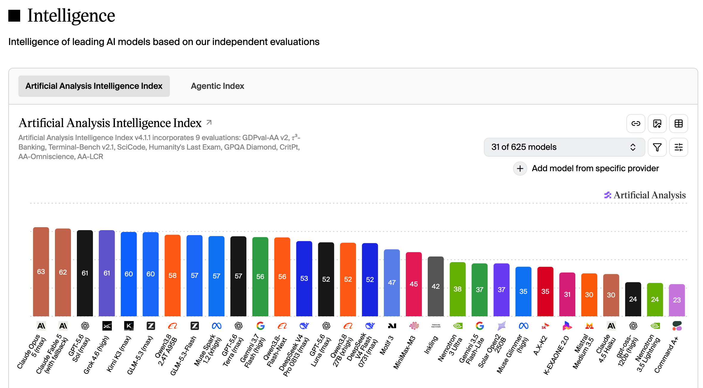

**背景导读：**

> 这个月 AI 的关键词是百花齐放。DeepSeek、Qwen、GLM 等国内模型密集发布，Stripe、英伟达、苹果等巨头也在上下游同月落子。这篇月报盘点 8 月的 14 条关键资讯，并聊聊算力自给、强模型开放与全新市场三个走向。

金句：忽如一夜春风来，千树万树梨花开。

# 资讯盘点 - 本月发生了什么

- 2026.08.06 | 谷歌AI部门大洗牌：哈萨比斯卸任日常管理，首席科学家杰夫·迪恩离职创业
- 2026.08.07 | OpenAI宣布暂停Astra模型开发，因AI模型达到“关键网络安全”门槛
- 2026.08.13 | DeepSeek V4 Pro 正式版深夜上线，Harness 开发者预览版正式开源
- 2026.08.14 | 苹果联合阿里巴巴为中国市场训练专属大模型
- 2026.08.17 | 支付巨头Stripe以超70亿美元收购AI基础设施公司OpenRouter
- 2026.08.17 | AI编程平台Cursor推出代码托管平台Origin，对标GitHub
- 2026.08.22 | Anthropic从谷歌挖来TPU项目创始高管，推动自研芯片战略
- 2026.08.25 | 苹果发布M5 Ultra和M6芯片，强化设备端AI生态
- 2026.08.26 | 阿里发布 Qwen3.8-Flash-Next，Qwen4架构先导预览版
- 2026.08.26 | 智谱开源 GLM-5.3-Flash，GLM-5系列首个原生多模态模型
- 2026.08.27 | 英伟达据悉以129亿美元收购开源AI平台Hugging Face
- 2026.08.28 | Anthropic据悉最早10天后公布IPO招股书
- 2026.08.31 | MiniMax H3 Max 正式上线，解锁 AI 实时直播场景
- 2026.08.31 | OpenAI 购入数万台 Mac 用于 AI 强化学习与智能体训练

# 信息解读

- **模型迭代加速**：DeepSeek V4 Pro、Qwen3.8-Flash-Next、GLM-5.3-Flash、MiniMax H3 Max 在一个月内密集上线，国内厂商是本月发布的绝对主力。
- **上下游生态**：Stripe 收购 OpenRouter、Cursor 推出 Origin、英伟达收购 Hugging Face、OpenAI 购入数万台 Mac 用于训练——支付、工具、芯片厂商都在向 AI 的上下游延伸卡位。
- **AI公司自研芯片**：Anthropic 挖来谷歌 TPU 项目创始高管，苹果 M5 Ultra/M6 强化设备端 AI，自研芯片正在成为大厂的标配动作。

# AI榜单

Artificial Analysis 智能指数（综合 9 项评测）：Claude Opus 5 以 63 分居首，但第 3 到第 12 名挤在 61~56 的窄带里。国产模型贴身紧咬——Kimi K3、GLM-5.3 双双 60 分，距 GPT-5.6 Sol、Grok 4.6 仅 1 分；本月新发的 Qwen3.8-Flash-Next、GLM-5.3-Flash、DeepSeek V4 Pro 也全部在榜。百花齐放，在这张图上非常直观。

# 个人洞察 - AI会走向何方

**国内算力芯片是否会走向自给**

上月：国内超节点很热，算力缺口大，推理芯片需求量高。

本月：AI公司自研芯片是一个大趋势，也是一种自给形态。观望国内AI公司是否有芯片新进展。

**强模型会开放吗？**

上月：硅谷非常激烈的对垒，本质是各方的利益出发点不同。Kimi K3的能力已经达到智能临界点并已开源，Hugging Face遭到OpenAI内测模型的攻击。在AI普惠的前提下保证AI的低破坏性是一个很难的课题。

本月：Astra模型暂停；前沿模型Qwen3.8 GLM5.3均以开源；开放依然有高风险，兼顾普惠和降风险依然是一个很难的课题。

**是否会出现全新的市场？**【新】

本月：MInimax H3做到Live很有趣，可能会催化新的直播形态出现。个人这几年一直看好娱乐业的发展，AI的引入大可以重启元宇宙。

# 总结

本月最直观的感受是国内模型的百花齐放：DeepSeek、Qwen、GLM 接力发布，榜单上与国际头部的差距已缩到个位数。其次是自研芯片的趋势愈发清晰，从 Anthropic 到苹果都在把算力命脉握回自己手里，国内的算力自给值得持续观望。最后是 MiniMax H3 Max 的 Live 能力，实时交互可能催化全新的直播与娱乐形态，这或许是一个全新市场的起点。
