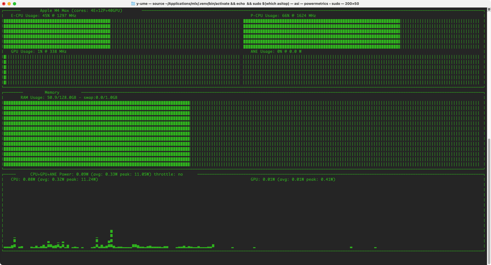
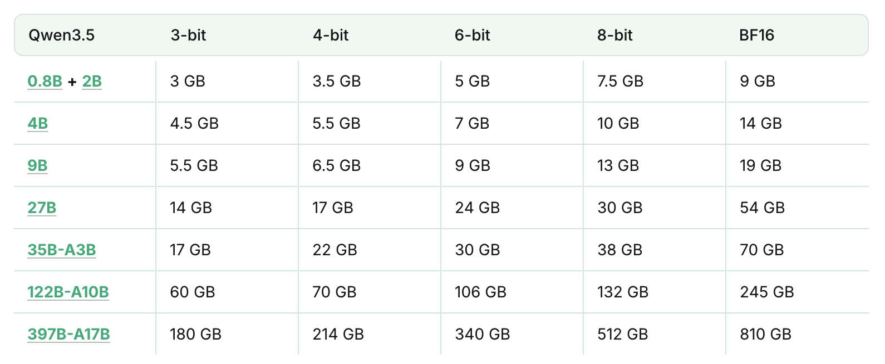
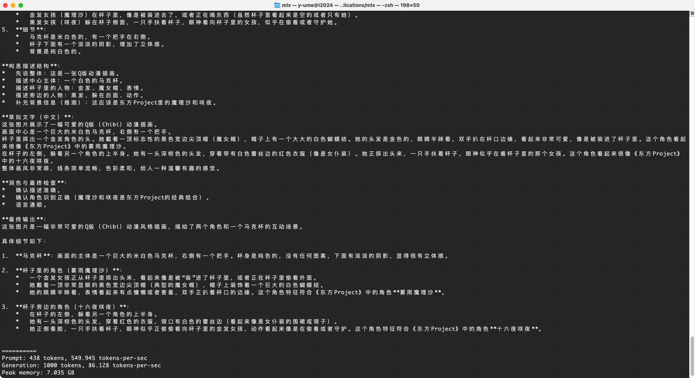
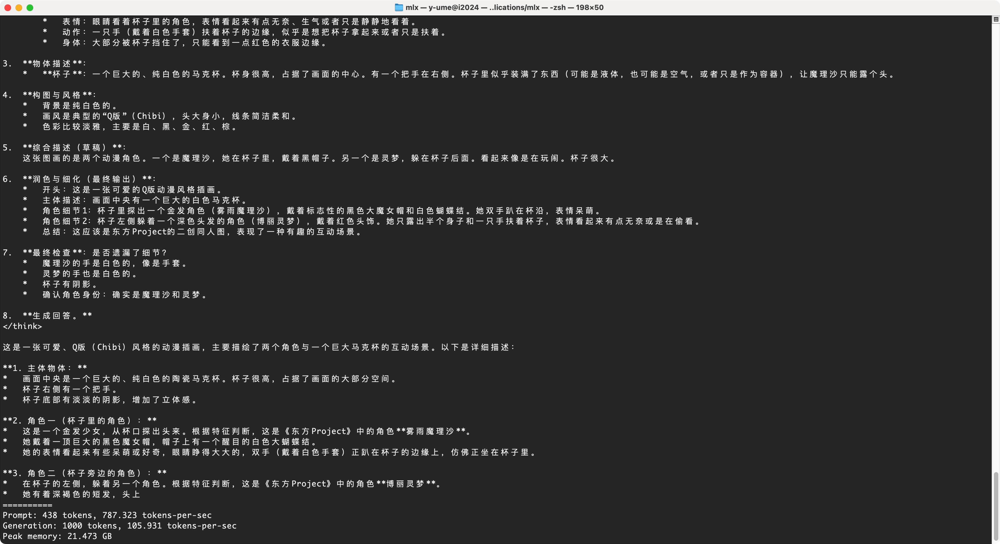
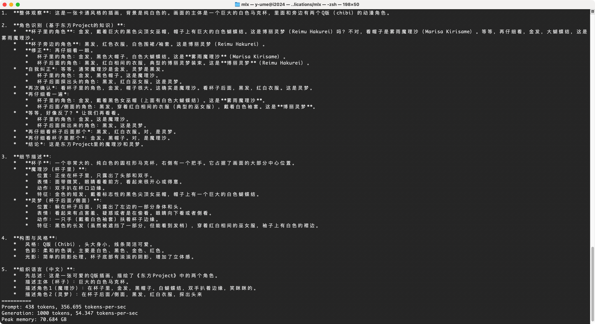

import { Image } from 'astro:assets';
import testPic from './test.jpg';

> 提高认知的一种方式是在可控的范围内多试错

实践部分分为两个系列：DeepDive（深潜）会进行深度的研究和探索，有一定门槛；Surfing（冲浪）会体验最新的玩意儿，门槛较低。

**背景：**

> 恰逢苹果 M5 芯片系列发布，搭载 M5 Ultra 的 Mac Studio 也备受期待。看着手中前年购入的 M4 MacBook Pro，不忍其强大的 GPU 长期闲置，于是决定充分调用它的剩余算力，进行一次本地大模型的部署实践。

## Step 1：方案选型

### 性能特征速查表

| **性能维度**         | **Ollama (llama.cpp)** | **MLX**              |
| ---------------- | ---------------------- | -------------------- |
| **每秒生成速度**       | 优秀                     | **极致** (完美契合 M 系列芯片) |
| **首字响应延迟 (长文本)** | **极快** (C++ 极致优化)      | 较快                   |
| **框架内存开销**       | **极低** (无冗余)           | 偏高 (存在 Python 开销)    |
| **多模型并发支持**      | **极佳** (自动管理显存置换)      | 一般 (需要手动写代码分配)       |

```txt title="➤ 决策" ins={1}
选择：MLX
✓ 生态前景好
✓ 低层优化更好
✓ 当前不涉及多模型并发场景
```

## Step 2：部署 MLX

```txt title="➤ 思考" ins={1}
使用 uv 管理 Python 环境
✓ 隔离简单又干净
✓ 装环境恐惧症患者的福音
```

```txt title="➤ 实施步骤"
# 安装 uv
curl -LsSf https://astral.sh/uv/install.sh | sh

# 创建目录
mkdir mlx && cd mlx

# 创建虚拟环境
uv venv

# 激活环境
source .venv/bin/activate

# 安装 mlx 库
uv pip install mlx-lm
```

## Step 3：测试模型

```txt title="➤ 思考" ins={1}
选择测试模型：mlx-community/Qwen3.5-9B-MLX-4bit
✓ 9B 参数量适中，适合快速验证
✓ 4bit 量化，内存占用低
✓ 模型较新，支持多模态
```

```txt title="➤ 实施步骤"
# 多模态需要用 mlx-vlm 启动，可能多装了
uv venv --python 3.11
uv pip install --upgrade mlx mlx-vlm mlx-lm
uv pip install torch torchvision

mlx_vlm.generate \
  --model mlx-community/Qwen3.5-9B-MLX-4bit \
  --image test.jpg \
  --prompt "请详细描述一下这张图片里的内容。" \
  --max-tokens 5000
```

```txt title="📊 性能数据"
Prompt: 438 tokens, 565.461 tokens-per-sec
Generation: 1297 tokens, 86.367 tokens-per-sec
Peak memory: 7.035 GB
```

```txt title="📁 模型存储位置"
下载的模型会存储在：
~/.cache/huggingface/hub/
```

## Step 4：查看内存消耗

```txt title="➤ 思考" ins={1}
监控内存消耗的两种方式
✓ 活动监视器：快速直观，适合初步观察
✓ asitop：专业工具，详细分析 GPU/CPU/内存
```

```txt title="➤ 方式 1：活动监视器"
# 打开活动监视器
# 肉眼观察 python 进程
```

```txt title="➤ 方式 2：asitop（推荐）"
uv pip install asitop
sudo asitop
```

### asitop 界面说明



实时监控 M4 Max 的 CPU/GPU/内存占用及功耗数据

**界面指标说明：**
- **E-CPU/P-CPU**：能效核/性能核使用率及频率
- **GPU**：图形处理器使用率
- **Memory**：内存占用（示例：50.9/128.0GB）
- **Power**：CPU+GPU+ANE 实时功耗及峰值

## Step 5：模型对比

**测试环境：** Apple M4 Max 128GB 内存

**测试模型：** Qwen3.5系列

### Qwen3.5 显存需求参考

Qwen3.5 模型的显存需求如下，图片横轴表示不同的量化策略（3-bit/4-bit/6-bit/8-bit/BF16），数据来自 Unsloth：

**Unsloth:** https://unsloth.ai/docs/models/qwen3.5



### MLX Community 模型性能实测

**MLX Community:** https://huggingface.co/mlx-community

MLX Community 是维护 Mac 开源大模型生态的社区，以下为在 Apple M4 Max 128GB 内存环境下的实测性能数据：

| 模型                                   | Prompt(tokens-per-sec) | Generation(tokens-per-sec) | Peak memory(GB) |
| ------------------------------------ | ---------------------- | -------------------------- | --------------- |
| mlx-community/Qwen3.5-9B-MLX-4bit    | 565.461                | 86.36                      | 7.035           |
| mlx-community/Qwen3.5-27B-bf16       | 215.983                | 8.907                      | 55.801          |
| mlx-community/Qwen3.5-122B-A10B-4bit | 317.060                | 54.038                     | 70.70           |
| mlx-community/Qwen3.5-27B-4bit       | 207.207                | 28.067                     | 17.346          |
| mlx-community/Qwen3.5-35B-A3B-4bit   | 783.781                | 110.743                    | 21.473          |

### 本地实测结果

**测试图片：**
<Image src={testPic} width={100} alt="测试图片" />

**测试场景：** 使用个人常用头像进行多模态识别测试

**9B 模型：**

❌ 无法正确识别头像中的角色

**35B 模型：**

✅ 可识别，输出详细准确
- 生成速度：105.931 tokens/s
- 峰值内存：21.473 GB

**122B 模型：**

✅ 可识别，输出详细准确
- 生成速度：54.347 tokens/s
- 峰值内存：70.684 GB

**小结：** 本次简单测试中，9B 模型未能识别头像角色，35B 和 122B 模型均可正确识别

## 结语

MLX是M系列芯片当前部署LLM的最优解，契合Apple Silicon架构，在生成速度和内存管理之间取得了最佳平衡。

**后续折腾方向：**

1. **vLLM生态** - vLLM有兼容MLX的项目，但当前还没有适配Qwen3.5
2. **新模型持续对比** - 关注其他更优开源大模型的发布
3. **Agentic工具集成** - 利用本地模型构建个人AI服务，实现数据不出设备的隐私保护
   1. 当前的方案对于生成任务可以胜任，也可以和OpenCode和Claude Code打通流程
   2. 但是在并发和性能上还有很多不足，在信息不敏感的情况下使用服务商的API是当前最优解
