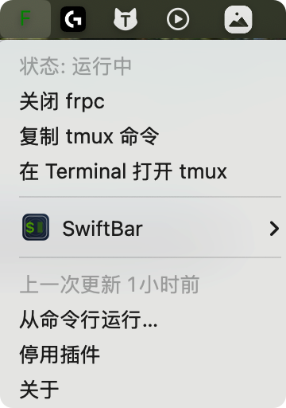

> 一切的开始，不过是一台安静的电脑和一个被墙的世界。

**背景：**

> 在使用 Claude Code 时，我们希望 AI 能交付端到端的结果，同时希望任务可以不被本机影响、也不获取本机的敏感信息。因此将 AI 部署在独立的远程服务器上，是更合理的方案。本文记录了搭建远程开发环境的完整流程，从购买 VPS、配置代理，到安装 OhMyZsh、部署 Claude Code，最后通过 FRP 实现内网穿透。

---

## Step 1：上网部署

整个链路的前提是**能科学上网**。这一 Step 解决的是服务器访问境外资源的问题，否则后续依赖都无法下载。

### 1.1 VPS 选购

年费 $39.99，每月 1T 流量，支持支付宝。因合规原因不做深入展开。

### 1.2 V2Ray 安装

ssh 登录服务器后，执行官方安装脚本：

```txt title="➤ V2Ray 安装"
ssh root@{服务器IP}
bash <(wget -qO- -o- https://git.io/v2ray.sh)
```

### 1.3 域名与 DNS 策略

先用域名作为接入层，Cloudflare 作为 DNS 和代理：

在 Godaddy 购买域名（示例：`underlaminar.com`），Cloudflare 添加 DNS A 记录指向服务器 IP（代理关闭），Godaddy 变更 Nameservers 指向 Cloudflare，SSL/TLS 加密设置为"完全开启"。

### 1.4 远端服务器部署

ssh 登录服务器后，执行官方安装脚本：

```txt title="➤ V2Ray 安装"
ssh root@{服务器IP}
bash <(wget -qO- -o- https://git.io/v2ray.sh)
```

### 1.5 开发服务器部署

因为开发服务器网络受限，无法直接下载资源，这里是整个流程中最折腾的部分。最终借助 Gemini 的对话能力，通过 Vibe Deploying 方式完成部署：

1. 放弃失效脚本，切换纯手工模式
2. 修正服务路径与组件搬运
3. 解析节点与手写核心配置
4. 注入全局环境变量开关
5. 服务测试与固化
---

## Step 2：Shell 环境优化

### 2.1 安装 Oh My Zsh

```txt title="➤ 安装 zsh 和 Oh My Zsh"
sudo dnf install -y zsh curl git
chsh -s $(which zsh)
sh -c "$(curl -fsSL https://raw.githubusercontent.com/ohmyzsh/ohmy-zsh/master/tools/install.sh)"
```

### 2.2 .zshrc 核心配置

```txt title="~/.zshrc 关键配置"
# 目录与清理别名
alias .="cd .."
alias cl="clear"

# 语言环境
export LANG="en_US.UTF-8"
export LC_ALL="en_US.UTF-8"

# Oh My Zsh
export ZSH="$HOME/.oh-my-zsh"
ZSH_THEME="mystyle"
plugins=(git z)
source $ZSH/oh-my-zsh.sh

# 代理开关
export PROXY_MARKER=""
alias proxy="export https_proxy=http://127.0.0.1:5678 http_proxy=http://127.0.0.1:5678 all_proxy=http://127.0.0.1:5678 PROXY_MARKER='%F{black}%K{green} ✈️ PROXY %k%f ' && echo '🟢 Proxy ON'"
alias unproxy="unset http_proxy https_proxy all_proxy && export PROXY_MARKER='' && echo '🔴 Proxy OFF'"

# Claude API 配置
alias cc='env CLAUDE_CODE_DISABLE_NONESSENTIAL_TRAFFIC=1 \
  ANTHROPIC_BASE_URL="https://api.minimaxi.com/anthropic" \
  ANTHROPIC_API_KEY="你的密钥" \
  ANTHROPIC_MODEL="你的模型" \
  claude'

# nvm
export NVM_DIR="$HOME/.nvm"
[ -s "$NVM_DIR/nvm.sh" ] && \. "$NVM_DIR/nvm.sh"
[ -s "$NVM_DIR/bash_completion" ] && \. "$NVM_DIR/bash_completion"
```

### 2.3 自定义主题

将 `mystyle.zsh-theme` 放置到 `~/.oh-my-zsh/themes/`:

```txt title="mystyle.zsh-theme"
PROMPT='${PROXY_MARKER}'"%(?:%{$fg_bold[green]%}%1{➜%} :%{$fg_bold[red]%}%1{➜%} ) (%n)%{$fg[cyan]%}%c%{$reset_color%}"
PROMPT+=' $(git_prompt_info)'

ZSH_THEME_GIT_PROMPT_PREFIX="%{$fg_bold[blue]%}git:(%{$fg[red]%}"
ZSH_THEME_GIT_PROMPT_SUFFIX="%{$reset_color%} "
ZSH_THEME_GIT_PROMPT_DIRTY="%{$fg[blue]%}) %{$fg[yellow]%}%1{✗%}"
ZSH_THEME_GIT_PROMPT_CLEAN="%{$fg[blue]%})"
```

开启代理后，终端提示符左侧会显示绿色 `✈️ PR0XY` 徽章，直观提示当前环境已开启网络代理：


---

## Step 3：Claude Code 部署

### 3.1 nvm 与 Node.js

```txt title="➤ nvm 和 Node.js 安装"
curl -o- https://raw.githubusercontent.com/nvm-sh/nvm/v0.39.7/install.sh | bash
source ~/.zshrc
nvm install 20
node -v
npm -v
```

### 3.2 Claude Code 启动

安装完成后，直接使用 `cc` 即可启动，API 配置已全部内嵌在 `.zshrc` 的 alias 中。

```txt title="➤ 启动 Claude Code"
cc
```

---

## Step 4：内网穿透

通过 FRP 实现外部电脑 SSH 远程访问内网服务器，整体架构为：本地 → 阿里云 FRPS（中转）→ 开发机 FRPC。

### 4.1 FRPS 服务端（阿里云）

购买阿里云 99 套餐，在阿里云服务器部署 FRPS。阿里云支持原生的 Agent 模式，命令行和 Chat 可以在同一个窗口同时进行，可以愉快地和 AI 对话完成部署：

```txt title="➤ frps.toml（阿里云）"
bindPort = 7000
auth.token = "复杂密钥1"
```

阿里云安全组入方向添加端口 **7000** 规则。


### 4.2 FRPC 客户端（服务器）

在开发机（Hostdare VPS）部署 FRPC，将本地 SSH（127.0.0.1:22）通过 STCP 暴露给阿里云：

```txt title="➤ frpc.toml（开发机）"
serverAddr = "公网IP"
serverPort = 7000
auth.token = "复杂密钥1"

[[proxies]]
name = "p2p_ssh"
type = "stcp"
secretKey = "复杂密钥2"
localIP = "127.0.0.1"
localPort = 22
```

### 4.3 FRPC 客户端（本机）

本地部署 FRPC，通过 STCP visitor 模式连接至开发机：

```txt title="➤ frpc.toml（本机）"
serverAddr = "公网IP"
serverPort = 7000
auth.token = "复杂密钥1"

[[visitors]]
name = "p2p_ssh"
type = "stcp"
secretKey = "复杂密钥2"
serverName = "p2p_ssh"
bindAddr = "127.0.0.1"
bindPort = 6000
```

### 4.4 远程访问

```txt title="➤ 启动与连接"
# 开发机启动 FRPC
frpc -c frpc.toml

# 本机启动 FRPC
frpc -c frpc.toml

# 本机 SSH 连接（通过 127.0.0.1:6000 经阿里云中转至开发机）
ssh -p 6000 {账号}@127.0.0.1
```

---

## Step 5：账号与 SSH 管理

### 5.1 创建用户（服务器）

```txt title="➤ 服务器：创建账号"
sudo useradd -m newuser
sudo passwd newuser
```

### 5.2 SSH 密钥配置（本机）

```txt title="➤ 本机：生成密钥对"
ssh-keygen -t ed25519 -f ~/.ssh/{key_name} -C "name"
```

本地 `~/.ssh/config`:

```txt title="~/.ssh/config"
Host {取个名字}
  HostName 127.0.0.1
  Port 6000
  User {newuser}
  IdentityFile ~/.ssh/{key_name}
```

### 5.3 公钥注入（服务器）

```txt title="➤ 服务器：注入公钥"
mkdir -p ~/.ssh
chmod 700 ~/.ssh
vim ~/.ssh/authorized_keys  # 粘贴公钥
chmod 600 ~/.ssh/authorized_keys
```

### 5.4 禁用密码登录（服务器）

编辑 `/etc/ssh/sshd_config`:

```txt title="/etc/ssh/sshd_config 修改"
PasswordAuthentication no
ChallengeResponseAuthentication no
PubkeyAuthentication yes
```

```txt title="➤ 服务器：重启 SSH"
systemctl restart sshd
```

完成后即可通过 `ssh {取个名字}` 无密码登录。

---

## Step 6：体验提升

### 子账号初始化脚本

为子账号编写初始化脚本，一键完成 zsh、Claude Code、SSH 的初始环境配置，省去重复操作。

### Swiftbar FRP 插件

在 Mac 系统中，Swiftbar 可以自定义上边栏按钮。制作一个 FRP 一键关闭和打开的插件，方便控制内网穿透的开关状态。配合 tmux 使用，可以在后台启动 FRP 的同时查看实时日志。



---

## 结语

至此，我们就初步打通了开发环境。整个过程就是如何快速把 Claude Code 部署上，然后配合调试。但是由于几个设备的 AI 不通，还需要大量的手工通信。

AI 的发展让部署的门槛也降低了，基于流程方案（感谢学弟提供的实践），结合 AI 处理各类教程没有提到的问题，可以大大降低部署的挫败感。

**后续方向：**

1. 有了一个安心玩耍的环境后，就可以开始用 AI 做各类尝试
2. 将 AI 能力扩展到手机端
3. 探索更多 AI 进度追踪与交付管理手段
