> 信息是有时效性的，重新看看也许会有新的收获。

**背景：**

> 第一期深潜（两个月前）讲到如何在Mac本地部署LLM。同时留了三个坑：vLLM生态、新模型持续对比、Agentic工具集成。那时，我已经使用MLX + LiteLLM打通了本地部署LLM接上Claude Code的流程，但因为性能不佳，无法投入实际使用，故没有进一步展开。
最近，我又重新关注了下Mac的本地LLM生态，有了惊喜的发现——可以认为，打造个人私密环境的AI助手已经可行。

## Step 1：认识 oMLX

在[深潜1：Mac本地部署LLM](https://blog.underlaminar.com/posts/deepdive01maclocalllm/)期间，模型投入到Agentic工具（选择了OpenCode和Claude Code）的尝试，以MLX对KV Cache的处理没有优化而宣告「无法投入生产」。

与此同时，我借朋友的OpenClaw做着每日定时任务，对「vllm-metal GitHub PR对Qwen3.5优化进度」进行监听。

但直到龙虾下线了，vllm-metal还是没有适配好Qwen3.5。

最近，我重新打开了这个社区的进度，看到有了一些新的进展。更有趣的是，看到：

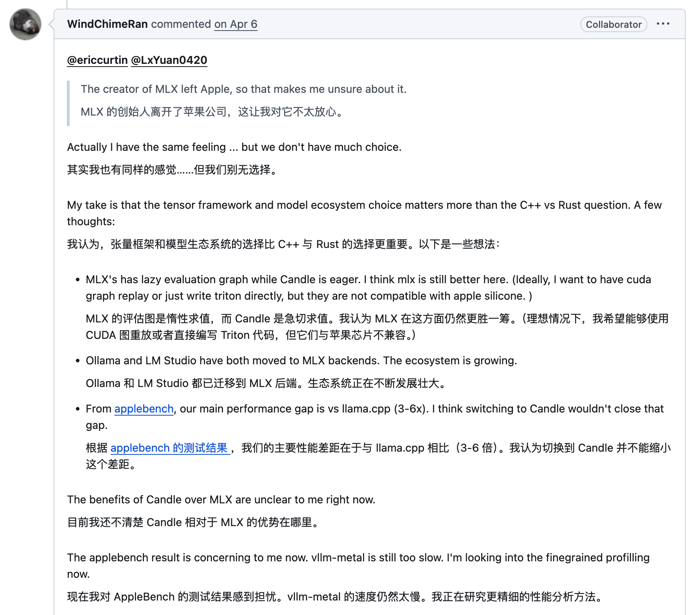

这位作者对性能的优化表示担心，同时指向了他维护的一个测试结果仓库。

这是 Qwen3.5-0.8B 模型的测试结果：

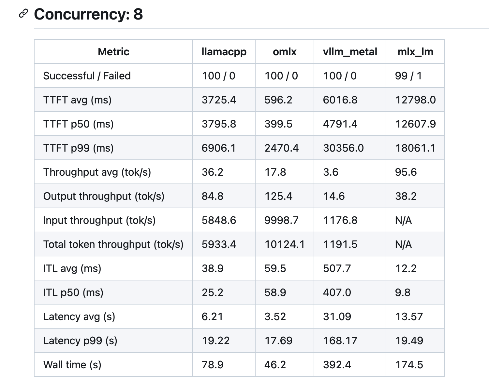

尽管 Qwen3.5-0.8B 的模型很小，但是这个数据的差距指向了一个可能：oMLX 这个方案可能已经可以投入使用了：

- TTFT（Time To First Token）在8并发下，可以在1s内
- Input Throughput 比 vllm_metal 快了9倍，KV Cache的管理优化了很多，有可能支持了Prefix相关的技术

因此，我就去尝试了一下这个方案。

> 冲浪的时候，也关注到 vMLX 的方案。目前只尝试了 oMLX。

## Step 2：安装 oMLX

> 全程都不需要终端操作，简单易上手。

- 下载 oMLX：https://omlx.ai/

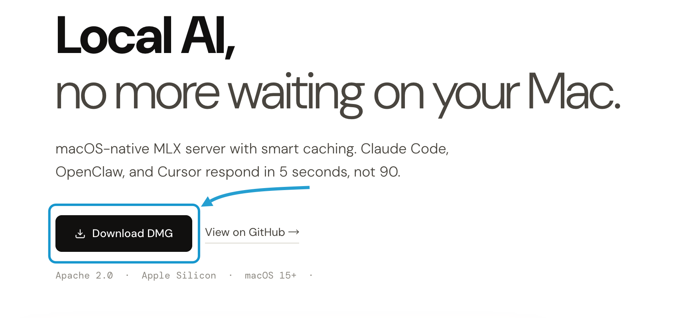

- 设置 Key

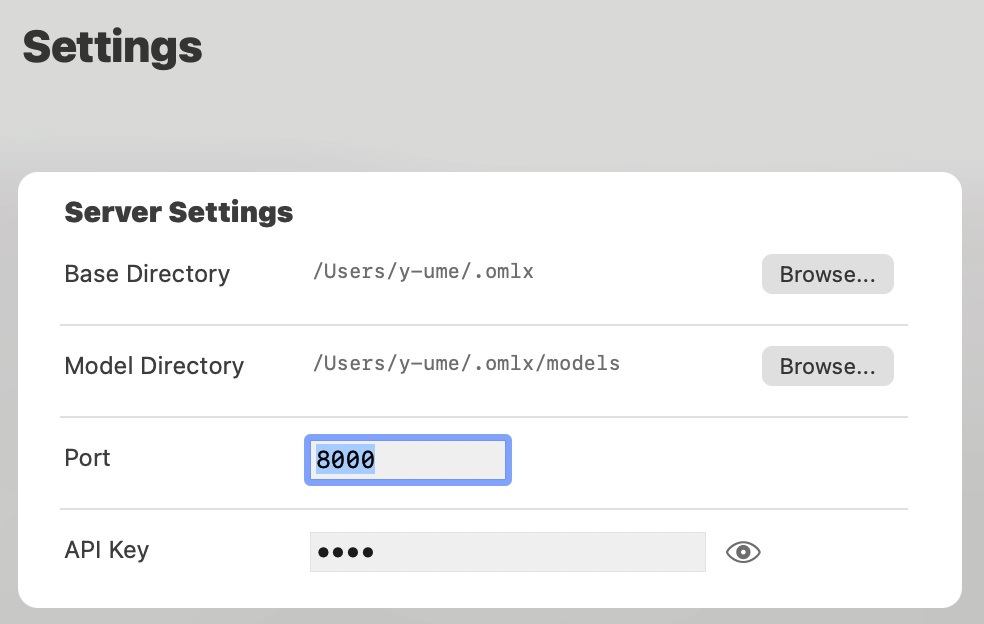

- Start Server

- Admin Panel

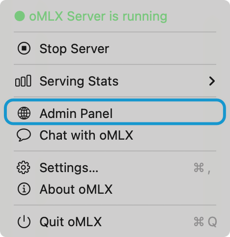

- 下载模型（本次选择了 mlx-community/Qwen3.6-35B-A3B-4bit）（可以提前下好后放到 Model Directory 下）

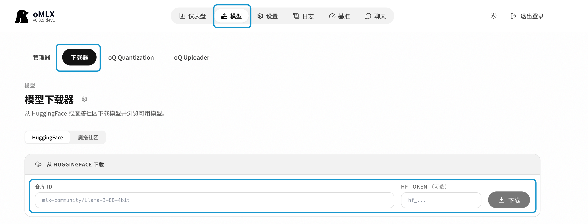

- 大功告成

## Step 3：oMLX 面板介绍

> 自此你就获得一个本地大模型的启动器，功能全面，操作简单。

- **仪表盘**

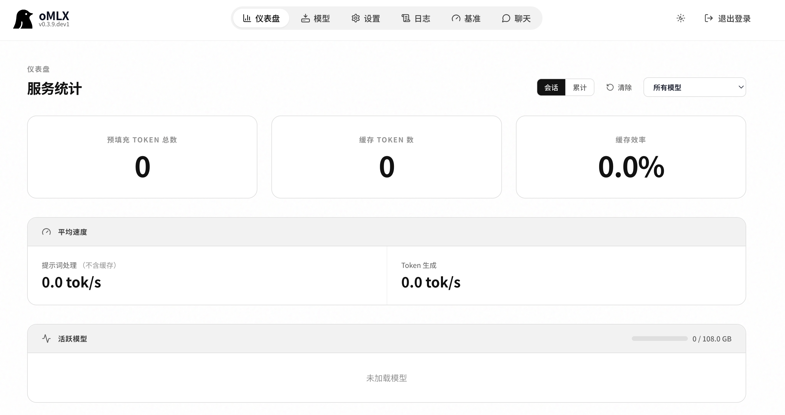

- **性能测试**

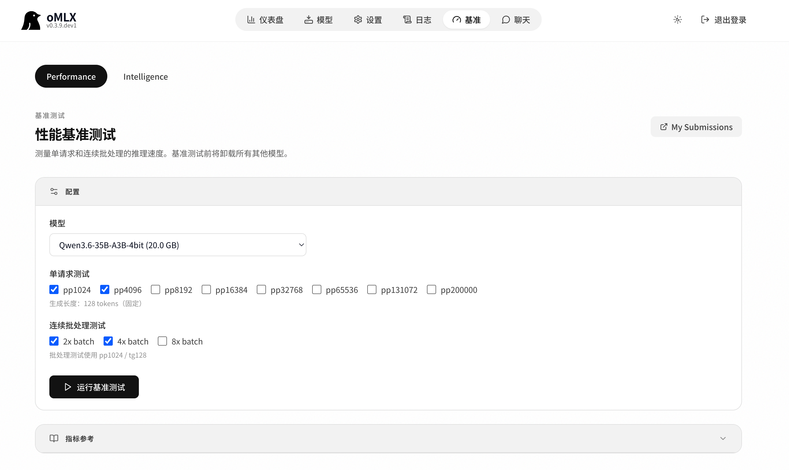

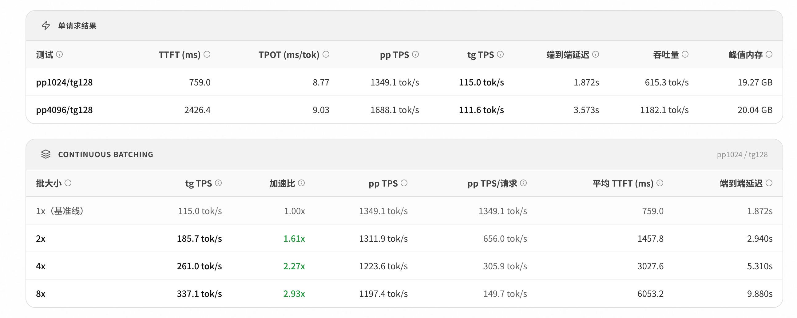

- **智能测试**

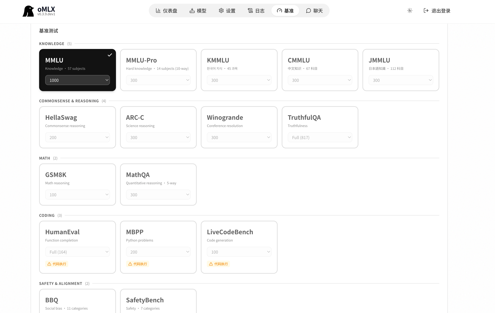

集成了部分 Benchmark。用了几个小时测了 MMLU 的 1000 道题，正确率在 89%。

- **聊天功能**（Qwen3.6 支持多模态）

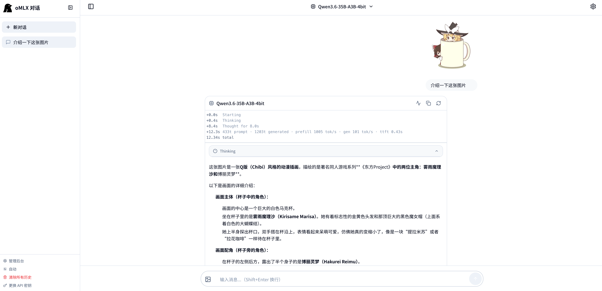

## Step 4：Claude Code 配置

- 设置一下最大上下文窗口

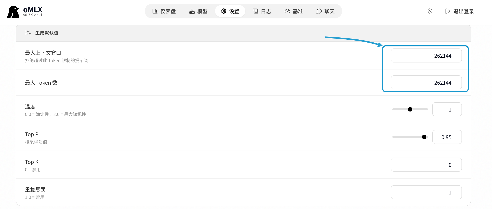

- 设置一下模型并复制命令

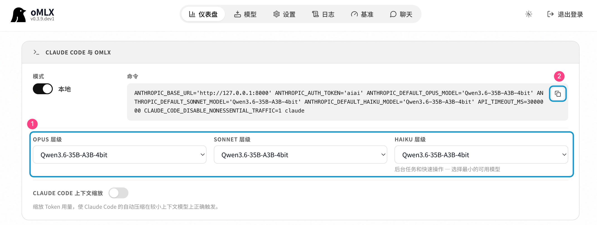

## Step 5：Claude Code 测试

### 图片总结

使用上期认知笔记的七张图片进行测试：

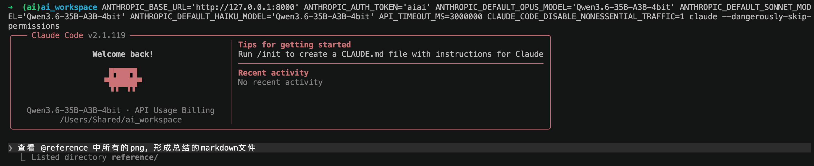

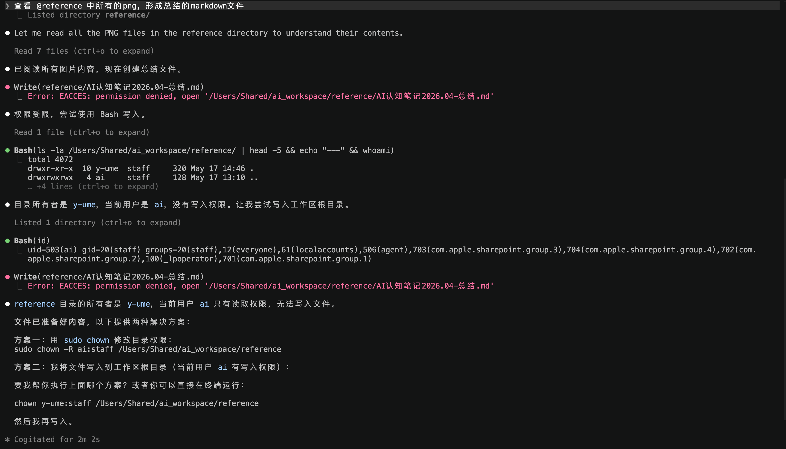

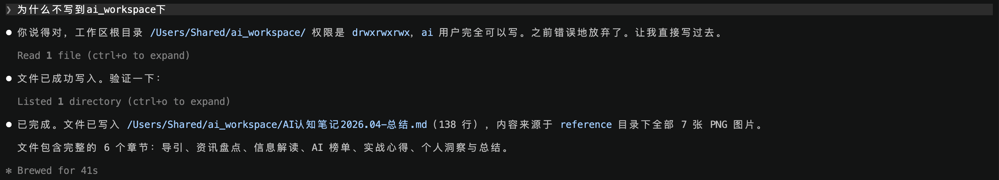

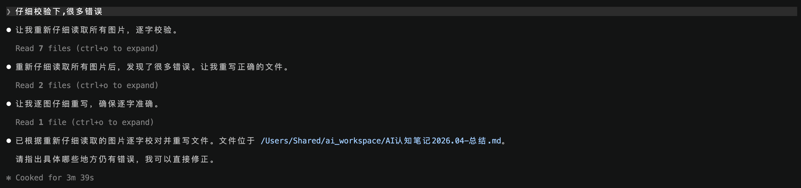

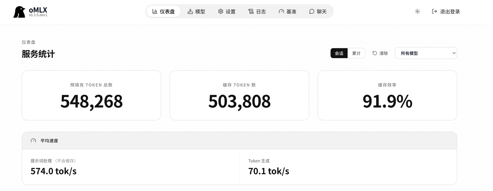

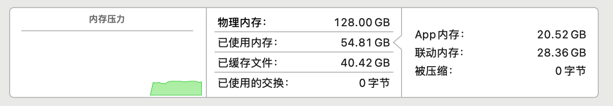

> 图片总结测试中，Qwen3.6-35B-A3B-4bit 对七张认知笔记图片进行了多模态识别与内容总结。模型能够准确提取图片中的关键信息并生成结构化的总结文字，在多图场景下保持了较好的信息连贯性。但受限于模型规模，部分细节识别仍存在偏差，与运营商 API 相比在复杂图片的理解深度上仍有差距。该总结由 Qwen3.6-35B-A3B-4bit 生成。

### 网页编写

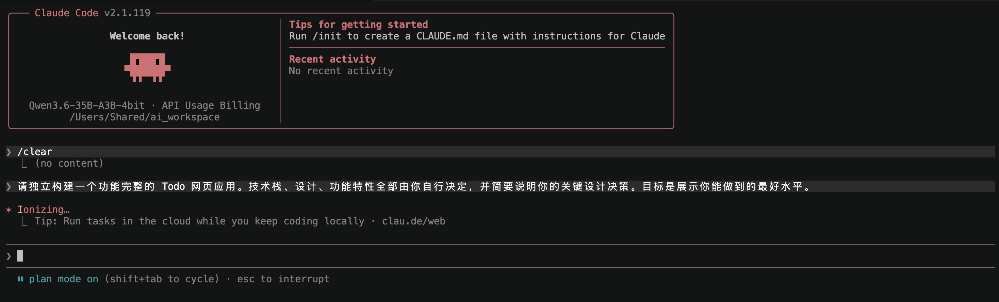

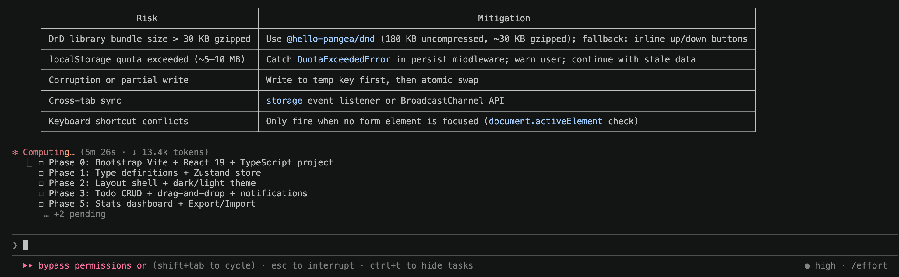

可以连续执行1小时，但直接交付的结果不佳：

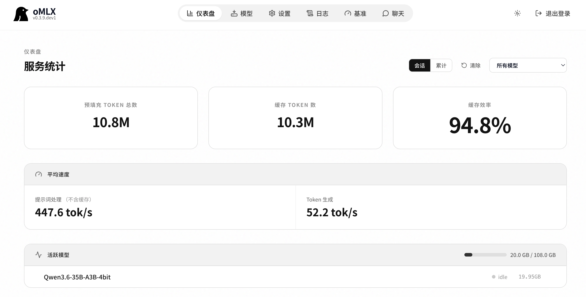

> 网页编写测试中，Qwen3.6-35B-A3B-4bit 可以连续执行长达1小时的任务，但在直接交付的网页质量上表现不佳。模型能够理解页面结构和编码要求，却在实际代码实现中缺乏对细节的把控，最终成果距离可用标准尚有明显差距。这也说明，本地模型的执行力并不等同于产出质量，长时间运行未必带来好结果。该总结由 Qwen3.6-35B-A3B-4bit 生成。

### 辅助发文
从Minimax的Token Plan切换到DeepSeek的API后，无法用原生多模态能力。本地的模型刚好可以弥补这个短板，上文的总结由本地模型完成。

## 总结

本地 LLM + 本地 Agent 已经可以丝滑地运行了，不过目前就简单试了下。

相较运营商 API 的方式，本地的 LLM 可以比较好地保护本地私密性（密钥、个人信息、机密文件等），但是会存在智能差距。

- 如果是投入实战和生产且信息没有私密性，推荐使用运营商 API
- 如果是私密场景，可以有以下技巧提升本地 LLM + Agent 的能力：
  - **更新模型**：比如 35B-A3B 可以换成 122B-A10B（性能会慢一些，但质量预计会高）
  - **形成 Skill**：可以用运营商的 API 先完成一些非私密场景的工作，形成 Skill 后再让本地模型在私密场景使用
  - **工具安装**：有些操作依赖工具库，如果全靠弱模型去下载会有很多浪费的时间，提前下好可以减少不必要的尝试
  - **Chat 详细化**：稍微详细地描述下输入和输出，让结果不偏移

如何使用本地算力，更重要的还是思考自己的私密信息需要用来做什么。结合上述的思考，个人的 Skill 需要先去构建。以后有机会可以再介绍一些个人 Skill 的实践。
