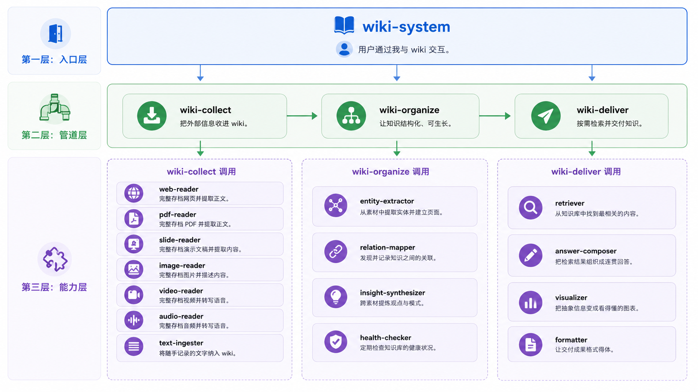
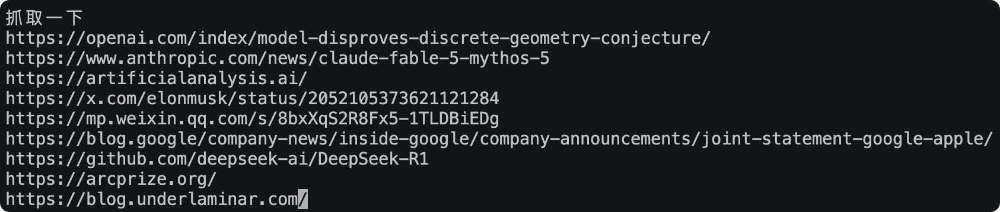
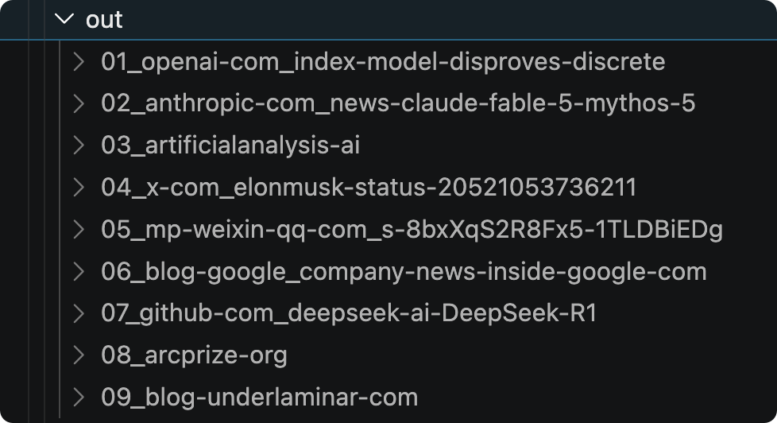

> 不积跬步无以至千里

## 背景

> 两个月前，Karpathy 发过一份基于 LLM 的个人 Wiki 搭建方针。整体思路有很高的借鉴价值，社区也围绕这个方针开发了各种工具。我本人有存储原始数据的习惯，并且希望 AI 生成的内容有明确的数据来源。因此，让我们来搭建一个可以输出内容的个人 Wiki。

## 思路

使用方式上，我希望可以通过对话方式输出可靠的内容，类似 Google 的 NotebookLM 的能力。原始数据部分，我希望其可以原始原味地保留素材。而直接从原始素材到内容输出会有断层，如果通过 RAG 方式挂载，整个系统的速度不够高效。因此在中间，我们引入一个组织层，来提前处理原始素材并形成全 AI 驱动的 Wiki。

## wiki 系统架构

### 第一层：入口层

**wiki-system**

- 一句话：用户通过我与 wiki 交互。
- 职责：解析用户指令，路由到对应模块，管理全局配置与工作流。

### 第二层：管道层

**wiki-collect**

- 一句话：把外部信息收进 wiki。
- 职责：接收链接、文件、文字或订阅源，去重后按类型分派处理，归档原始内容与整理后的笔记，完成后触发整理模块。

**wiki-organize**

- 一句话：让知识结构化、可生长。
- 职责：将新素材增量整合进知识库，提取实体与关联，维护交叉引用，跨素材提炼观点，定期检查知识库健康状态。

**wiki-deliver**

- 一句话：按需检索并交付知识。
- 职责：理解用户提问，检索相关内容，综合成连贯回答，可按多种格式呈现，输出结果可回存至知识库。

### 第三层：能力层

#### wiki-collect 调用

**web-reader**

- 一句话：完整存档网页并提取正文。
- 职责：下载网页及页面资源并归档；提取正文与元信息，输出阅读笔记。

**pdf-reader**

- 一句话：完整存档 PDF 并提取正文。
- 职责：归档原始文件；提取文字并重整段落结构，处理表格与多栏，输出阅读笔记；扫描件标记为待识别。

**slide-reader**

- 一句话：完整存档演示文稿并提取内容。
- 职责：归档原始文件；逐页提取标题、正文与备注，按序输出阅读笔记。

**image-reader**

- 一句话：完整存档图片并描述内容。
- 职责：归档原始图片；理解图像内容，生成自然语言描述。

**video-reader**

- 一句话：完整存档视频并转写语音。
- 职责：归档视频或保留源链接；提取字幕或转写语音，输出带时间戳的文字记录。

**audio-reader**

- 一句话：完整存档音频并转写语音。
- 职责：归档音频或保留源链接；将语音转为文字，标注说话人。

**text-ingester**

- 一句话：将随手记录的文字纳入 wiki。
- 职责：原样保存用户直接输入的文字，生成元数据与内容指纹，不做内容加工。

#### wiki-organize 调用

**entity-extractor**

- 一句话：从素材中提取实体并建立页面。
- 职责：识别人名、组织、术语等实体，创建或更新独立页面，记录定义、属性与来源。

**relation-mapper**

- 一句话：发现并记录知识之间的关联。
- 职责：识别引用、对立、补充、继承等关系，在相关页面间建立双向链接。

**insight-synthesizer**

- 一句话：跨素材提炼观点与模式。
- 职责：在多个素材间寻找共同主题、矛盾或趋势，生成对比或综述，写入主题页面。

**health-checker**

- 一句话：定期检查知识库的健康状况。
- 职责：扫描矛盾、过时内容、孤立页面、缺失实体、断裂链接，输出问题清单或直接修复。

#### wiki-deliver 调用

**retriever**

- 一句话：从知识库中找到最相关的内容。
- 职责：根据提问检索全文与索引，返回排序后的相关页面、段落及来源。

**answer-composer**

- 一句话：把检索结果组织成连贯回答。
- 职责：综合检索结果，处理冲突信息，生成带引用的回答、摘要或报告。

**visualizer**

- 一句话：把抽象信息变成看得懂的图表。
- 职责：将数据、对比、关系等信息转换为表格、趋势图、关系图、时间线等可视化形式。

**formatter**

- 一句话：让交付成果格式得体。
- 职责：将回答按指定格式封装，支持页面、幻灯片、PDF 等多种输出形式。

## web-reader

### 步骤 1：多路径寻找原型方案

> 收集了一些方案，启动 SubAgent 尝试不同路径

**任务目标**

用 Lightpanda、Headless Chrome、Puppeteer、Playwright 分别抓取这个页面：

- https://openai.com/index/model-disproves-discrete-geometry-conjecture/

评估其 **web‑reader 能力**：能否提取完整、可读的核心内容，保留正文、公式、代码块、重要链接，并去除噪声。

对每个 URL × 方案，记录加载耗时、内存峰值、是否完整加载，输出：

- 完全保真（MHTML/完整 HTML）
- 相关的脚本和工具包

lightpanda: https://github.com/lightpanda-io/browser

### 步骤 2：聚合策略，形成初版

- 手动测试：手动运行 cli 命令测试完成
- 结构优化：查看各个策略的完成情况，优化目录结构至 mjs/md/node_models
- 泛化测试：进一步挑选 5 个网站进行测试
  - Step1: 启动子 Agent 完成网页抓取
  - Step2: 主 Agent 和参考进行对比
  - Step3: 如果有不满足的点，请启动优化 Agent 进行优化，然后回到 Step1。直到完成
  - 原始文件备份，后续的演进维持文件和结构
- 性能优化：仿照泛化测试的流程

### 步骤 3：封装 Skill

使用 skill-creator 封装下即可。

### 总结

本篇主要是探讨了个人 Wiki 的架构，以「最终效果为导向」同样拆解出了三层架构。

高效的 System 是软硬结合，其中软的部分是 LLM，硬的部分是固定的程序（传统软件）。

下半部分我们探索了 Skill + CLI Tool 的构建过程，采用 TDD 的策略创建了基础的功能点，采用几个核心思想：

- 并行探索，快速锁定原型
- 定义目标，形成泛化能力

接下来的 Wiki 构建，我们还要继续探索以下问题：

- 补全 wiki-collect
  - 如何用标准方式构建 Skill？
  - 如何构建 Wiki Raw Database
- 设计 wiki-organize
  - 如何确保系统可以周期性运作？

从大模型训练，到模型微调，再到个人 Wiki 构建，本质是类似的，无非是规模和迭代构建的不同。
