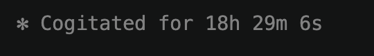
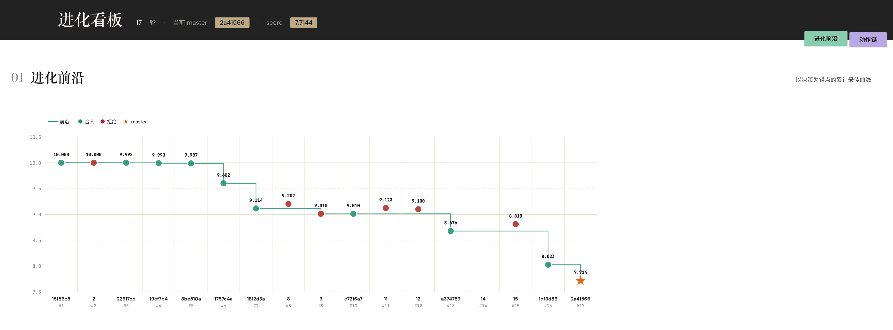

> 推倒重来的价值已远高于成本

**背景：**

最近经常可以看到一些算法进化相关的工作。抱着玩耍的心态，让我们也来构建一下这个架构。我们先聚焦评价标准确定且问题规模不大的问题，以快速完成一版架构。

## Step 1：目标

优化算子自进化,高并发自动搜索更优算法,闭环可追溯。

> 关键字：自进化、高并发、可追溯

围绕这个目标,系统被拆成八个模块,各自职责清晰、依赖单向。

## Step 2：八大模块结构

- **optimize** – 优化模块
- **eval** - 评估模块
- **analyze** - 分析模块
- **data** – 标准化测试集
- **db** – 进化过程全量数据
- **cli** - 命令入口包
- **dash** – 进化过程可视化看板
- **workspace** – 临时工作区

> data, eval, data, db scheme, cli, dash 提前设计好
>
> optimize 和 analyze 使用 git 维护并进化
>
> workspace 为 agent 工作区

## Step 3：五大动作闭环

一次完整的进化迭代由五个动作组成,前后依赖,形成闭环:

- **ideate** – 生成优化方向
- **implement** – 将方向转为代码变更
- **evaluate** – 在测试集上确定性评测
- **analyze** – 剖析评估结果,形成洞察
- **decide** – 基于证据决策合入 / 驳回

## Step 4：过程追溯

DB 本质是动作日志管理。所有动作共享以下列:

- **id** — 同一系列自增编号
- **previous** — 前向来源
- **start** — 开始时间
- **finished** — 完成时间

各动作增量字段:

- **ideate**:content(方向内容)
- **implement**:content(代码改动记录)
- **evaluate**:score(评测分数)
- **analyze**:content(分析内容)、image(分析图片)
- **decide**:commit(代码提交记录)、result(决策结果:合入 / 驳回)

## Step 5：可视化看板

> 只读 DB,不写 DB。

- **进化前沿图**:以决策为锚点的累计最佳曲线,可行性优先;合入 / 拒绝 / 待定用不同颜色标记;当前 master 用星形高亮。
- **动作链图**:每个迭代一行,五个动作(思路、实现、评估、分析、合入)按时间顺序串联;同迭代用灰实线,跨迭代用虚线表示前继启发。

## Step 6：实践与待优化

> 我们以今年 ICCAD C 题作为尝试,这道优化问题的背景是 SoC Floorplan,剔除运行速度下,最优得分是 1,最差得分是 10

- **运行时间**
  - 缺陷:并行度还没有优化上去

- **进化前沿曲线**
  - 缺陷:目前的约束较弱,数据为后补充
  - 离最优解还有较大差距,不过已经可以看到分数的持续提升

## 结语

迭代进化架构落地的体感是:把"想法 → 代码 → 评分 → 洞察 → 决策"压成同一条可追溯的链路,每次重构只需改 optimize / analyze 这两个 git 受控的模块,其他契约层几乎不动。架构重构的迭代成本,主要花在契约稳定后的能力扩展上,而不是反复重写脚手架。

**后续方向:**

1. 使用 SubAgent + Hook 或 LangGraph 构建更可控和高效的系统
2. 导入知识库,提升 ideate 能力
3. 优化分析流程,提升 analyze 能力
