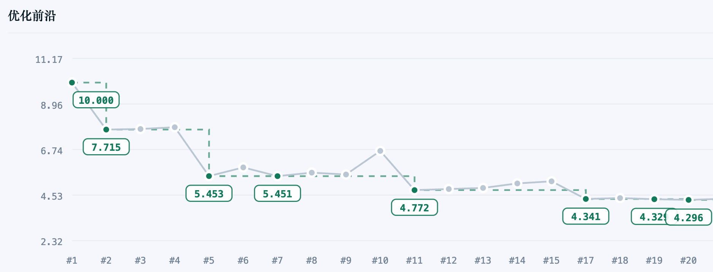
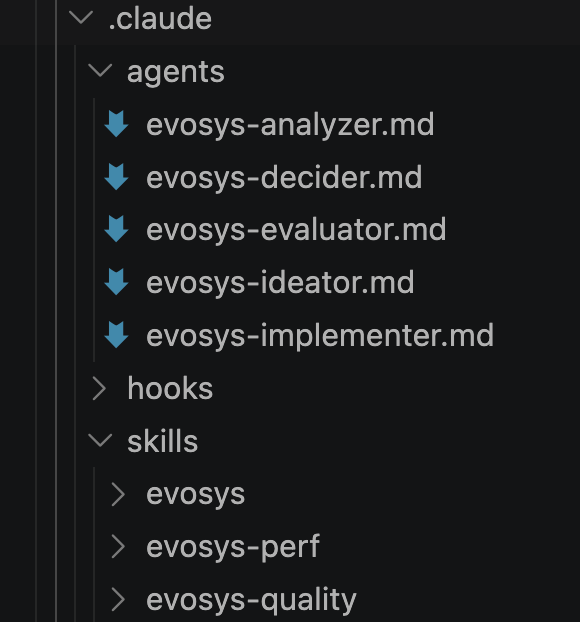
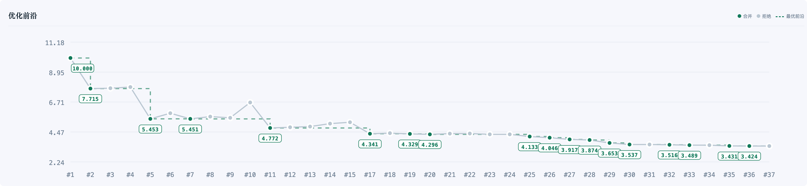
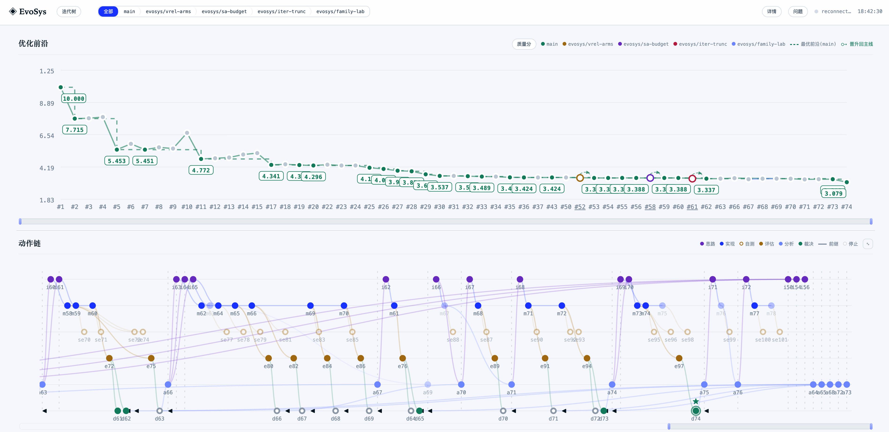
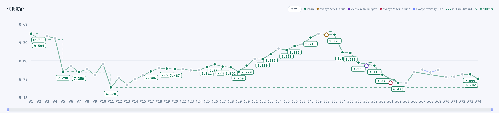
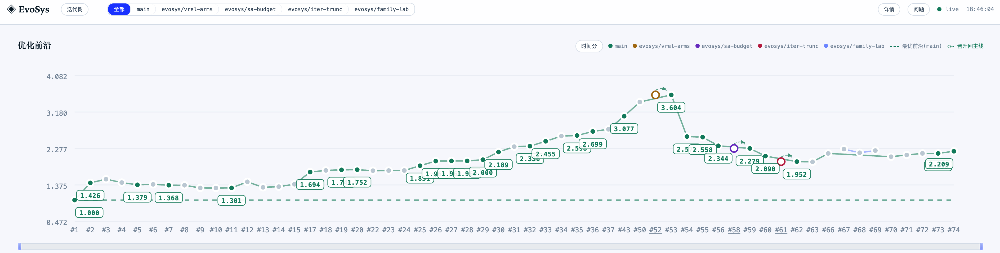
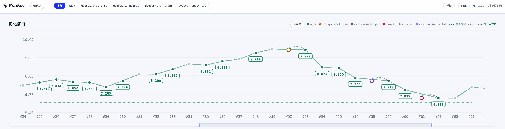
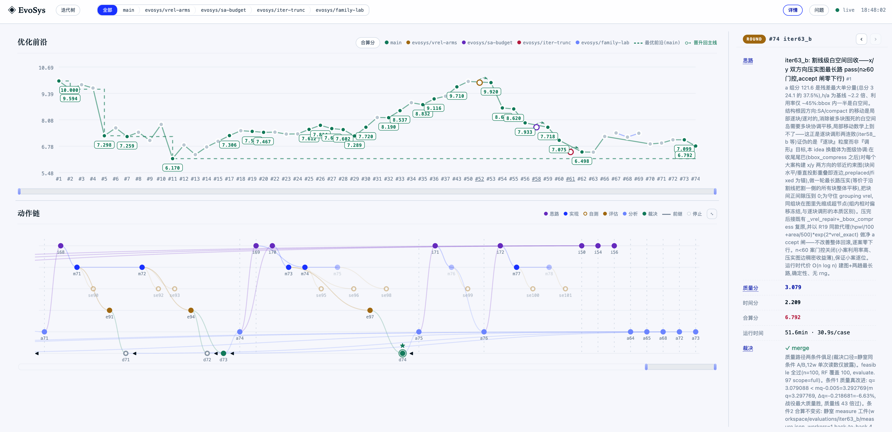
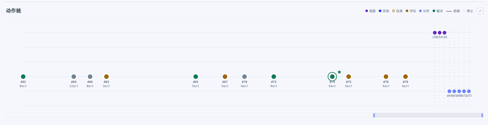

> 工欲善其事，必先利其器

**背景：**

> Kimi K3发布后，看分数很不错，就拿出来演进下初版的进化系统。本篇将介绍从「模型基础能力」到「Multi-Agent构建」到「系统能力初步提升」的三步走优化。本次演进耗费了两个Kimi K3最高档的周额度。

## 回顾

进化系统（EvoSys, Evolutionary System）的目标是「优化算子自进化，高并发自动搜索更优算法，闭环可追溯」。

目录结构包括优化模块、评估模块、分析模块、测试数据、数据库、CLI、看板和工作区。

动作包括「思路」、「实现」、「评估」、「分析」、「裁决」。

在测试阶段，我们使用ICCAD 2026 C (SoC Floorplan)，进行的测试，本题质量分从10到1（1最优），时间系数最优0.7系数，最优0.7分。

## 阶段一 · 模型能力裸测

上期我们是使用Minimax M3模型进行的系统构建，最终分数停在了7.714分

做了什么：

- 切换模型为Kimi K3
- 让Kimi K3重新整理了一下目录结构并让其基于Coding Agent编写了agents/hooks/skills
  - Kimi K3的目录一次就整理得比较干净
- 让Kimi K3直接尝试优化
  - 模型并没有直接接入multi-agent模式，而是main agent扮演了所有角色并录入db
- 结果如下，因为把上个版本的结果导入了，第二版就延续了之前的优化结果，经过20轮迭代系统优化到了4.3分
  - 

>  因为没有触发任何的子agent，第一版的尝试比较像是带有规则的单agent运作，可以看到K3的模型基础能力是有较大的提升的。

## 阶段二 · 构建Multi-Agent

做了什么：

- 精简了db的字段
- 确保agent可以被调用
- 构建目录（以claude code agent为例），进入系统通过 /evosys 描述目标。系统调度不同的子Agent进行优化
  - 
- 结果如下，质量分从4.3分优化到3.4分

> 因为没有对比（需要耗费更多的token测试），带有Agent和不太有Agent是否有优化能力差距不能下定论

## 阶段三 · 对抗局部最优解

在阶段二我们碰到了若干问题：

- 因为只考虑质量分，而忽视了运行时间，导致评估部分变成了时间瓶颈
- 系统基本是通过串行运作的，没有实现并行化
- 策略上已经陷入了局部最优解，这个问题中一直在延续SA这个算法

这些问题，部分已有一些方案实践，还有部分将在后续继续优化

做了什么：

- 提出了分支系统，optimize仓库可以通过分支系统来尝试全新的路线
  - 当前的效果不佳，实际基本还在已有方案上，不过运行上可行
- 优化了评估部分的并行度，从1改为了8
- 增加了自测节点，「思路」提出自测标准，「实现」需要通过子用例「自测」后才可以申请全量「评估」
- 沿用合算分的方式，将质量分和运行时间合算形成总分
- 让Main Agent采用并行启动SubAgent的方式
- 结果如下：质量分进一步优化到3.079，运行速度开始回归，合算分出现下降趋势。

## Dashboard介绍

- 优化前沿部分包括「质量分」、「时间分」、「合算分」，可通过左右区间控件控制窗口
  - 
- 点击优化前沿、动作链的节点可以打开「详情」
  - 
- 动作链可折叠迭代
  - 
- 还有迭代树和问题面板，还需要在后续演进中进一步优化

## 总结

从模型、系统、组件三个维度上的升级，都可以看到结果的提升。不过当前这个赛题的前排已经逼近最优的0.7~1分的区间，系统离最优解还有较大差距。当前的系统还没有使用任何的文献资料，并且人在进化过程中没有触碰过任何代码以及提出任何解决思路，因此还有较大的潜力。个人估计即使没有人工指导，这套系统也有希望逼近最优的分数区间（需要耗费更多的Token）。

更多的延伸：

- 分析模块详细打磨
- 问题机制系统构建
- 经验沉淀策略
- 知识库挂载策略
- 成本优化策略
- 并行度进一步提升
- 跳出算法局限性
