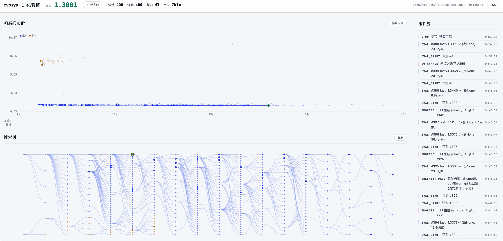
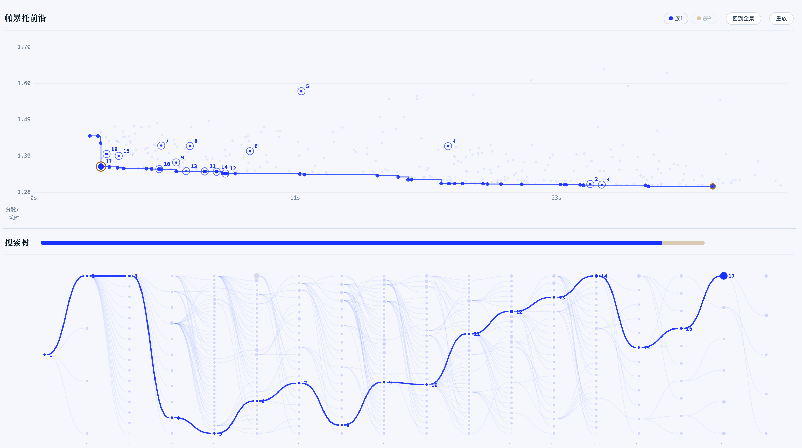
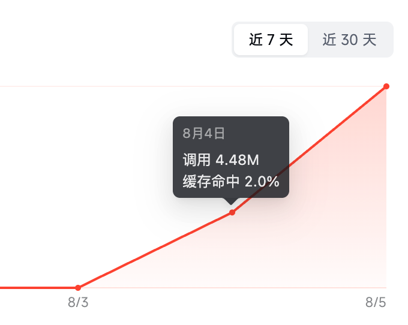
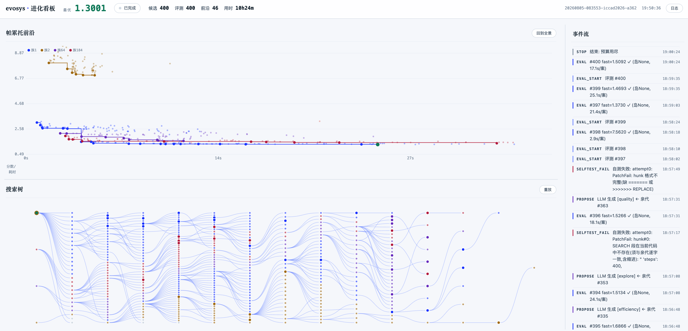
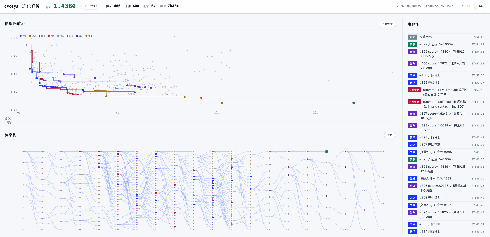
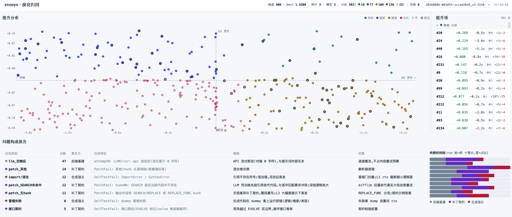
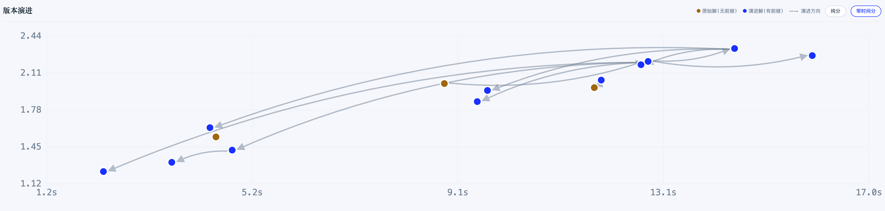

> めぐる Loop 循环

**背景：**

> 这两周沉迷进化系统的研究，不知不觉整套系统已经步入下个阶段了。上篇使用通用Agent挂载Skill/Hook/SubAgent的方式来完成各类动作并使用数据库追踪。这套系统比较依赖大模型的能力，尽管可以通过CLI命令封装，但还是有很多环节没有必要去使用模型。因此，新一代的系统步入了Loop Engineering。同时，我比较喜欢这类系统有95%的确定性加上5%的非确定性（LLM）。

**概念表**：

| 概念                                   | 核心关注点       | 一句话概括               | 解决的核心问题                             |
| :------------------------------------- | :--------------- | :----------------------- | :----------------------------------------- |
| **Prompt Engineering** （提示词工程）  | **怎么问**       | 写好"一句话指令"         | 让模型在**单次交互**中准确理解任务         |
| **Context Engineering** （上下文工程） | **看什么**       | 备好"参考资料包"         | 为模型提供**充分且相关**的背景信息         |
| **Harness Engineering** （驾驭工程）   | **在哪做**       | 搭建"安全运行的工作台"   | 让AI在**可控、可观测**的环境里安全行动     |
| **Loop Engineering** （循环工程）      | **怎么持续做对** | 设计"自动运转的闭环系统" | 让AI系统**自主迭代**，完成复杂的长流程任务 |

进化系统（EvoSys, Evolutionary System）的目标是「高并发自动搜索最优优化器，闭环可追溯」。

## 阶段一：搭建系统

> 让Kimi K3出手来AI Coding一下系统，我拿上个版本的System作为参考

以下是初始的部分Prompt

```
### 使用逻辑
- 用户通过binary启动程序，带有yaml配置，dashboard同步启动
- yaml包括：评估器路径、优化器路径、LLM接口、迭代轮次
- evosys会执行进化过程，可以配置不同的起点并用树形结构搜索优化器
- evosys会将信息实施db中，这个db是可以落盘的。整个evosys也能继续在已有的基础上继续探索
- llm基本上都是用在优化器的生成，其他所有的动作都可以是确定性的，如果有参数配置也是放到yaml中
- 先不要配置knowledge
```

经过一系列对看板和环节的打磨，第一个版本的看板效果如下：



这个版本的特点：

- 由二进制代码启动，LLM也由代码完成调用
- 7小时完成了400轮进化，节点有明确的前继版本
- 可以支持多起点演进
- 优化目标不再只是质量，而是「质量x性能」的帕累托前沿

这一次迭代的质量没有超越基线（基线来自于上次迭代的质量最优解），不过在牺牲不到5%的质量下获得了不错的性能提升。

来自新Dashboard的综合最优点的前继视觉效果：



这个版本的Input没有任何优化，KV Cache命中率非常低



## 阶段二：引入新族

> 初始版本的系统有一个问题，同族内的方法容易陷入局部。

针对这个问题，引入了新族。新族每过一定轮次触发，会通过历史族的观察思考全新的思路，进行比较大的进化。

同时，在单次进化的时候使用随机控制让演进有不同的倾向。





## 阶段三：二重Loop

> 这个版本是挑选用子集例进行进化，然后再对整个全集进行测试。再加上进化系统的能力还有较大的空间。引入外层的循环来完成全集的测试和下次进化的挑选

演化归因看板，包括日志问题和提升量汇总。可以看到双优（两维都提升）的进化是比较少的。



全量测试看板，包括时间和综合分。



这里引入一个新的概念进化系统的进化：

- 起点构建：根据全量测试结果分析，挑选合适的迭代子集以及合适的起点种子
- 迭代进化：使用evosys将将构建好的起点进行一轮新的算法进化
- 全量测试：对进化结果中有潜力的前沿点进行全量测试
- 框架进化：对本轮进化过程和全量测试结果进行分析，优化evosys

## 总结

Loop初步达成，可以继续推倒重构已有系统，进行二重循环系统的完整构建了。
