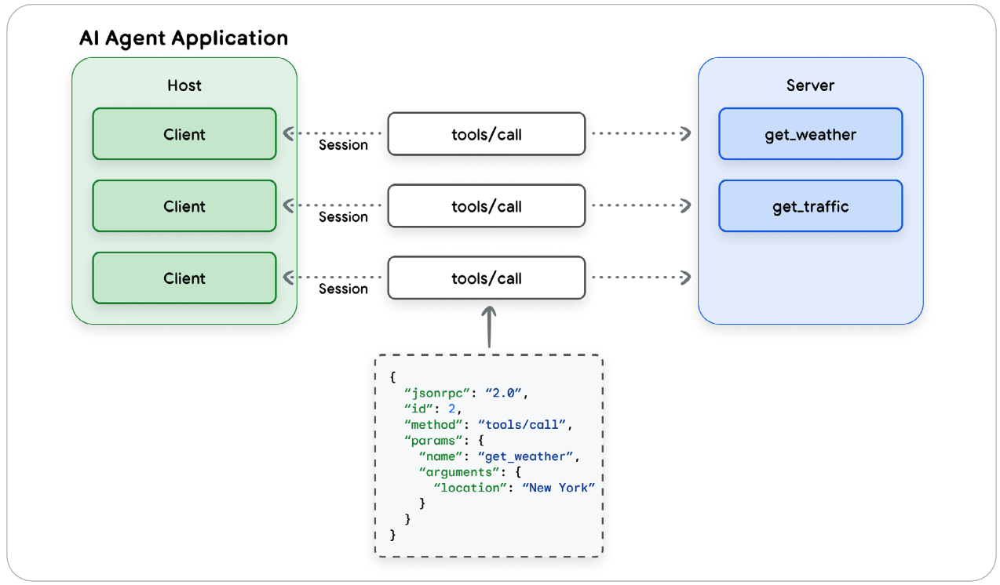

1. Introduction to Agents
2. → Agent Tools & Interoperability with MCP
3. Agent Quality
4. Context Engineering: Sessions, Memory
5. Prototype to Production

在认识Agent并了解到Agent评估的重要性后，让我们来进一步了解如何扩展Agent的能力边界。

---

> **Unifying Agents, Tools, and the World**

如果想让Agent完成各项任务，仅靠语言模型是不够的，还需要提供Agent与外界交互的手段。

Model Context Protocal (MCP) 于2024年提出，旨在简化工具与模型的集成过程，并解决一些技术和安全挑战。

> _MCP已经一周年了，不过落地应该是有些问题。最近也常听到Skill这个词。本文聚焦方法论，MCP和Skill都可以认为是一种工具的挂载方式，不影响本文理解。_

# 工具

工具的定义如同非AI程序中的函数。工具定义声明了模型与工具之间的约束。至少包括一个明确的名称、参数，以及一段解释其用途和使用方式的自然语言描述。

Agent Tool按照构建方式分为三种：
- **函数工具**：调用外部工具函数，函数描述可以来自代码中已有的注释。
- **内置工具**：一些基础模型具备利用内置工具的能力，例如搜索、代码执行、URL获取。
- **Agent工具**：构建一个Agent并作为可被调用的工具。

> _对模型，内置函数、函数工具、Agent工具自内向外构建。_

Agent Tool按照功能和交互方式分为以下常见类型：
- **信息检索**：从各种来源获取数据，例如网络搜索、数据库或非结构化文档。
- **行动**：执行现实世界的各类操作，例如发送电子邮件、发布消息、启动代码执行或控制物理设备。
- **API集成**：连接现有软件系统和API，集成到企业工作流中，或与第三方服务进行交互。
- **人机协作**：促进与人类用户的合作：请求澄清、寻求关键行动的批准或移交人类判断。

## 工具构建实践经验

### 文档很重要
工具文档（名称、描述和属性）都会作为请求上下文的一部分传递给模型，这些上下文对于帮助模型理解很重要。
- **使用清晰的名称**：工具的名称应该有明确的描述性、易于人类理解且具体。`reate_critical_bug_in_jira_with_priority`比`update_jira`更加清晰。
- **描述所有输入和输出参数**：所有的输入都应该被清晰描述，包括类型和用途。
- **简化参数列表**：保持参数列表间接，并给参数起清晰的名称。
- **明确工具描述**：提供输入和输出参数、工具用途以及有效调用工具所需的其他任何细节的清晰且详细的描述。避免使用缩写或技术术语。
- **添加有针对性的示例**：示例有助于解决歧义、展示如何处理棘手的请求或阐明术语上的差异。
- **提供默认值**：为关键参数提供默认值，并确保在工具文档中记录和描述这些默认值。

> *简而言之，就是写代码的时候的注释要尽可能精炼且详实。*

### 描述行动，而非实现方式
如果每个工具都有完善的文档说明，那么模型的指令应该描述操作，而非具体的工具。
- **描述做什么，而不是怎么做**：说「创建一个bug来描述这个问题」而不是「使用create_bug工具」。
- **不要重复指令**：不要重复或重述工具指令，可能会使模型产生混淆。
- **不要规定工作流程**：描述目标，让模型有自主使用工具的空间。
- **务必解释工具交互**：如果工具间存在影响，需要记录下来。

> *模型的核心任务是进行语言推理。问题的目标、约束、手段需要清晰。*

### 其他技巧
- **不要返回大型响应**：工具的输出内容不要太大，会占据上下文。
- **使用外部系统**：利用外部系统进行数据存储和访问。
- **有效使用验证**：运行时检查，使应用程序本身能够验证工具的调用是否正确。
- **提供描述性的错误信息**：错误描述除了基础的描述外，还需要提供一些如何解决特定错误的指示。

> *把Agent想成自己去操作，就能比较好理解这些技巧的作用。*

# 理解MCP
对模型（N）与工具（M）定制连接器，需要N×M个连接器。Anthropic于2024年11月推出的模型上下文协议（Model Context Protocol, MCP）作为开放标准，旨在解决这个问题。

> *$N*M$ 优化到 $N+M$*

## MCP核心组件：主机、客户端和服务器

采用 client-server 模式，灵感来自于 Language Server Protocal (LSP)。

MCP核心组件包括：
- **MCP主机（Host）**：负责创建和管理各个MCP客户端的应用程序。职责包括管理用户体验、协调工具的使用，以及执行安全策略和内容防护措施。
- **MCP客户端（Client）**：嵌入在主机中的软件组件，负责维持与服务器的链接。职责包括发出命令、接收响应，以及管理与MCP服务器之间通信回话的生命周期。
- **MCP服务器（Server）**：提供AI应用一系列能力，包括外部工具、数据源或者API的适配器或代理。职责包括工具发现、接收和执行命令，以及格式化和返回结果。

> *看示意图更加清楚一些：通过Json触发调度，MCP统一管理调度工具方式，包括外部工具和内部函数。*

## 通信层：JSON-RPC，传输方式和消息类型
MCP使用JSON-RPC 2.0作为基本消息格式，为所有通信提供了一种轻量级、基于文本且与语言无关的结构。协议定义了四种基本消息类型：
- **请求**：一方发送给另一方的RPC调用，期望得到响应。
- **结果**：包含相应请求成功结果的消息。
- **错误**：请求失败的消息，包括代码和描述。
- **通知**：一种单向消息，不需要相应，也无法回复。

MCP支持两种传输协议，一种用于本地通信，另一种用于远程连接。
- **标准输入输出**：用于本地环境中的快速直接通信。
- **流式HTTP**：推荐远程client-server协议。

## 关键要素：工具和其他
服务器端提供工具、资源和提示词；客户端提供采样、启发和根目录能力。

在MCP这些功能中，只有工具获得了广泛支持，资源和提示词支持程度很低。

### 工具
MCP的Tool实例是服务器想客户端描述其可用功能的标准化方法。MCP服务器会发布其可用工具列表，其中包括描述和参数模式。
工具定义必须符合JSON模式，包含一下字段：
- **名称**：工具的唯一标识符
- **标题**：【可选】用于显示的易读名称
- **描述**：人类（或LLM）可理解的功能说明
- **inputSchema**：定义预期工具参数的JSON格式
- **outputSchema**：【可选】定义输出结构的JSON格式
- **注释**：【可选】描述工具行为的属性

> *这部分的内容和软件强相关了，简单了解即可。如果做相关软件开发，也建议简单过一下概念即可，需要结合实践来清晰概念。*

MCP工具可以返回结构化或者非结构化的信息，非结构化的类型包括非结构化字符串数据、带有适当MIME类型标记的base64编码的图像或音频数据。MCP还允许工具反馈制定的资源。

结构化内容始终以JSON对象的形式返回。

MCP定义了两种标准的错误报告机制，第一种是JSON-RPC中的错误类型，第二种是工具运行中产生的错误。

### 其他

除了工具外，其他功能目前没有获得广泛支持，快速介绍下：
- **资源**：提供Host应用程序访问和使用的上下文数据，可能包括文件内容、数据库中的一条记录、数据库模式、图像等。
- **提示词**：旨在由客户端检索并用于直接与LLM交互。
  - 任意提示词存在隐患，在没有更完善的安全模型前建议少用提示词。
- **采样**：第一种客户端能力。MCP服务器向客户端请求LLM补全，工具可以利用主机的AI模型来执行子任务。
- **启发**：第二种客户端能力。允许MCP服务器向客户端请求额外的用户信息。
- **根目录**：第三种客户端能力。从客户端接受根目录规范的服务器应将其操作限制在该范围内。

> *除了工具外，其他的功能都比较勉强。特别是客户端三种能力，感觉像是有个别场景需要后构建出来的，缺少点自然美感。*

# MCP的优势和挑战
## MCP的优势
- 简化集成过程，即插即用，使工具成为可复用和可共享的资产。
- 可在运行时发现可用工具；标准化接口定义；扩展LLM的能力和可获取的信息。
- 促进了模块化和可组合的系统设计。
- 架构为实施更健全的治理提供了必要的挂钩机制。

## MCP的挑战

安全是最大的风险，下一章节会单独描述。

初次之外，MCP当前的设计还有多项挑战：
- **性能和规模瓶颈**：主要和模型上下文有关
  - 上下文窗口膨胀：每个连接MCP服务器的工具的定义和参数都必须包含在模型的上下文窗口中，导致token被大量占用。
  - 推理质量下降：过载的上下文窗口会降低人工智能的推理质量。
  - 有状态协议挑战：对远程服务器使用有状态、持久化连接的情况，可能会导致架构更加复杂，难以开发和维护。
  - > 提到一种通过工具检索步骤动态加载工具的方式。
- **企业就绪差距**：一些关键的企业级功能还在发展中
  - 认证与授权：目前的OAuth实现已被指出与一些现代企业安全实践存在冲突。
  - 身份管理模糊：该协议尚未有清晰、标准化的身份管理和传播方式。这种模糊性使审计、问责以及细粒度访问控制的实施变得复杂。
  - 缺乏原生可观测性：没有定义可观测源于的标准，如日志、追踪和指标。
  - > *和上一篇Agent Quality对上了*

# MCP的安全性
随着MCP通过将Agent与工具和资源连接而提供的新功能，也带来了一系列新的安全挑战。

## 动态能力注入
- **风险**：MCP服务器可能会动态更改其提供的工具、资源和提示词，而无需明确通知客户端或获得批准。恶意服务器可能会利用这一点在客户端中引发未授权行为。
- **缓解措施**：明确允许列表；强制变更通知；工具和包固定；安全API和智能网关；在受控环境中托管MCP服务器。

> *从范围限制、变更通知、外部约束几方面控制工具权限。*

## 影子工具
- **风险**：工具描述可以指定任意触发器，使恶意工具优先级盖过合法工具，导致用户数据被攻击者拦截或修改。
- **缓解措施**：防止命名冲突；双向TLS；执行确定性策略；要求HITL;限制对未授权MCP服务器的访问。

> *在工具定义端通过提示词提升工具被调用的优先级，而套出敏感信息。*

## 恶意工具定义
- **风险**：即使工具的定义是良性的，也可以通过文档和API签名来恶意操作Agent执行恶意操作。
- **缓解措施**：输入验证；输出清理；独立的系统提示；对MCP资源进行严格的白名单验证和清理；

## 敏感信息泄露
- **风险**：MCP工具可能会无意中获得敏感信息，从而导致数据泄露。这些数据通常存储在对话上下文中，并传输给Agent工具。
- **缓解措施**：MCP工具使用结构化输出；污染输入和输入标记。

## 不支持限制访问范围
- **风险**：MCP不支持单个工具和单个资源的进一步授权。
- **缓解措施**：工具调用应使用有范围的凭据；采用最小权限原则；机密和凭证不能出现在Agent的上下文中。

# 结论
MCP可以解决工具与模型的组合增加问题，但是会带来很多潜在的风险，特别是安全性。

未来，落地的MCP很可能不是纯粹的开发协议，而是整合了多层治理和控制的版本。

> *整篇白皮书看似在讲如何增加工具，更多的是对工具接入后是否安全进行探讨。本文的概念会比较硬核，安全角度确实需要进一步构建一个更好地标准。*

> 写于2026-01-03