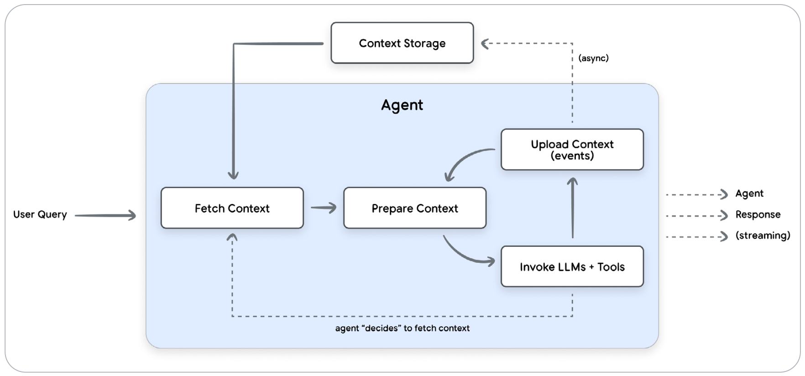
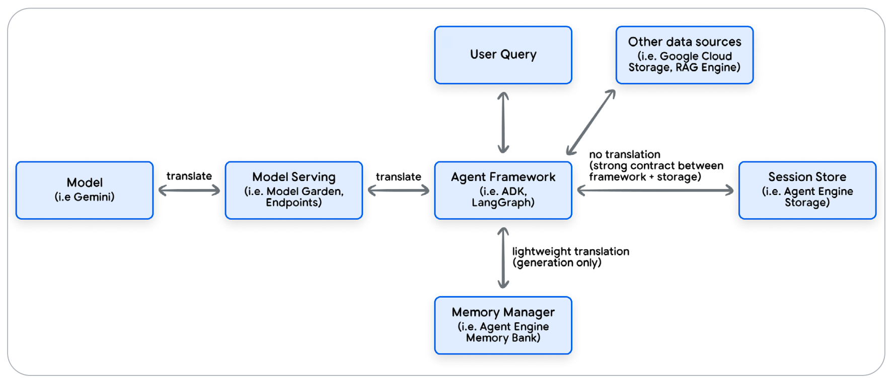
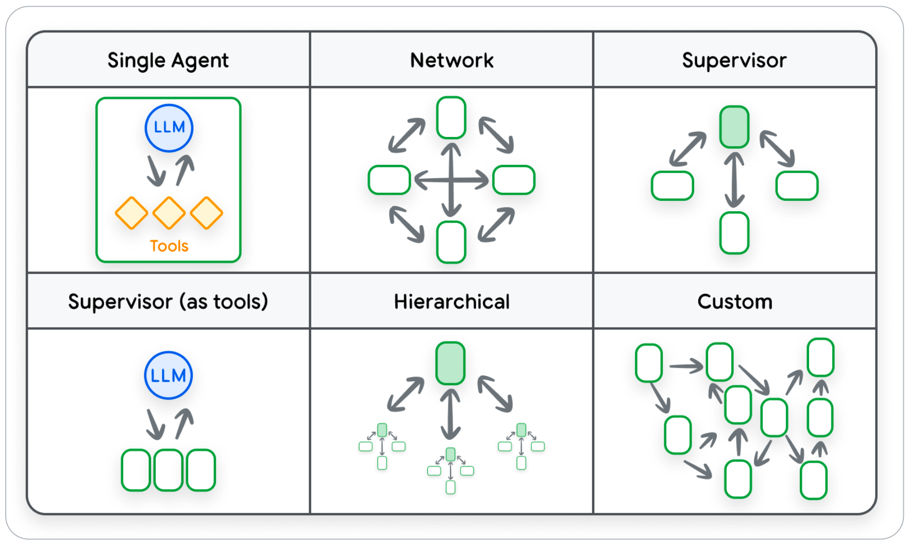
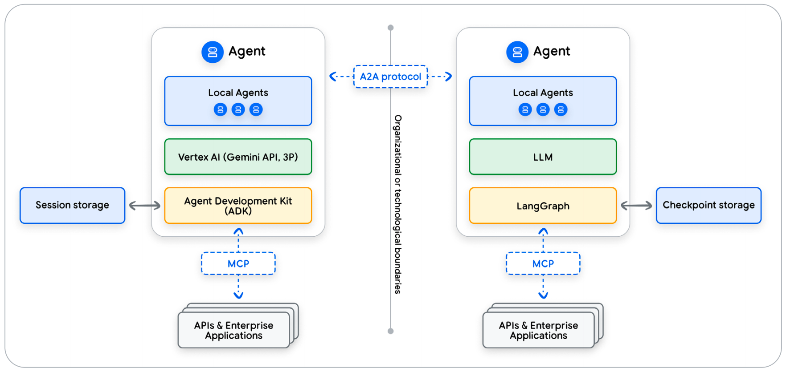

1. Introduction to Agents
2. Agent Tools & Interoperability with MCP
3. Agent Quality
4. → Context Engineering: Sessions, Memory
5. Prototype to Production

由于当前语言模型对于上下文存在限制，我们需要在限制内构建充分的上下文信息使Agent可以持续做正确的动作。

> Stateful and personal AI begins with Context Engineering.

三个核心概念：
- Context Engineering（上下文工程）：在LLM的上下文窗口内动态组合和管理信息，以实现有状态智能体的过程。
- Sessions（会话）：与Agent进行的整个对话的容器，包含按时间顺序排列的对话历史和Agent的工作记忆。
- Memory（记忆）：用于长期保存的机制，跨多个会话捕获和整合关键信息，为LLM Agent提供持续且个性化的体验。

# 上下文工程
上下文工程是传统提示词工程的演进。提示词工程侧重于精心设计优化的、通常是静态的系统指令。而上下文工程处理整个信息载荷，基于用户、对话历史和外部数据**动态**构建具有状态感知能力的提示词。

上下文工程的目标是确保模型拥有不多不少、恰好完成其任务所需的最相关信息。

> *不多不少这一点是挺难做到的，看看下文怎么给出方法*

上下文工程的载荷可包括多种组件：
- **用于指导推理的上下文**定义了Agent的基本推理模式和可用动作
  - 系统指令：定义Agent角色、能力和限制。
  - 工具定义：Ageng可用于与外部世界交互的API或函数的模式。
  - 少样本实例：通过上下文学习指导模型推理过程的精选实例。
- **证据性和事实数据**是Agent进行推理所依据的实质性数据，包括既有知识和为特定任务动态获取的信息
  - 长期记忆：跨多个会话收集的关于用户或主题的永久性知识。
  - 外部知识：从数据库或文档中检索到的信息，通常使用RAG。
  - 工具输出：工具返回的数据或结果。
  - Sub-Agent输出：由被委派了特定子任务的专业Agent返回的结论或结果。
  - 人工制品：与用户或会话相关联的非文本数据。
  - 对话历史：当前交互的逐轮记录。
  - 状态/暂存区：Agent在即时推理过程中使用的临时、进行中的信息或计算结果。
  - 用户提示：需要解决的即时查询。

构建一个具备上下文感知能力的Agent时，最关键的挑战之一是管理不断增长的对话历史。上下文工程通过动态调整历史记录的策略（如总结、选择性删减或其他压缩技术）直接解决质疑问题。

上图展示了上下文管理流程（一轮对话）：
- Fetch Context（获取上下文）：检索上下文，例如用户记忆、RAG和最近的对话事件。
- Prepare Context（准备上下文）：动态构建用于LLM调用的完整提示词。
- Invoke LLM and Tools（调用LLM和工具）：Agent会反复调用LLM和必要的工具，指导生成给用户的最终响应。工具和模型的输出会附加在上下文中。
- Upload Context（上传上下文）：本轮收集到的新信息会上传至持久性存储。

# 会话
每个会话包括两个关键组件：按时间顺序排列的历史记录和Agent的工作记忆。

事件是对话的基本构成要素。常见的事件类型包括：用户输入、智能体响应、工具调用或工具输出。

会话会通过结构化的「工作记忆」或缓存区记录信息。

> *结构化指的就是问答的信息记录，AI模型网站的对话形式的数据版。*

如上图所示，Agent Framework充当代码和大语言模型之间的通用翻译器。

在多智能体体系中，多个智能体会展开协作。每个智能体专注于一项更小、更专业的任务。下图是多智能体的架构形式。

> *Multi-Agent架构形式取决于需要完成的任务适合的分解形式。*

智能体框架通过两种主要方式来处理多智能体体系的会话历史：
- 一种是共享的统一历史，所有智能体都为单一日志贡献内容；
- 另一种是独立的个体历史，每个智能体都保持自己的视角。

第一种方式适合需要单一事实来源的紧密耦合、协作型任务。

第二种方式交流仅通过明确的消息进行，智能体在其中分项的是最终输出，而非其过程。这种交互通常通过两种方式实现，一种是Agent-as-a-tool，另一种是Agent-to-Agent2协议。前者Agent会像工具一样调用另一个Agent；后者会通过A2A协议使用结构化协议进行消息传递。

保护会话中的敏感信息是一项不容协商的要求。不同用户的会话数据必须隔离。处理个人身份信息的一个最佳实践是在会话数据写入存储前对其进行编辑。

会话需要配置生命周期以减少存储成本。

需要考虑会话的读写性能以确保流产的用户体验。

## 管理上下文对话

LLM能换处理长上下文，但仍存在局限性：
- **上下文窗口限制**：每个LLM都有一次可处理的最大文本量。
- **API成本**：按照token数量收费。
- **延迟**：更多文本需要更长的处理时间。
- **质量**：token越多，噪声越多，性能可能下降。

> *Google有一个更大上下文窗口的模型。上下文窗口大小是限制现在Agent能力极限的一个因素。*

压缩上下文有一些方式：
- **保留最后N轮对话**：如字面意思。
- **基于Token阶段**：最新消息向前计算指导达到预定的Token数量限制。
- **递归总结**：对话中较旧的部分被AI生成的摘要取代。

Agent决定压缩的触发机制：
- **基于计数的触发机制**：当对话超过摸个预定义的阈值时，就会对对话进行压缩。
- **基于时间的触发机制**：在用户设定的时间段内停止交互，在后台进行压缩。
- **基于事件的触发机制**：当Agent检测到特定任务、子表或对话主题已结束时，会决定触发压缩。

> *压缩形式和触发机制看上去是用混合形式是比较好的。*

# 记忆

## 记忆的能力
记忆会在不同会话之间持久存在，以提供连贯且个性化的体验。

存储和检索记忆对于构建复杂且智能的Agent至关重要。一个强大的记忆系统通过解锁多项关键能力，能将基础的聊天机器人转变为真正智能的Agent：
- **个性化**：记住用户的偏好、事实和过往互动，以制定未来的回应。
- **上下文窗口管理**：记忆系统可以通过生成摘要或提取关键事实来压缩这些历史记录。
- **数据挖掘与洞察**：通过分析众多用户的存储记忆，从干扰信息中提取洞察。
- **智能体的自我提升与适应**：Agent会通过创建关于自身表现的程序性记忆，从之前的运行中学习。

> *这些能力的触发时机都值得研究研究。*

## 记忆的类型
记忆管理器和RAG的区别的有效理解方式：将RAG视为Agent的研究图书管理员，而将记忆管理器视为其私人助理。

记忆通常包括两个主要部分：内容和元数据。其中：
- **内容**：从原始数据中提取的记忆实质，内容可以是结构化数据，也可以是非结构化数据。
- **元数据**：提供关于记忆的上下文，通常以简单字符串的形式存储。这可以包括记忆的唯一标识符、记忆所有者的标识符，以及描述记忆内容或数据源的标签。

记忆根据其代表的基本知识类型分为：
- **陈述性记忆**：知道是什么。
- **程序性记忆**：知道怎么做。

记忆通常存储在向量数据库或知识图谱中：
- **向量知识库**：支持语义相似性而非精确关键词的检索。记忆被转换为嵌入向量，数据库会找到与用户查询在概念上最接近的匹配项。
- **知识图谱**：用于将记忆存储为实体（节点）和关系（边）的网络。检索过程包括遍历该图谱以找到直接和间接的联系。

> *以上两种形态应该对应RAG的两种技术*

记忆的创建方式分为用户直接命令Agent记忆和隐式记忆。

一段以及描述需要考虑影响的实体范围。

Agent可以处理各种数据类型：文本、图像、音频，但它创建的记忆是从中提取的文本洞察。

> *人的思考媒介是文字*

## 记忆的生成
记忆生成的高级流程通常遵循以下四个阶段：
- 摄入：当客户端向内存管理器提供原始数据时就开始了。
- 提取与筛选：使用LLM从源数据中提取有意义的内容。
  - 记忆提取的目标是回答「在这段对话中，哪些信息有足够的意义成为记忆？」。
  - 有意义并非一个通用概念，而是有智能体的目的和使用场景来定义。
- 整合：记忆管理器处理冲突和去重，利用LLM将新提取的信息和现有记忆进行比较，决定合并、删除、创建记忆的动作。
  - 单个记忆可能是多个数据来源的混合体，单个来源也可能被分割成多个记忆。
- 存储：新的记忆会被持久化到一个存储层中，以便在未来的交互中能被检索。

记忆来源主要分为三类：
- 自举数据：从内部系统预加载的信息。这种高可信度数据可用于数据化用户的记忆，已解决冷启动问题。
- 用户输入：这包括明确提供的数据（可信度高）或对话中隐式提取的信息（可信度较低）。
- 工具输出：从外部工具调用返回的数据。这类记忆往往容易出错且过时，这使得这种来源类型更适合短期缓存。

管理记忆中两个主要的操作挑战：冲突解决和解决衍生数据。

当记忆出现冲突时，通常倾向于最可信的来源、倾向于最新的信息，或在多个数据点中寻找相互佐证。

当用户撤销了对某个数据源的访问权限时，从该数据源衍生的数据也应被移除。一种精确但成本更高的方法是，仅使用剩余的有效数据源从头重新生成受影响的记忆。

一段记忆的可信度是动态变化的，遗忘由多种因素触发：
- 基于时间的衰减：记忆的重要性会随着时间的推移而降低。
- 低置信度：有薄弱推理产生且从未被其他来源证实的记忆可能会被删除。
- 不相关性：随着智能体对用户的理解越来越深，它可能会判定一些较旧的、琐碎的记忆与用户当前的目标不再相关。

> *对真实性的判断可以采用置信度打分的方式来量化。如何建立数据渠道的信任级别定义比较关键。*

记忆生成可以基于各种事件：会话结束、轮次触发、实时、明确指令。触发条件设计成本与准确度的平衡。

一种更加复杂的方式是让智能体自己决定何时创建记忆。这个方式叫做Memory-as-a-Tool.

另一种方式是利用内部记忆，即智能体主动决定从对话中记住哪些内容。这个工作流中，智能体负责提取关键信息。

> *记忆的使用模式取决于处理事件的复杂度*

## 记忆的检索

记忆检索策略取决于记忆的组织方式。记忆检索会寻找与当前对话最相关的记忆。

高级记忆系统超越了简单的搜索，会在多个维度对潜在记忆进行评分：
- 相关性（语义相似度）：该记忆与当前对话在概念上的关联程度如何？
- 时效性（基于时间）：该记忆是多久前创建的？
- 重要性（意义）：这段记忆总体而言有多关键？该项可以再生成时定义。

在准确性至关重要的应用中，可以通过查询重写、重排序或专用检索器等方法来优化检索，但这些技术计算成本高，且会增加显著的延迟。

缓存层是一种有效的缓解手段，能够临时存储检索查询的高成本结果，从而避免后续相同请求产生的高延迟成本。

关于检索的最终架构决策时何时检索记忆。一种是主动检索，即在每一轮开始时自动加载记忆。另一种是反应式检索，即赋予智能体一个查询自身记忆的工具，让其自行决定何时检索上下文。

> *考虑一下自己的记忆模式，如果不需要触发长期记忆，当前任务的记忆是主动检索的。而当需要深度思考的时候会触发反应式检索。*

## 带记忆的推理
记忆被检索出来后，最后一步就是有策略地将它们放到模型的上下文中。在实践中，混合策略通常是最有效的。将系统提示用于稳健的、全局的记忆，这些记忆应该始终存在；对于仅与对话当前上下文相关的短暂的记忆，使用对话注入或记忆即工具的方式。

- 系统指令中的记忆：通过将检索到的记忆与一段前言一起直接附加到系统提示中，将其作为整个交互的基础上下文。
- 对话历史中的记忆：检索到的记忆会直接注入到逐轮对话中，既可以放在完整对话历史之前，也可以放在最新的用户查询之前。

## 程序性记忆
本白皮书主要聚焦于**陈述性记忆**，这一关注点是当前商业记忆领域的现状。大多数记忆管理平台在架构上采用了陈述性方法，擅长提取、存储和检索内容。

程序性记忆是改进智能体工作流程和推理能力的机制。存储「如何做」而非信息检索问题，而是推理增强问题。管理「如何做」需要一个完全独立且专门的算法生命周期：
- 提取：程序性提取需要专门设计的提示词，以便从一次成功的互动中提炼出可复用的策略或操作手册。
- 巩固：程序性巩固优化工作流程本身。这是一个主动的逻辑管理过程，重点在于将新的成功方法与现有的最佳实践结合，修补已知计划中的有缺陷步骤，并剔除过时或无效的程序。
- 检索：目标不是检索数据来回答问题，而是检索一个能知道智能体如何执行复杂任务的计划。

## 测试与评估
这一章节考虑如何通过全面的质量和评估测试来验证具备记忆功能的智能体的行为。评估需要验证智能体是否记住了正确的信息、能否在需要时找到这些记忆，以及使用这些记忆是否真的有助于其完成目标。

- 记忆生成质量：「智能体是否记住了正确的信息」
  - 精确性、召回率、F1-Score
- 记忆检索性能指标：「智能体能否在需要时找到这些记忆」
  - 召回率@K、延迟
- 端到端任务成功指标：「智能体使用这些记忆是否真的有助于其完成目标」

> *评价标准和机器学习一致，多了一个端到端*

上述指标侧重于质量，但生产就绪性还取决于性能。从原型过渡到生产环境还需要关注企业级的架构问题，其中内存管理器至关重要。

# 结论
上下文工程这一学科重点关注核心部分：会话和记忆。

从简单的对话轮次到形成持久、可操作的智能，这个过程依赖：即时会话和长期记忆。

会话管理当前，充当单个对话的低延迟、按时间顺序排列的容器。

记忆是长期个性化的引擎，也是跨多个会话保持连贯性的核心机制。

> *整篇白皮书充分讨论了记忆。而上下文工程是当前Agent非常重要的部分。考虑「让自己来做这件事需要什么信息」是非常好的上下文工程设计切入点。*

> 写于2026-01-26