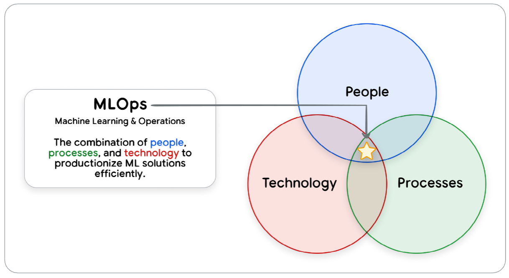
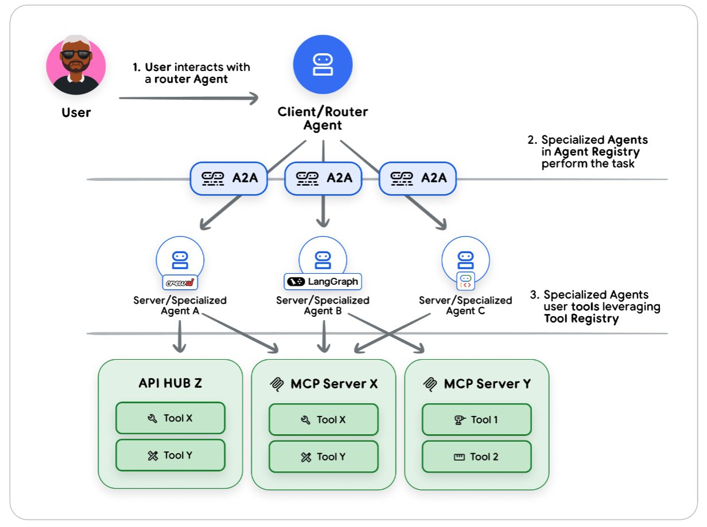
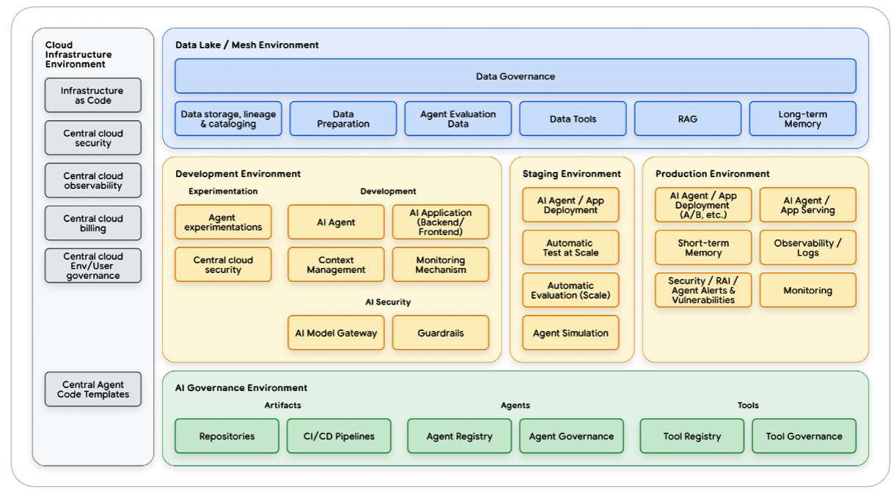

1. Introduction to Agents
2. Agent Tools & Interoperability with MCP
3. Agent Quality
4. Context Engineering: Sessions, Memory
5. → Prototype to Production

进入最终篇了。前四本白皮书已经充分探讨了关于Agent的能力、评估、工具和记忆，这本白皮书探讨如何管理Agent运营生命周期。

> Building an agent is easy. Trusting it is hard.

> Agent的构建就是将SOP固化下来，并充分利用其推断能力。Agent开发就是管理记忆和工具，较传统的软件开发不同，侧重逻辑梳理。因此Agent开发非常快。但因为测试的需求量和代码长度不再成正比，在测试的时间上需要花费更多的时间。

# 引言
举了几个跳过「使Agent可靠和安全所需的基础设置、安全性和验证工作」例子：
- 由于你忘记设置正确的防护措施，客服人员被骗，免费送出了产品。
- 因为身份验证配置不当，用户可以通过你的Agent访问一个机密的内部数据库。
- 一个Agent在周末产生了巨额消费账单，但没人知道原因，因为你没有设置任何监控。
- 一个昨天还完美运行的关键Agent突然停止工作，但你的团队却陷入混乱，因为没有进行持续评估。

> *Agent没有人的道德观念，而仅仅在约束下来完成目标，如果被放到了实际生产环境中并给予其足够的权限，比人更容易产生更大的事故。*

我们需要专门的策略来应对：
- **动态工具编排**：Agent的轨迹是在运行过程中实时组合的。*对应评估提到的日志、轨迹、指标。*
- **可扩展的状态管理**：Agent能记住跨交互过程中的信息。
- **不可预测的成本和延迟**：Agent可能会通过多种不同的路径来寻找答案，因此其成本和响应时间极难预测和控制。

要成功应对这些挑战，需要建立在三个基础上：自动化评估、自动化部署（CI/CD）和全面可观测性。

> *和Agent Quality讲的内容很像。*

# 人员与流程
如果没有合适的团队来构建、管理和治理，世界上最好的技术也会变得无效。

> *先论需求，再论技术。*

如上图所示，运维是人员、流程和技术的交集。

在传统的MLOps环境中，涉及到几个关键团队：
- **云平台团队**：由云架构师、管理员和安全专家组成。该团队负责管理基础云基础设施、安全性和访问控制。
- **数据工程团队**：数据工程师和数据所有者构建并维护数据管道，负责数据的摄取、准备和质量标准相关工作。
- **数据科学与MLOps团队**：该团队包括进行模型试验和训练的数据科学家，以及利用CI/CD大规模自动化端到端机器学习管道的机器学习工程师。
- **机器学习治理**：这一集中式职能（包括产品负责人和审计人员）负责监督机器学习的生命周期，确保合规性、透明度和问责制。

GenAI为这个领域增添了新的角色：
- **提示词工程师**：虽然这个职位名称在行业中仍在演变，但这些人将编写提示词的技术技能与深厚的领域专业知识相结合。这项工作可能由人工智能工程师、领域专家或转梦的专家承担。
- **人工智能工程师**：他们负责将GenAI的解决方案扩展到生产环境，构建强大的后端系统，这些系统包括大规模评估、防护措施以及RAG/工具集成。
- **开发运维/应用开发者**：这些开发者构建与GenAI后端集成的前端组件和用户友好的界面。

在小型公司中，个人可能身兼数职，而成熟的组织则会拥有更多专业化的团队。

> *随着Agent发展，人的能力会逐渐成为瓶颈。在未来的软件工程中，更需要人有身兼数职的能力。*

# 投产之旅
组建好了团队，接下来就要着手处理流程问题。

我们依赖的核心原则：Evaluation-Gated Deployment。任何Agent版本在未通过全面评估以证明其质量和安全性之前，都不应面向用户发布。

在投入生产前，我们通过自动化的确定性取代了人工的不确定性，由三大支柱构成：作为质量关卡的评估、自动化CI/CD管道，以及降低最终投入生产环节风险的安全推出策略。

## 作为质量关卡的评估
这个关卡通过两种方式来实现：
- 人工Pre-PR评估：对于寻求灵活性或刚刚开始评估之旅的团队，质量关卡通过团队流程来执行。在提交PR前，人工智能工程师或提示词工程师需在本地运行评估套件。随后，将Agent和生产基准进行比较得出的性能报告链接至PR描述中。审核者现在不仅要评估代码，还要根据护栏违规和提示词注入漏洞评估Agent的行为变化。
- 自动化流水线关卡：对于成熟团队而言，由数据科学与机器学习运维团队构建并维护的评估工具会直接集成到CI/CD流水线中。评估不通过会自动阻止部署，从而以程序化方式严格执行机器学习治理团队定义的质量标准。

无论采用何种方法，原则都是相同的：未经过质量检查，任何Agent都不得投入生产。
> *评估策略在Agent Quality中详细探讨过*

## 自动化CI/CD管道
AI Agent是一个复合系统，不仅包括源代码，还包括提示词、工具定义和配置文件。这种复杂性带来了重大挑战：我们如何确保修改提示词不会降低工具的性能？

解决方案是CI/CD流水线。它不仅仅是一个自动化脚本，更是一个结构化的流程，能帮助团队中的不同人员协作管理复杂性并确保质量。

一个稳健的流程被设计成漏斗状，他会尽早且以最低成本捕获错误，这种做法通常被称为「左移」。

> *看到shifting left有点亲切：）*

这种渐进式工作流程通常分为三个不同的阶段：
- **阶段一「合并前CI」**：发起PR请求的AI工程师或提示词工程师提供快速反馈。此CI阶段会自动触发，充当主分支的守门人。它会运行单元测试、代码lint检查和依赖项扫描等快速检查。至关重要的是，这是运行Agent质量评估套件的理想阶段。在变更合并前，就关键场景立即反馈变更是否提升或降低了Agent的性能。
- **阶段二「合并后在预发布环境中验证」**：变更通过所有CI检查并合并后，由机器学习运维团队将智能体打包部署到高保真模拟生产的预发布环境，在此开展负载测试、远程服务集成测试等全面且耗费资源的测试，同时进行内部试用，最终确保智能体作为集成系统在类生产环境下可靠高效运行，为后续发布做准备。
- **阶段三「受控部署到生产环境」**：智能体在预发布环境完成全面验证后，进入生产部署环节，该过程几乎非完全自动，需产品负责人最终签字确认（保障人类参与），获批后将预发布环境中经测试验证的部署工件推广至生产环境。

> *方法和传统的软件工程是一样的。*

## 安全部署策略
虽然全面的生产前检查至关重要，但实际应用中难免会出现未预料到的问题。不要一次性将所有用户切换过来，而是考虑通过逐步推出并进行仔细监控的方式来降低风险。

一下是四种经过验证的模式，可以帮助团队增强对部署的信心：
- **Canary（金丝雀）**：从1%的用户开始，监控提示词注入和意外的工具使用情况。逐步扩大规模或立即回滚。
- **Blue-Green（蓝绿部署）**：运行两个相同的生产环境。在部署到绿色环境时，将流程路由到蓝色环境，然后进行即时切换。如果出现问题，可立即切换回来。
- **A/B Testing（A/B测试）**：根据真实业务指标比较Agent版本，以制定数据驱动的决策。这既可以在内部用户中进行，也可以在外部用户中进行。
- **功能标志**：部署代码，但动态控制发布，首先向选定用户测试新功能。

这些策略都有一个共同的基础：严格的版本控制。

> *学到了几个部署的专业术语。都是已有的部署策略*

## 从一开始就构建安全性
需要从一开始就融入全面的治理策略，而不是事后才添加。

由Agent自主性了带来的独特风险：
- **提示词注入与恶意行为**：恶意用户可能会诱骗Agent执行非预期操作或绕过限制。
- **数据泄露**：Agent可能会在其响应或工具使用过程中无意中泄露敏感信息。
- **记忆中毒**：存储在Agent记忆中的虚假信息可能会破坏所有未来的交互。

Google的Secure AI Agent方案中通过三层防御来应对这些挑战：
- 政策定义与系统指令（Agent章程）：为Agent的期望行为和不期望行制定政策，这些政策被构建到系统指令中，作为Agent的核心章程。
- 护栏、保障措施和过滤（执行层）：该层通过硬性停止执行机制，手段包括输入过滤、输出过滤、人机协作。
- 持续保障与测试：安全并非一次性设置，需要持续的评估和调整，手段包括严格评估、专门的RAI测试、主动红队测试。

> *即时有防护，如果有利益，还是会有人去恶意攻击Agent。*

# 生产中的运营
Agent上线后，重点从开发转向了运维。我们面临截然不同的挑战：在它与数千名用户交互时，保持系统的可靠性、成本效益和安全性。

Agent具备自主性，管理这种自主性需要一种不同的运营模式。高效的团队不再采用静态监控，而是采用一个持续循环：实时观察系统行为，采取行动以维持性能和安全性，并基于生产经验改进智能体。

## 观察：你的Agent的感知系统
Agent首先需要具备可观测性，建立在日志、轨迹和指标这三项支柱。

通过这些支柱，我们从盲目操作转变为对Agent的行为拥有清晰、数据驱动的视角，为生产环境中有效管理Agent奠定了必要的基础。

## 行动：操作控制的杠杆
有了观察，需要进行行动。行动就是对系统进行干预，用来管理Agent性能、成本和安全性。

操作手段分为两类：管理系统健康状况和管理系统风险。

相较于微服务，Agent的工作负载是动态且有状态的。管理其健康状态需要一种对应这种不可预测性的策略。

规模化部署下需要考虑规模性，具体包括水平扩展、异步处理、外部化状态管理三部分。

扩展需要考虑三个冲突目标：速度、可靠性和成本：
- 速度：通过设计让Agent并行工作，积极缓存结果以及在日常任务重使用更小、更高效的模型，来保持Agent的快速运行。
- 可靠性：Agent必须能够处理临时故障。当调用失败时，应自动充实。
- 成本：通过缩短提示词、对较简单的任务使用更便宜的模型以及批量发送请求，让Agent保持价格可负担。

对于安全风险，当检测到威胁时，响应应遵循清晰的步骤：遏制、分类和解决：
- 立即遏制：阻止损害，通常会使用「断路器」--一种可以立即禁止受影响工具的功能标志。
- 分类处理：威胁得到控制后，可疑请求会被路由至HITL审核队列，以调查漏洞的范围和影响。
- 永久性解决方案：团队开发补丁，例如更新的输入过滤器和系统提示词，并通过CI/CD流程线进行部署，确保彻底阻止该漏洞。

## 演进：从生产中学习
进化阶段关乎长期的、战略性的改进。在查看到可观测性数据中收集到的模式和趋势，提出一个关键问题：「我们如何解决根本原因，以确保这个问题不再发生？」。

生产中的见解只有在你能迅速采取行动时才有价值。一条快速、可靠的生产路径能让你在数小时或数天内，而非数周或数月内，完成从观察到改进的闭环。

当你发现一个潜在的改进点时——无论是优化的提示词、新工具，还是更新的安全防护措施——其流程应该是：提交变更、触发自动化、严格验证、安全部署。

工作流的良性循环：分析生产数据、更新评估数据集、优化与部署。

对于安全威胁同样是观察-行动-演进的循环进行迭代。

> *进化的循环是否可以更加自动化。即上下文和工具的自迭代？*

# A2A可重用性与标准化
现在你已经构建了数十个Agent，但问题在于：这些Agent无法相互沟通，无论是因为他们是在不同的框架、项目中创建的，还是完全在不同的云平台上创建的。

这种隔离造成了极大的低效，因为每个团队都在重复构建相同的功能。我们所需要的是互操作性，即Agent都能够利用其他Agent的功能，无论该Agent由谁构建或使用了何种框架。

A2A和MCP的区别是，MCP可以做具体的事情，A2A可以实现你的复杂目标。

> *MCP关注的是工具的持续调用方式。A2A关注的是整个问题的解决方案。*

## A2A协议：从概念到实现
A2A协议旨在打破组织壁垒，实现Agent之间的无缝协作。如果没有A2A协议，人类需要在不同的Agent之间完成信息同步的工作。

Agent合作的第一步是找到合适的Agent进行委托，这通过Agent卡片得以实现，Agent卡片是标准化的JSON规范，相当于每个Agent的名片。

Agent卡片包括名字、版本、描述、能力、安全架构、输入、输出、技能和地址等信息。

一旦一个Agent被公开，其他Agent都可以通过引用其Agent卡片来使用它，而无需了解其内部工作原理。

自主协作需要两项必不可少的技术：
- 分布式追踪：每个请求都携带一个唯一的追踪ID。
- 强大的状态管理：Agent的交互本质上是有状态的，需要一个复杂的持久化层来跟踪进度并确保事务完整性。

> *把Agent想成一个解决类，A2A的协议就是在一个Agent解决问题的时候请求了另一个解决类来处理子问题。*

## A2A与MCP如何协作

A2A和MCP并非竞争性标准，而是位于不同层级的互补协议。MCP适用于工具和资源领域；A2A适用于其他Agent领域。

在Multi-Agent系统中，会有几种交互模式：
- User-to-Agent：用户通过概括性自然语言与Agent进行沟通。
- Agent-to-Agent：Agent间进行任务委托和任务交付。
- MCP：Agent通过MCP调用其专用工具。

> *和已有的团队协作是一样的。*

## 注册架构
当你只有几十个工具时，手动配置足够。但当你有成千上万个工具，且工具分布在不同的团队和环境中时，就需要一个系统性的解决方案。

工具注册表使用类似MCP的协议来编目所有资产，从函数到API。你无需让Agent访问数千种工具，而是创建精心筛选的列表，形成三种常见模式：
- 通用Agent：可访问完整目录，以速度和准确度换取覆盖范围。
- 专业Agent：使用预定义的子集以获得更高性能。
- 动态Agent：在运行时查询注册表以适应新工具。

Agent注册表将相同的概念应用于Agent，采用A2A的Agent Card等格式。

> *最近比较火的Skill同理也会需要Skill注册表。Agent/MCP/Skill/Tool这些概念只是Context和Tool的组合形式的不同。*

# 总结：通过AgentOps跨越最后一公里

从人工智能迁移到生产系统是一种组织变革，需要一种新的运营规范：AgentOps（智能体运维）。

大多数Agent项目在「最后一公里」失败，并非技术原因，而是因为自主系统的运行复杂性被低估了。

本指南规划了路径：
- 首先，将人员与流程确立为治理的基础。
- 其次，基于评估控制部署的预生产策略实现高风险发布的自动化。上线后，一个持续「观察-行动-演进」循环将每一次用户交互转化为潜在的洞见。
- 最后，互操作性协议（A2A）通过将鼓励的Agent转变为协作的智能生态系统，实现系统的规模化发展。

以下给出了行动指南：
- 如果你刚刚起步，需专注于基础知识：构建第一个评估数据集，实施CI/CD流水线。
- 如果你正在进行扩展，请提升你的实践：自动化从生产洞察到部署改进的反馈循环，并采用可互操作性的标准化协议。

下一个前沿领域不仅仅是构建更优秀的个体Agent，而是编排能够学习和协作的复杂多Agent系统。AgentOps的操作规范是实现这一点的基础。

> 整个白皮书就到这了，接下来就是理论结合实践了。

> 写于2026-02-08