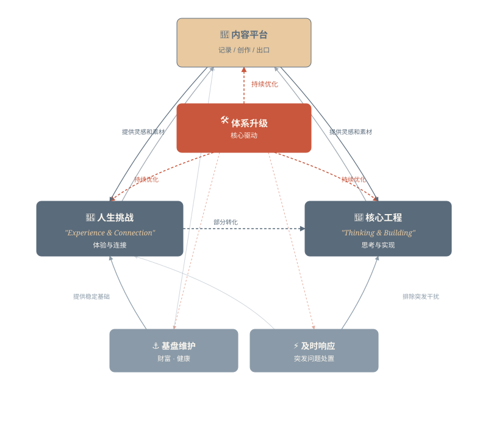
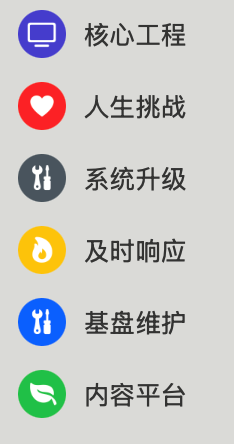

> 我追求两种深刻的快乐：

> 一是**体验与连接的广度**——尝遍趣味，与共振的灵魂分享。

> 二是**思考与实现的深度**——将兴趣铸成洞见，将洞见化为现实。

今天 6 点多晨跑后，望着经常路过的树木，脑中无意间探索着最佳的拍摄视角。过去一周，我做过的和想做的增加了不少——增加了力量训练，买了一部拍照的手机，尝试了新发型，OPC 提交了税务，公众号关注数到百；想去爬山，想去记录美好，想去结识更多的人。

回过头，一切的根源始于去年的四月。

---

## 思考的历程

### 前

去年四月（2025）前，我的人生可以说是只留主干的目标驱动。从数学、足球，到程序设计竞赛和 EDA，基本都是几年的周期。目标驱动的人生的问题就是一旦目标达成或结束了，就会进入迷茫。我最迷茫的时候就是在程序设计竞赛退役后，五年的沉淀不再有更大的舞台可以展示。

### 悟

去年四月是我人生目前为止最低谷的时期。在破碎中，我逐步开始构建真正的自我。我开始思考「我想做什么？」。这个问题很普通，但对于我来说是直击要害的。我过去擅长的事情可以说都是兴趣使然的，然而更加根本的原因应该是「我好像做得不错」。在我的目标驱动意识下，「我想做什么」会被优先级高的事情主导。然而我并不喜欢这样的状态，因为过往的经历告诉我这是危险的。我进一步思考「为什么需要限制自己呢？」。

### 始

我发现我根源意识的出发点很纯粹，我追求可以让我长期感到快乐的事情。深刻的快乐是一种源于内在价值实现、精神成长与意义感的持久心理状态。大白话来讲，就是让我自己感到很酷的事情。我是贪心的，尽管我的过去是倾向「思考与实现的深度」，但我也想追求「体验与连接的广度」。这两类的本质区别就是前者是更加孤独和长期的。

### 起

在考虑清楚我的人生主旋律后，我开始落实想法。经过了一年多的收敛，形成了运作起来的方法论。方法论的核心就是「保持活力」和「记录内容」。

---

## 实践的体系

> 以下是我对于体系的整理策略

### 六维分类体系

| 分类模块      | 核心定义             | 记录内容范畴                 |
| ------------- | -------------------- | ---------------------------- |
| **🌱内容平台** | 灵感积累与内容孵化   | 创作素材、灵感点子、思考笔记 |
| **⚡及时响应** | 被动触发的时效性任务 | 突发问题处置                 |
| **🧩人生挑战** | 主动发起的成长性挑战 | 能力边界探索                 |
| **🎯核心工程** | 长期价值创造项目     | 知识体系构建、资产积累       |
| **🛠️体系升级** | 个人 OS 持续优化     | 行为模式改进、效率工具迭代   |
| **⚓基盘维护** | 生存基础保障体系     | 财富、健康等监测维护         |

### 维度间的联系

### 提醒策略

> 大道至简，仅用 iOS 的提醒事项。其中基盘维护做成周期日程

### 并不是全部

- 并不需要全面地记录（P）
- 情感不需要记录（F）
- 记录只是释放注意力，关键是自身原动力

---

> 写给自己，也送给你。
